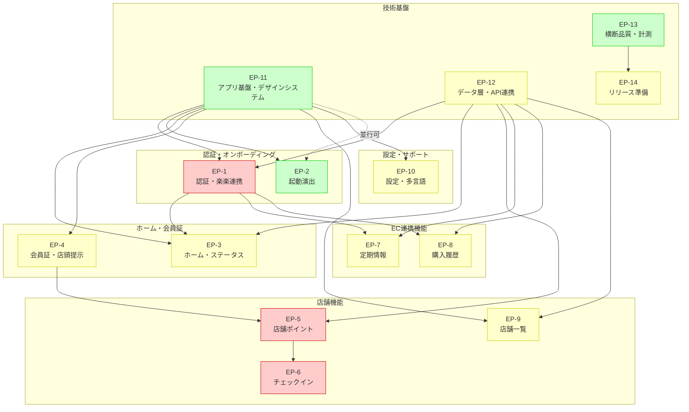
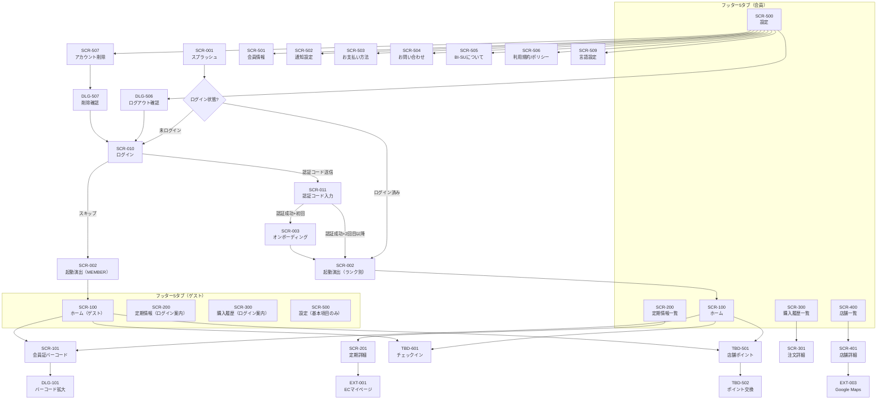

# BI-SU アプリマップ

| 項目 | 内容 |
|---|---|
| バージョン | v1.0 |
| 作成日 | 2026-06-19 |
| ステータス | 設計フェーズ（練習PJ / 社内検討用） |
| 根拠文書 | 要件定義書 v2.1 / 仕様書 v2.1 / エピック・ストーリーマップ v2.0 |

---

## 1. 画面階層マップ（Layer 1-5）

> **凡例**
> - Layer 1 = アプリルート / Layer 2 = フロー・タブ / Layer 3 = 画面 / Layer 4 = サブ画面 / Layer 5 = モーダル・ダイアログ
> - **ハイブリッド**: 未ログインでも利用可能な画面（ログイン状態で表示内容が変わる）
> - ステータスは全画面 **未着手**（設計フェーズのため）

| Layer 1 | Layer 2 | Layer 3 | Layer 4 | Layer 5 | 画面ID | 画面名 | Epic | Story ID | 関連Issue | 依存 | ハイブリッド | ステータス |
|---------|---------|---------|---------|---------|--------|--------|------|----------|-----------|------|-------------|-----------|
| App | 起動フロー | スプラッシュ | | | SCR-001 | スプラッシュ | EP-11 | S-11.1 | | | - | 未着手 |
| | | 起動演出 | | | SCR-002 | ランク別ボルネオ演出 | EP-2 | S-2.1 | OP-19 | EP-11 | 対象（MEMBER演出/ランク別） | 未着手 |
| | | オンボーディング | | | SCR-003 | 初回ウォークスルー | EP-1 | S-1.6 | | EP-11 | - | 未着手 |
| | 認証フロー | ログイン | | | SCR-010 | メール/電話番号入力 | EP-1 | S-1.1, S-1.2 | OP-06, OP-31 | EP-11 | 対象（スキップ可） | 未着手 |
| | | 認証コード入力 | | | SCR-011 | 6桁コード入力 | EP-1 | S-1.2, S-1.3 | OP-06, OP-26 | SCR-010 | - | 未着手 |
| | Tab 1: ホーム | ホーム | | | SCR-100 | ステータス・ポイント残高 | EP-3 | S-3.1, S-3.2, S-3.3, S-3.4, S-3.5, S-3.6 | OP-03, OP-05 | EP-1, EP-12 | 対象（ブランドビジュアル+連携案内） | 未着手 |
| | | | 会員証バーコード | | SCR-101 | バーコード表示 | EP-4 | S-4.1, S-4.2, S-4.5 | OP-01, OP-27 | EP-11 | 対象（仮会員証） | 未着手 |
| | | | | バーコード拡大 | DLG-101 | バーコード拡大モーダル | EP-4 | S-4.1 | OP-01, OP-27 | SCR-101 | 対象（仮会員証） | 未着手 |
| | | | 店舗ポイント残高 | | TBD-501 | 店舗ポイント残高・履歴 | EP-5 | S-5.1, S-5.2, S-5.4 | OP-28, OP-05 | EP-12 | 対象（仮IDでも利用可） | 未着手 |
| | | | 店舗ポイント交換 | | TBD-502 | ポイント交換・特典 | EP-5 | S-5.3 | OP-28 | TBD-501 | 対象 | 未着手 |
| | | | チェックイン | | TBD-601 | チェックイン（来店記録） | EP-6 | S-6.1, S-6.2 | OP-29 | EP-5 | 対象 | 未着手 |
| | Tab 2: 定期情報 | 定期情報一覧 | | | SCR-200 | 定期コース一覧 | EP-7 | S-7.1, S-7.2, S-7.4, S-7.5 | OP-24 | EP-1, EP-12 | ログイン必須（グレーアウト） | 未着手 |
| | | | 定期詳細 | | SCR-201 | 定期コース詳細 | EP-7 | S-7.2, S-7.3 | OP-24 | SCR-200 | ログイン必須 | 未着手 |
| | Tab 3: 購入履歴 | 購入履歴一覧 | | | SCR-300 | 注文履歴一覧 | EP-8 | S-8.1, S-8.2, S-8.3 | OP-15, OP-24 | EP-1, EP-12 | ログイン必須（グレーアウト） | 未着手 |
| | | | 注文詳細 | | SCR-301 | 注文詳細 | EP-8 | S-8.1, S-8.4, S-8.5 | OP-15 | SCR-300 | ログイン必須 | 未着手 |
| | Tab 4: 店舗一覧 | 店舗一覧 | | | SCR-400 | 店舗一覧（リスト/マップ） | EP-9 | S-9.1, S-9.2, S-9.4, S-9.5 | OP-11, OP-20 | EP-12 | 対象（全機能利用可） | 未着手 |
| | | | 店舗詳細 | | SCR-401 | 店舗詳細 | EP-9 | S-9.3 | OP-20 | SCR-400 | 対象 | 未着手 |
| | Tab 5: 設定 | 設定メニュー | | | SCR-500 | 設定トップ | EP-10 | S-10.2, S-10.3 | OP-08, OP-09 | EP-11 | 対象（基本項目のみ） | 未着手 |
| | | | 会員情報 | | SCR-501 | 会員情報 | EP-10 | S-10.3 | OP-08 | SCR-500 | ログイン必須 | 未着手 |
| | | | 通知設定 | | SCR-502 | 通知設定 | EP-10 | S-10.2 | OP-09 | SCR-500 | ログイン必須 | 未着手 |
| | | | お支払い方法 | | SCR-503 | お支払い方法（EC誘導） | EP-10 | S-10.3 | OP-08 | SCR-500 | ログイン必須 | 未着手 |
| | | | お問い合わせ | | SCR-504 | お問い合わせ | EP-10 | S-10.4 | OP-14 | SCR-500 | 対象 | 未着手 |
| | | | BI-SUについて | | SCR-505 | ブランドストーリー | EP-10 | S-10.1, S-10.7 | | SCR-500 | 対象（未ログインでも閲覧可） | 未着手 |
| | | | 利用規約 | | SCR-506 | 利用規約 | EP-10 | S-10.5 | | SCR-500 | 対象 | 未着手 |
| | | | プライバシーポリシー | | SCR-506 | プライバシーポリシー | EP-10 | S-10.5 | OP-11 | SCR-500 | 対象 | 未着手 |
| | | | アカウント削除 | | SCR-507 | アカウント削除注意 | EP-1 | S-1.8 | | SCR-500 | ログイン必須 | 未着手 |
| | | | | 削除確認 | DLG-507 | アカウント削除最終確認 | EP-1 | S-1.8 | | SCR-507 | ログイン必須 | 未着手 |
| | | | | ログアウト確認 | DLG-506 | ログアウト確認 | EP-1 | S-1.7 | | SCR-500 | ログイン必須 | 未着手 |
| | | | 言語設定 | | SCR-509 | 言語切替（日/EN） | EP-10 | S-10.6 | OP-30 | SCR-500 | 対象（未ログインでも利用可） | 未着手 |
| | 外部遷移 | ECマイページ | | | EXT-001 | ECマイページ（外部ブラウザ） | EP-7 | S-7.3, S-10.3 | | | ログイン必須 | 未着手 |
| | | EC新規登録 | | | EXT-002 | EC新規登録（外部ブラウザ） | EP-1 | S-1.4 | OP-26 | | - | 未着手 |
| | | 地図アプリ | | | EXT-003 | 地図アプリ起動 | EP-9 | S-9.3 | OP-20 | | 対象 | 未着手 |

### 1.1 画面数サマリ

| 種別 | 件数 | ID体系 |
|------|------|--------|
| 認証・起動 | 4画面 | SCR-001 ~ SCR-011 |
| タブ画面 | 5画面 | SCR-100 ~ SCR-500 |
| サブ画面 | 13画面 + TBD | SCR-x01 ~ SCR-x09 |
| v2.1追加予定画面 | 3画面(TBD) | TBD-501, TBD-502, TBD-601 |
| モーダル/ダイアログ | 3件 | DLG-101, DLG-506, DLG-507 |
| 外部遷移 | 3件 | EXT-001 ~ EXT-003 |
| **合計** | **31件 + TBD** | |

### 1.2 画面ID命名ルール

- 百の位 = フッタータブ番号（1=ホーム, 2=定期情報, 3=購入履歴, 4=店舗一覧, 5=設定）
- x00 = タブのルート画面、x01以降 = サブ画面
- 0xx = 認証・起動フロー（タブ到達前）
- DLG = ダイアログ/モーダル、EXT = 外部遷移先
- TBD = v2.1で新設、画面ID未確定

---

## 2. エピック・ストーリー対応表

### 2.1 エピック一覧（14 Epic / 65 Story）

| EP | エピック名 | Story数 | 着手判定 | v2.1変更 |
|----|-----------|---------|----------|----------|
| EP-1 | 認証・楽楽連携・オンボーディング | 8 | 要決定 | 大幅改訂 |
| EP-2 | 起動演出 | 1 | 即着手OK | 変更なし |
| EP-3 | ホーム・ステータス | 6 | 一部待ち | 改訂 |
| EP-4 | 会員証・店頭提示 | 6 | 一部待ち | 大幅改訂（QR->バーコード） |
| EP-5 | 店舗ポイント | 5 | 要決定 | 新設 |
| EP-6 | チェックイン | 3 | 要決定 | 新設 |
| EP-7 | 定期情報 | 5 | 一部待ち | 番号移動 |
| EP-8 | 購入履歴 | 5 | 一部待ち | 番号移動 |
| EP-9 | 店舗一覧 | 5 | 一部待ち | 番号移動 |
| EP-10 | 設定・サポート・多言語 | 7 | 一部待ち | 改訂（多言語追加） |
| EP-11 | アプリ基盤・デザインシステム | 5 | 即着手OK | 改訂（ハイブリッド対応） |
| EP-12 | データ層・API連携 | 6 | 一部待ち | 改訂（楽楽API追加） |
| EP-13 | 横断品質・計測 | 4 | 即着手OK | 番号移動 |
| EP-14 | リリース準備 | 4 | 後半 | 番号移動 |

### 2.2 ストーリー・画面マッピング全量

| Epic | Story ID | ストーリー | 画面ID | 出典 |
|------|----------|-----------|--------|------|
| EP-1 | S-1.1 | ログインしなくてもアプリの基本機能を使い始める | SCR-010, SCR-100 | NEW |
| EP-1 | S-1.2 | メールアドレスまたは電話番号で認証コードを受け取り、会員機能を解放する | SCR-010, SCR-011 | 既存(US-1-00) |
| EP-1 | S-1.3 | 認証後、楽楽アカウントとメール照合で紐付け、購入履歴・ランクを引き継ぐ | SCR-011 | NEW |
| EP-1 | S-1.4 | 楽楽に未登録の場合、アプリからアカウントを生成して紐付ける | SCR-011, EXT-002 | NEW |
| EP-1 | S-1.5 | 機種変更後も同じメールアドレス/電話番号で再認証して復帰する | SCR-010, SCR-011 | 既存(US-1-00) |
| EP-1 | S-1.6 | 初めてアプリを開いた時、スキップ可能なオンボーディングでアプリ概要を知る | SCR-003 | NEW(v1) |
| EP-1 | S-1.7 | ログアウトする | DLG-506 | 既存(US-5-06) |
| EP-1 | S-1.8 | アカウントを削除（退会）する | SCR-507, DLG-507 | 既存(US-5-07) |
| EP-2 | S-2.1 | ランクに応じたボルネオ起動演出を毎回楽しむ | SCR-002 | 既存(US-1-05) |
| EP-3 | S-3.1 | ステータス・ポイント残高・特典を確認する | SCR-100 | 既存(US-1-03) |
| EP-3 | S-3.2 | 翌年ステータスへの進捗を確認する | SCR-100 | 既存(US-1-04) |
| EP-3 | S-3.3 | 年次のステータス切替わりを理解する | SCR-100 | 既存(US-1-08) |
| EP-3 | S-3.4 | 3Dロゴエンブレムがランクに応じて表示される | SCR-100 | NEW(v1) |
| EP-3 | S-3.5 | 未ログイン時でもホーム画面でブランドの世界観に触れる | SCR-100 | NEW |
| EP-3 | S-3.6 | 店舗ポイントの残高をホームで確認する | SCR-100, TBD-501 | NEW |
| EP-4 | S-4.1 | レジでバーコードを提示して素早く会員証を見せる | SCR-101, DLG-101 | 既存(US-1-01) |
| EP-4 | S-4.2 | 電波なし・メンテ中でも会員証を使う | SCR-101, DLG-101 | 既存(US-1-02) |
| EP-4 | S-4.3 | （スタッフ）バーコードから会員ID取込 | SCR-101 | 既存(US-1-06) |
| EP-4 | S-4.4 | バーコードが読めない時に代替手段で本人確認する | SCR-101 | 既存(US-1-07) |
| EP-4 | S-4.5 | 未登録でも仮会員証を取得し、店舗ポイントを貯める | SCR-101, DLG-101 | NEW |
| EP-4 | S-4.6 | 仮会員証で貯めたポイントを、本登録後のアカウントに引き継ぐ | SCR-101, SCR-011 | NEW |
| EP-5 | S-5.1 | 店舗で買い物や来店時にポイントを受け取る | TBD-501 | NEW |
| EP-5 | S-5.2 | 貯まったポイントの残高と履歴を確認する | TBD-501 | NEW |
| EP-5 | S-5.3 | ポイントをクーポンや特典と交換する | TBD-502 | NEW |
| EP-5 | S-5.4 | ポイントの付与理由と種別がわかる | TBD-501 | NEW |
| EP-5 | S-5.5 | ログインで楽楽連携すると、ポイント付与率が優遇される | TBD-501 | NEW |
| EP-6 | S-6.1 | 店舗に来店したことを記録し、ポイントを受け取る | TBD-601 | NEW |
| EP-6 | S-6.2 | 店内のQRコードを読み取ってチェックインする | TBD-601 | NEW |
| EP-6 | S-6.3 | （スタッフ）チェックインの不正利用を防止する | TBD-601 | NEW |
| EP-7 | S-7.1 | 次回お届けを確認する | SCR-200, SCR-201 | 既存(US-3-01) |
| EP-7 | S-7.2 | 定期コースの内容を確認する | SCR-200, SCR-201 | 既存(US-3-02) |
| EP-7 | S-7.3 | 定期の変更手続きへ進む（ECマイページ誘導） | SCR-201, EXT-001 | 既存(US-3-03) |
| EP-7 | S-7.4 | 解約済みの定期を確認する | SCR-200 | 既存(US-3-04) |
| EP-7 | S-7.5 | 定期の異常（決済不備等）に気づく | SCR-200 | 既存(US-3-05) |
| EP-8 | S-8.1 | 過去の注文を確認する | SCR-300, SCR-301 | 既存(US-4-01) |
| EP-8 | S-8.2 | 店頭購入も履歴で確認する | SCR-300 | 既存(US-4-02) |
| EP-8 | S-8.3 | 目的の注文を素早く見つける | SCR-300 | 既存(US-4-03) |
| EP-8 | S-8.4 | 問い合わせ時に注文番号を示す | SCR-301 | 既存(US-4-04) |
| EP-8 | S-8.5 | 注文のいまの状態を知る | SCR-301 | 既存(US-4-05) |
| EP-9 | S-9.1 | 近くの店舗を探す | SCR-400 | 既存(US-2-01) |
| EP-9 | S-9.2 | 地図で店舗の位置をつかむ | SCR-400 | 既存(US-2-02) |
| EP-9 | S-9.3 | 店舗の詳細を見て迷わず行く | SCR-401, EXT-003 | 既存(US-2-03) |
| EP-9 | S-9.4 | 期間限定ストアを知る | SCR-400 | 既存(US-2-04) |
| EP-9 | S-9.5 | 位置情報を許可せずに店舗を探す | SCR-400 | 既存(US-2-05) |
| EP-10 | S-10.1 | アナツバメとブランドの物語を知る（未ログインでも可） | SCR-505 | 既存(US-5-01) |
| EP-10 | S-10.2 | PUSH通知の配信を設定する | SCR-502 | 既存(US-5-02) |
| EP-10 | S-10.3 | 登録情報・お支払い方法を変更する（EC誘導） | SCR-501, SCR-503, EXT-001 | 既存(US-5-03+04) |
| EP-10 | S-10.4 | 問い合わせる | SCR-504 | 既存(US-5-05) |
| EP-10 | S-10.5 | 規約・プライバシーポリシーを確認する | SCR-506 | 既存(US-5-08) |
| EP-10 | S-10.6 | アプリの表示言語を日本語/Englishで切り替える | SCR-509 | NEW |
| EP-10 | S-10.7 | BI-SUの理念・アナツバメの物語を深く知る | SCR-505 | NEW |
| EP-11 | S-11.1 | Flutterプロジェクト初期化・CI/CD環境構築 | SCR-001 | NEW(v1) |
| EP-11 | S-11.2 | タブナビゲーション・画面遷移フレームワーク構築 | 全タブ画面 | NEW(v1) |
| EP-11 | S-11.3 | ブランドテーマ定義（カラー・タイポグラフィ・アイコン） | 全画面共通 | NEW(v1) |
| EP-11 | S-11.4 | 共通UIコンポーネント整備（ボタン・カード・モーダル等） | 全画面共通 | NEW(v1) |
| EP-11 | S-11.5 | 未ログイン/ログイン済みの画面状態管理パターン設計 | 全画面共通 | NEW |
| EP-12 | S-12.1 | データモデル定義（会員・定期・注文・店舗・ポイント） | - | NEW(v1) |
| EP-12 | S-12.2 | API契約定義 + モックサーバ構築 | - | NEW(v1) |
| EP-12 | S-12.3 | オフラインキャッシュ・データ同期戦略 | - | NEW(v1) |
| EP-12 | S-12.4 | 画面状態パターン共通実装（空/読込中/エラー/圏外） | 全画面共通 | NEW(v1) |
| EP-12 | S-12.5 | 楽楽API連携基盤（メール照合・顧客作成・データ引き継ぎ） | - | NEW |
| EP-12 | S-12.6 | 店舗ポイントデータ管理（付与/照会/利用のAPI設計） | - | NEW |
| EP-13 | S-13.1 | アクセシビリティ対応（文字サイズ・コントラスト・reduced-motion） | 全画面共通 | NEW(v1) |
| EP-13 | S-13.2 | KPI計測イベント設計・SDK実装 | 全画面共通 | NEW(v1) |
| EP-13 | S-13.3 | セキュリティ基盤（データ暗号化・認証トークン管理） | - | NEW(v1) |
| EP-13 | S-13.4 | パフォーマンス基準（起動3秒目標・画像最適化） | SCR-001, SCR-002 | NEW(v1) |
| EP-14 | S-14.1 | 試作専用要素の除去（ランク切替UI・ダミー注記等） | SCR-500 | NEW(v1) |
| EP-14 | S-14.2 | 素材権利確認・AI透かし除去 | - | NEW(v1) |
| EP-14 | S-14.3 | ストア申請・配信準備（iOS App Store / Google Play） | - | NEW(v1) |
| EP-14 | S-14.4 | 対応OS最低バージョン確定・互換性テスト | - | NEW(v1) |

---

## 3. TSVコピー用（スプレッドシート貼り付け）

```tsv
Layer1	Layer2	Layer3	Layer4	Layer5	画面ID	画面名	Epic	StoryID	関連Issue	依存	ハイブリッド	ステータス
App	起動フロー	スプラッシュ			SCR-001	スプラッシュ	EP-11	S-11.1		-	-	未着手
	起動フロー	起動演出			SCR-002	ランク別ボルネオ演出	EP-2	S-2.1	OP-19	EP-11	対象	未着手
	起動フロー	オンボーディング			SCR-003	初回ウォークスルー	EP-1	S-1.6		EP-11	-	未着手
	認証フロー	ログイン			SCR-010	メール/電話番号入力	EP-1	S-1.1,S-1.2	OP-06,OP-31	EP-11	対象	未着手
	認証フロー	認証コード入力			SCR-011	6桁コード入力	EP-1	S-1.2,S-1.3	OP-06,OP-26	SCR-010	-	未着手
	Tab1:ホーム	ホーム			SCR-100	ステータス・ポイント残高	EP-3	S-3.1~S-3.6	OP-03,OP-05	EP-1,EP-12	対象	未着手
	Tab1:ホーム		会員証バーコード		SCR-101	バーコード表示	EP-4	S-4.1,S-4.2,S-4.5	OP-01,OP-27	EP-11	対象	未着手
	Tab1:ホーム			バーコード拡大	DLG-101	バーコード拡大モーダル	EP-4	S-4.1	OP-01,OP-27	SCR-101	対象	未着手
	Tab1:ホーム		店舗ポイント残高		TBD-501	店舗ポイント残高・履歴	EP-5	S-5.1,S-5.2,S-5.4	OP-28,OP-05	EP-12	対象	未着手
	Tab1:ホーム		店舗ポイント交換		TBD-502	ポイント交換・特典	EP-5	S-5.3	OP-28	TBD-501	対象	未着手
	Tab1:ホーム		チェックイン		TBD-601	チェックイン	EP-6	S-6.1,S-6.2	OP-29	EP-5	対象	未着手
	Tab2:定期情報	定期情報一覧			SCR-200	定期コース一覧	EP-7	S-7.1,S-7.2,S-7.4,S-7.5	OP-24	EP-1,EP-12	ログイン必須	未着手
	Tab2:定期情報		定期詳細		SCR-201	定期コース詳細	EP-7	S-7.2,S-7.3	OP-24	SCR-200	ログイン必須	未着手
	Tab3:購入履歴	購入履歴一覧			SCR-300	注文履歴一覧	EP-8	S-8.1,S-8.2,S-8.3	OP-15,OP-24	EP-1,EP-12	ログイン必須	未着手
	Tab3:購入履歴		注文詳細		SCR-301	注文詳細	EP-8	S-8.1,S-8.4,S-8.5	OP-15	SCR-300	ログイン必須	未着手
	Tab4:店舗一覧	店舗一覧			SCR-400	店舗一覧	EP-9	S-9.1,S-9.2,S-9.4,S-9.5	OP-11,OP-20	EP-12	対象	未着手
	Tab4:店舗一覧		店舗詳細		SCR-401	店舗詳細	EP-9	S-9.3	OP-20	SCR-400	対象	未着手
	Tab5:設定	設定メニュー			SCR-500	設定トップ	EP-10	S-10.2,S-10.3	OP-08,OP-09	EP-11	対象	未着手
	Tab5:設定		会員情報		SCR-501	会員情報	EP-10	S-10.3	OP-08	SCR-500	ログイン必須	未着手
	Tab5:設定		通知設定		SCR-502	通知設定	EP-10	S-10.2	OP-09	SCR-500	ログイン必須	未着手
	Tab5:設定		お支払い方法		SCR-503	お支払い方法	EP-10	S-10.3	OP-08	SCR-500	ログイン必須	未着手
	Tab5:設定		お問い合わせ		SCR-504	お問い合わせ	EP-10	S-10.4	OP-14	SCR-500	対象	未着手
	Tab5:設定		BI-SUについて		SCR-505	ブランドストーリー	EP-10	S-10.1,S-10.7		SCR-500	対象	未着手
	Tab5:設定		利用規約		SCR-506	利用規約	EP-10	S-10.5		SCR-500	対象	未着手
	Tab5:設定		プライバシーポリシー		SCR-506	プライバシーポリシー	EP-10	S-10.5	OP-11	SCR-500	対象	未着手
	Tab5:設定		アカウント削除		SCR-507	アカウント削除注意	EP-1	S-1.8		SCR-500	ログイン必須	未着手
	Tab5:設定			削除確認	DLG-507	アカウント削除最終確認	EP-1	S-1.8		SCR-507	ログイン必須	未着手
	Tab5:設定			ログアウト確認	DLG-506	ログアウト確認	EP-1	S-1.7		SCR-500	ログイン必須	未着手
	Tab5:設定		言語設定		SCR-509	言語切替	EP-10	S-10.6	OP-30	SCR-500	対象	未着手
	外部遷移	ECマイページ			EXT-001	ECマイページ	EP-7	S-7.3,S-10.3			ログイン必須	未着手
	外部遷移	EC新規登録			EXT-002	EC新規登録	EP-1	S-1.4	OP-26		-	未着手
	外部遷移	地図アプリ			EXT-003	地図アプリ起動	EP-9	S-9.3	OP-20		対象	未着手
```

---

## 4. オープン論点 (OP) と画面の対応表

### 4.1 ブロッカー（本実装着手不可）

| OP ID | 論点 | 重要度 | 決定者 | 影響画面 | 影響Epic |
|-------|------|--------|--------|----------|----------|
| OP-05 | ポイント制度のシステム仕様（残高・有効期限・付与タイミング・端数処理） | ★★★ | yukaさん・会社 | SCR-100, TBD-501 | EP-3, EP-5 |
| OP-24 | EC基盤APIの仕様・認証方式（楽楽移行） | ★★★ | 会社（システム） | SCR-200, SCR-201, SCR-300, SCR-301 | EP-7, EP-8, EP-12 |
| OP-26 | 楽楽API仕様（顧客作成/メール照合/データ引き継ぎ） | ★★★ | 山本 | SCR-011, EXT-002 | EP-1, EP-12 |
| OP-28 | 店舗ポイント仕様（付与/利用/失効/識別子/重複防止） | ★★★ | 企画側 | TBD-501, TBD-502, TBD-601 | EP-5, EP-6 |

### 4.2 早期必要

| OP ID | 論点 | 重要度 | 決定者 | 影響画面 | 影響Epic |
|-------|------|--------|--------|----------|----------|
| OP-01 | バーコード読み取りオペ・POS/EC連携 | ★★ | 会社（システム） | SCR-101, DLG-101 | EP-4 |
| OP-03 | ランク集計ルールの細部 | ★★ | yukaさん・会社 | SCR-100 | EP-3 |
| OP-06 | 会員ライフサイクル（ログイン/機種変/退会/複数端末） | ★★ | 会社（EC・システム） | SCR-010, SCR-011, SCR-507, DLG-507 | EP-1 |
| OP-07 | 起動演出動画の配布方式（アプリ同梱 or CDN） | ★★ | yukaさん・開発 | SCR-002 | EP-2 |
| OP-08 | 設定配下メニューのv1スコープ | ★★ | yukaさん・会社 | SCR-500 ~ SCR-508 | EP-10 |
| OP-09 | お知らせ・プッシュ通知のv1要否 | ★★ | yukaさん・マーケ | SCR-502 | EP-10 |
| OP-10 | ランク特典（ギフト・招待）のアプリ表示 | ★★ | yukaさん・マーケ | SCR-100 | EP-3 |
| OP-11 | 位置情報の許諾UXと拒否時挙動 | ★★ | yukaさん・法務 | SCR-400 | EP-9 |
| OP-12 | データ鮮度・正本宣言・CSフロー | ★★ | 会社（CS） | 全画面 | EP-12 |
| OP-13 | KPI・計測イベント設計 | ★★ | yukaさん・マーケ | 全画面 | EP-13 |
| OP-14 | 問い合わせ導線・FAQ/利用規約コンテンツ作成責任者 | ★★ | yukaさん・CS | SCR-504 | EP-10 |
| OP-15 | 履歴の表示範囲・注文ステータス列挙 | ★★ | 会社（EC仕様） | SCR-300, SCR-301 | EP-8 |
| OP-16 | 素材権利確認の担当・期限 | ★★ | yukaさん | - | EP-14 |
| OP-20 | 地図方式（実地図 or 簡略図）・店舗座標データ | ★★ | yukaさん | SCR-400, SCR-401, EXT-003 | EP-9 |
| OP-22 | 対応OS最低バージョン | ★★ | 開発チーム | 全画面 | EP-14 |
| OP-27 | 全店舗スキャナ環境棚卸し（バーコード/QR最終決定） | ★★ | 要確認 | SCR-101, DLG-101 | EP-4 |
| OP-29 | チェックイン機能仕様（方式/不正防止/ポイント付与条件） | ★★ | 企画側 | TBD-601 | EP-6 |

### 4.3 品質・運用

| OP ID | 論点 | 重要度 | 決定者 | 影響画面 | 影響Epic |
|-------|------|--------|--------|----------|----------|
| OP-17 | 公式掲載情報の鮮度管理 | ★ | yukaさん | SCR-400, SCR-401 | EP-9 |
| OP-19 | 残り4ランクの演出動画制作 | ★ | yukaさん | SCR-002 | EP-2 |
| OP-21 | 店舗データ・POP UPの更新運用 | ★ | yukaさん・店舗 | SCR-400, SCR-401 | EP-9 |
| OP-25 | 配布・ストア配信計画 | ★ | yukaさん・会社 | - | EP-14 |
| OP-30 | 多言語対応範囲（対象言語/翻訳品質/レビュー体制） | ★ | 要確認 | SCR-509, 全画面 | EP-10 |
| OP-31 | Amazon Pay認証の利用可否 | ★ | 山本 | SCR-010 | EP-1 |
| OP-32 | 祇園店舗のPR制約に準拠した文言 | ★ | 企画側 | 全画面テキスト | EP-10 |

### 4.4 クローズ済み

| OP ID | 論点 | クローズ日 | 結論 |
|-------|------|-----------|------|
| OP-02 | アプリの性格 | 2026-06-12 | 閲覧専用ミラー |
| OP-04 | 表示ランク | 2026-06-12 | 前年確定の公式ステータスを表示 |
| OP-18 | 基本ランクの正式名称 | 2026-06-12 | MEMBERで確定 |
| OP-23 | ランクダウン時の演出 | 2026-06-12 | 現ステータス準拠で出し分け |

---

## 5. エピック間依存関係（Mermaid図）



---

## 6. 画面遷移フロー



---

## 7. ハイブリッド方式: ログイン状態別アクセスマトリクス

| 画面ID | 画面名 | 未ログイン | ログイン済み（楽楽未連携） | ログイン済み（楽楽連携済） |
|--------|--------|-----------|------------------------|------------------------|
| SCR-002 | 起動演出 | MEMBER演出 | ランク別演出 | ランク別演出 |
| SCR-100 | ホーム | ブランドビジュアル+連携案内+店舗ポイント | ステータス表示（ポイント限定） | 全情報表示 |
| SCR-101 | 会員証バーコード | 仮会員証バーコード | 正会員証バーコード | 正会員証バーコード |
| TBD-501 | 店舗ポイント | 付与・照会（仮ID） | 付与・照会 | 付与・照会（優遇率） |
| TBD-601 | チェックイン | 利用可 | 利用可 | 利用可 |
| SCR-200 | 定期情報 | グレーアウト（ログイン案内） | グレーアウト（楽楽連携案内） | 全機能利用可 |
| SCR-300 | 購入履歴 | グレーアウト（ログイン案内） | グレーアウト（楽楽連携案内） | 全機能利用可 |
| SCR-400 | 店舗一覧 | 全機能利用可 | 全機能利用可 | 全機能利用可 |
| SCR-500 | 設定 | 基本項目のみ（言語/BI-SU/規約/問い合わせ） | 全メニュー表示 | 全メニュー表示 |
| SCR-505 | BI-SUについて | 閲覧可 | 閲覧可 | 閲覧可 |
| SCR-509 | 言語設定 | 利用可 | 利用可 | 利用可 |
| SCR-502 | 通知設定 | 非表示 | 利用可 | 利用可 |
| SCR-504 | お問い合わせ | 利用可 | 利用可 | 利用可 |

---

## 8. 主要遷移フロー一覧

| # | フロー名 | 経路 | v2.1変更 |
|---|----------|------|----------|
| 1 | 起動フロー | SCR-001 -> SCR-002 -> SCR-100（未ログイン: MEMBER演出->基本ホーム） | 改訂 |
| 2 | 認証フロー | SCR-010 -> SCR-011 -> 楽楽連携 -> [初回]SCR-003 -> SCR-002 -> SCR-100 | 改訂 |
| 3 | バーコード提示フロー | SCR-100 -> SCR-101 -> DLG-101（仮会員証も同フロー） | 改訂 |
| 4 | 定期管理フロー | SCR-200 -> SCR-201 -> EXT-001 | - |
| 5 | 購入履歴フロー | SCR-300 -> SCR-301 | - |
| 6 | 店舗探索フロー | SCR-400（リスト/マップ切替） -> SCR-401 -> EXT-003 | - |
| 7 | 設定フロー | SCR-500 -> SCR-501~SCR-509 | - |
| 8 | ログアウトフロー | SCR-500 -> DLG-506 -> SCR-010 | - |
| 9 | アカウント削除フロー | SCR-500 -> SCR-507 -> DLG-507 -> SCR-010 | - |
| 10 | 店舗ポイントフロー | SCR-100 -> TBD-501 -> TBD-502 | 新設 |
| 11 | チェックインフロー | SCR-100 -> TBD-601 | 新設 |

---

## 9. DoD チェックリスト（アプリマップ完成基準）

- [x] 全画面に画面ID（SCR-xxx / DLG-xxx / EXT-xxx / TBD-xxx）が付与されている
- [x] 全画面にLayer（1-5）が割り当てられている
- [x] 全画面がEpic（EP-1 ~ EP-14）に紐付いている
- [x] 全画面にStory ID（S-x.x）がマッピングされている
- [x] オープン論点（OP-01 ~ OP-32）が影響画面・影響Epicに紐付いている
- [x] ハイブリッド方式の3状態（未ログイン / ログイン済み楽楽未連携 / 楽楽連携済み）の表示切替が定義されている
- [x] 画面間の遷移フロー（11フロー）が網羅されている
- [x] TSVコピー用ブロックが含まれている
- [x] Mermaid図（エピック依存関係 + 画面遷移）が含まれている
- [x] v2.1の新規機能（店舗ポイント / チェックイン / 仮会員証 / 多言語）が反映されている
- [ ] TBD画面（TBD-501, TBD-502, TBD-601）の正式画面IDが確定していない（画面一覧改訂時に確定予定）
- [ ] OP-26（楽楽API）, OP-28（店舗ポイント仕様）の確定後に画面構成が変わる可能性がある

---

*出典: 要件定義書 v2.1 / 仕様書 v2.1 / エピック・ストーリーマップ v2.0（全て 2026-06-18）*
*練習PJ / 社内検討用*
