# BI-SU ユーザーストーリー

| 項目 | 内容 |
|---|---|
| バージョン | v1.0 |
| 作成日 | 2026-06-19 |
| 根拠 | エピック・ストーリーマップ v2.0 / 受け入れ条件一覧 v2.0 / 要件定義書 v1.3 / 仕様書 v1.3 / 6/18 要件会議 |
| ステータス | 練習PJ / 社内検討用 |
| Epic数 | 14 |
| Story数 | 70 |

---

## 目次

- [EP-1: 認証・楽楽連携・オンボーディング (8)](#ep-1-認証楽楽連携オンボーディング)
- [EP-2: 起動演出 (1)](#ep-2-起動演出)
- [EP-3: ホーム・ステータス (6)](#ep-3-ホームステータス)
- [EP-4: 会員証・店頭提示 (6)](#ep-4-会員証店頭提示)
- [EP-5: 店舗ポイント (5)](#ep-5-店舗ポイント)
- [EP-6: チェックイン (3)](#ep-6-チェックイン)
- [EP-7: 定期情報 (5)](#ep-7-定期情報)
- [EP-8: 購入履歴 (5)](#ep-8-購入履歴)
- [EP-9: 店舗一覧 (5)](#ep-9-店舗一覧)
- [EP-10: 設定・サポート・多言語 (7)](#ep-10-設定サポート多言語)
- [EP-11: アプリ基盤・デザインシステム (5)](#ep-11-アプリ基盤デザインシステム)
- [EP-12: データ層・API連携 (6)](#ep-12-データ層api連携)
- [EP-13: 横断品質・計測 (4)](#ep-13-横断品質計測)
- [EP-14: リリース準備 (4)](#ep-14-リリース準備)

---

## EP-1: 認証・楽楽連携・オンボーディング

ハイブリッド方式に対応。ログインは任意。メール/電話番号で認証コードを受け取り、認証後に楽楽のEC顧客データと紐付けて会員機能を解放する。未ログインでもアプリの基本機能は利用可能。

**ストーリー数:** 8 ｜ **ステータス:** 要決定
**依存:** `OP-06 認証方式` `OP-26 楽楽API仕様`

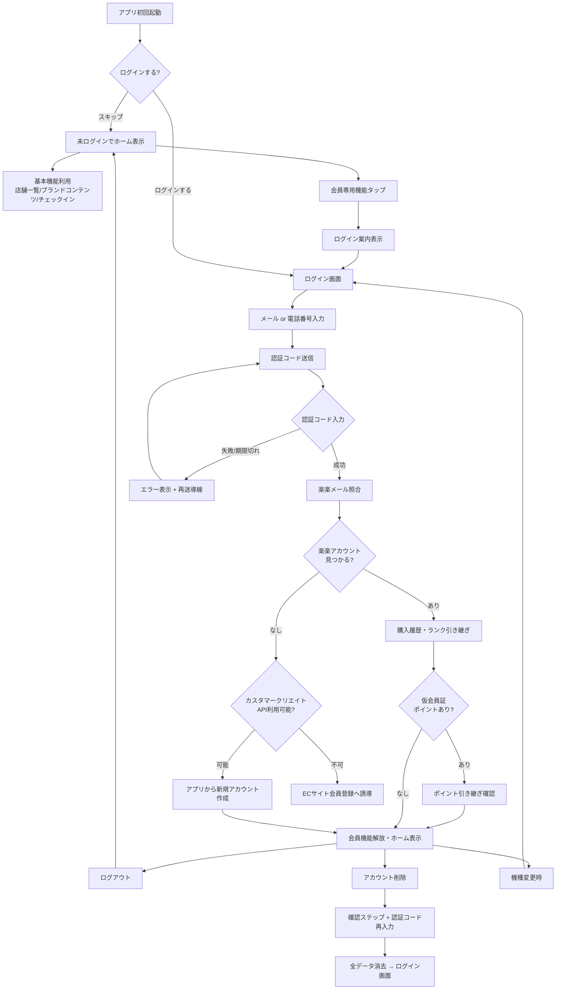

### S-1.1: ログインしなくてもアプリの基本機能を使い始める

**ユーザーストーリー**
> 初めてアプリを開いた人として、ログインせずにアプリの雰囲気や店舗情報を確認したい。
> なぜなら、個人情報を渡す前に、このアプリが自分にとって価値があるか判断したいから。

**できあがり条件**
- [ ] アプリを初回起動した時点で、ログインやアカウント作成を求められずにホーム画面に到達できる
- [ ] 未ログイン状態で店舗一覧（EP-9）・ブランドコンテンツ（S-10.1 / S-10.7）・チェックイン（EP-6）・店舗ポイント照会（EP-5）が利用できる
- [ ] 未ログイン状態で会員証・定期情報・購入履歴にアクセスしようとすると、「ログインして会員特典を解放」の案内が表示される
- [ ] ホーム画面の目立つ位置に「ログインする」導線が常設され、いつでもログインフローに進める
- [ ] 未ログイン状態であることが画面上で分かる表示（アイコン・文言等）がある

---

### S-1.2: メールアドレスまたは電話番号で認証コードを受け取り、会員機能を解放する

**ユーザーストーリー**
> 会員として、いつものメールアドレスか電話番号でアプリの会員機能を解放したい。
> なぜなら、新しい登録をやり直したくないし、自分のステータスを失いたくないから。

**できあがり条件**
- [ ] ログイン画面でメールアドレスまたは電話番号を入力し、「認証コードを送信」できる
- [ ] 認証コードがメール（メールアドレス入力時）またはSMS（電話番号入力時）で届く
- [ ] 受け取った認証コードを入力すると認証が完了し、楽楽のEC顧客データと紐付いて会員情報（氏名・ステータス・定期・履歴）が表示される
- [ ] 認証コードには有効期限があり、期限切れ時は再送導線が表示される
- [ ] 未登録のメールアドレス/電話番号を入力した場合、EC会員登録への案内が表示される
- [ ] ログインに失敗した場合、原因（入力誤り/認証コード不一致/通信エラー等）が分かるメッセージと再試行手段がある
- [ ] ログイン完了後、未ログイン時にはグレーアウトされていた会員専用機能が解放される

---

### S-1.3: 認証後、楽楽アカウントとメール照合で紐付け、購入履歴・ランクを引き継ぐ

**ユーザーストーリー**
> 会員として、認証後に自分の楽楽アカウントの購入履歴やランクがアプリに反映されてほしい。
> なぜなら、ECサイトで積み上げた実績をアプリでも活かしたいから。

**できあがり条件**
- [ ] 認証完了後、入力されたメールアドレスまたは電話番号で楽楽の顧客データベースとメール照合が行われる
- [ ] 照合に成功した場合、楽楽側の購入履歴・ランク・定期情報・ポイント残高がアプリに反映される
- [ ] 照合中はローディング表示があり、結果（成功/該当なし/エラー）が明確に表示される
- [ ] 照合に該当がない場合、「楽楽アカウントが見つかりません」の案内とともにカスタマークリエイト（S-1.4）または手動登録への導線が表示される
- [ ] 照合成功後、仮会員証（S-4.5）で貯めたポイントがある場合、本アカウントへの引き継ぎ（S-4.6）が自動で行われる

---

### S-1.4: 楽楽に未登録の場合、アプリからアカウントを生成して紐付ける

**ユーザーストーリー**
> アプリを気に入った新規の利用者として、EC会員登録を別サイトでやり直すのは面倒なので、アプリからそのまま会員になりたい。
> なぜなら、アプリの中で手続きを完結させたいから。

**できあがり条件**
- [ ] 楽楽に該当アカウントがない場合、「新規会員登録」の導線が表示される
- [ ] アプリ内で必要最小限の情報（メールアドレス・氏名等）を入力し、楽楽のカスタマークリエイトAPIで顧客アカウントが作成される
- [ ] アカウント作成後、自動的にアプリと紐付けが行われ、会員機能が解放される
- [ ] APIが利用不可の場合、ECサイトの会員登録ページへの誘導にフォールバックする
- [ ] 作成されたアカウントのランクはMEMBER（初期値）として設定される

---

### S-1.5: 機種変更後も同じメールアドレス/電話番号で再認証して復帰する

**ユーザーストーリー**
> 会員として、スマホを買い替えても同じ認証情報で復帰したい。
> なぜなら、自分のステータスや購入履歴を失いたくないから。

**できあがり条件**
- [ ] 新端末でアプリをインストールし、同じメールアドレスまたは電話番号で認証コードを受け取りログインすると、同じ会員情報・ステータスに復帰する
- [ ] 旧端末のログイン状態は、旧端末でのログアウト（S-1.7）またはセッション期限切れで無効になる
- [ ] データ移行ツール（iOS→iOS等）によるアプリ移行時も、再認証が求められる（セキュリティ上、認証済みセッションの移行は不可）

---

### S-1.6: 初めてアプリを開いた時、スキップ可能なオンボーディングでアプリ概要を知る

**ユーザーストーリー**
> 会員として、アプリを初めて開いた時に何をすればいいか迷いたくない。
> なぜなら、スマホ操作に不慣れでも自分で進めたいから。

**できあがり条件**
- [ ] 初回起動時、アプリの価値（会員証・ランク確認・定期管理・店舗ポイントなど）が3画面以内で伝わるブランドストーリー画面が表示される
- [ ] ブランドストーリー画面はスキップ可能で、各画面に「スキップ」ボタンが常設されている
- [ ] 楽楽連携のメリット（ランク反映・購入履歴・定期管理・ポイント優遇率）が案内され、「あとで連携」と「いますぐ連携」の選択肢がある
- [ ] ブランドストーリー画面からログイン画面（S-1.2）へスムーズに遷移する
- [ ] 2回目以降の起動では表示されない
- [ ] ログイン完了後、ホーム画面の主要機能（会員証の出し方・タブの使い方）を簡潔にガイドするコーチマーク等がある

---

### S-1.7: ログアウトする

**ユーザーストーリー**
> 会員として、共有端末や機種変更時にログアウトしたい。
> なぜなら、自分の情報を他人に見られたくないから。

**できあがり条件**
- [ ] 設定からログアウトでき、確認ダイアログを経て実行される
- [ ] ログアウト後、会員情報・会員証・履歴等の個人情報が端末上で参照できない（キャッシュ・認証トークンも消去）
- [ ] ログアウト後はログイン画面（S-1.2）に戻り、再度メールアドレス/電話番号で認証すれば同じ会員情報に復帰できる

---

### S-1.8: アカウントを削除（退会）する

**ユーザーストーリー**
> 会員として、利用をやめるときにアカウントを削除したい。
> なぜなら、自分のデータの扱いを自分で決めたいから。

**できあがり条件**
- [ ] アプリ内からアカウント削除の手続きに進める（App Store / Google Play の審査要件）
- [ ] 削除により何が消え、何が残るか（EC会員資格・定期契約・ポイントへの影響）が手続き前に明示される
- [ ] 誤操作防止のため、確認ステップ（「削除する」ボタン→確認ダイアログ→認証コード再入力）を経る
- [ ] 削除完了後、端末上の全データ（キャッシュ・認証情報）が消去され、ログイン画面に戻る

---

## EP-2: 起動演出

ランク別ボルネオ・ズーム演出。毎回再生+スキップ確定済み。ログイン済みの場合のみランク演出を再生。未ログイン時はMEMBER演出またはスキップ。

**ストーリー数:** 1 ｜ **ステータス:** 即着手OK
**依存:** `OP-19 残演出動画`

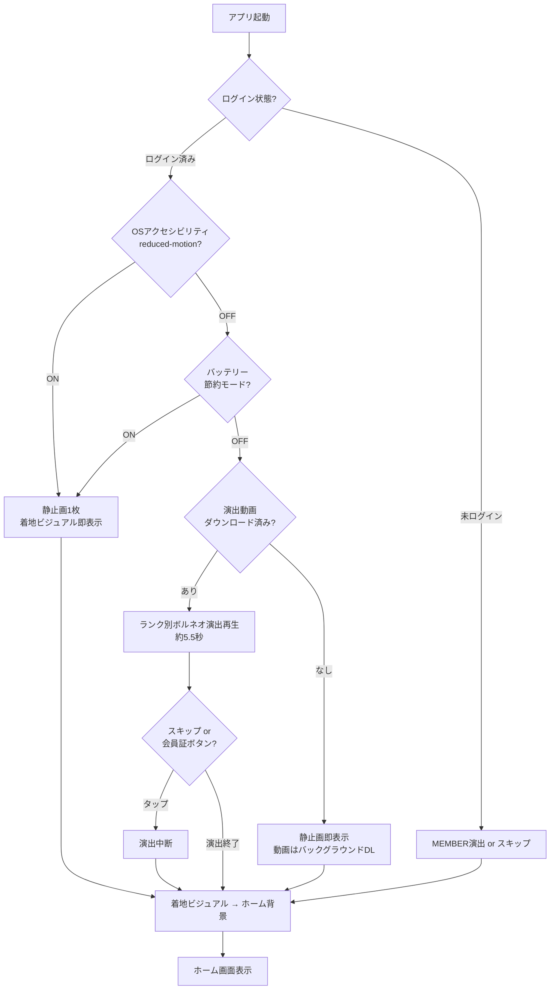

### S-2.1: ランクに応じたボルネオ起動演出を毎回楽しむ

**ユーザーストーリー**
> 会員として、アプリを開くたびに自分のステータスにふさわしい特別な体験をしたい。
> なぜなら、BI-SUの世界（ボルネオの聖地）に近づいていく実感がほしいから。

**できあがり条件**
- [ ] 起動のたびに、ランク別のボルネオ・ズーム演出が再生される（MEMBER=上空→島 / SILVER=島→ジャングル / GOLD=ジャングル→洞窟入口 / PLATINUM=洞窟入口→洞窟内 / DIAMOND=洞窟内→巣）
- [ ] 演出はランクの上下にかかわらず、現在の公式ステータスに基づいて表示される
- [ ] スキップボタンが常設され、いつでも演出を飛ばせる。会員証ボタン（EP-4）への直行時は演出を中断してよい
- [ ] 演出の着地ビジュアルがそのままホーム背景になり、体験が途切れない
- [ ] 演出の再生時間は約5.5秒以内とする
- [ ] OSの「視差効果を減らす」（iOS）/「アニメーションを削除」（Android）設定時は、演出を静止画1枚（着地ビジュアル）に短縮する
- [ ] 動画がまだダウンロードされていない（初回起動・CDN配信時）場合、静止画の着地ビジュアルを即表示し、動画はバックグラウンドで取得して次回起動から再生する
- [ ] バッテリー節約モード中は演出を静止画に短縮してもよい

---

## EP-3: ホーム・ステータス

ランク表示・ポイント残高・進捗バー・3Dロゴ。ホーム画面の中核。未ログイン時はブランドビジュアルと「ログインして会員特典を確認」の案内を表示。ポイント表示は店舗ポイント（EP-5）とEC連動ポイントの両方を想定。

**ストーリー数:** 6 ｜ **ステータス:** 一部待ち
**依存:** `OP-03 ランク集計細部` `OP-05 ポイント仕様`

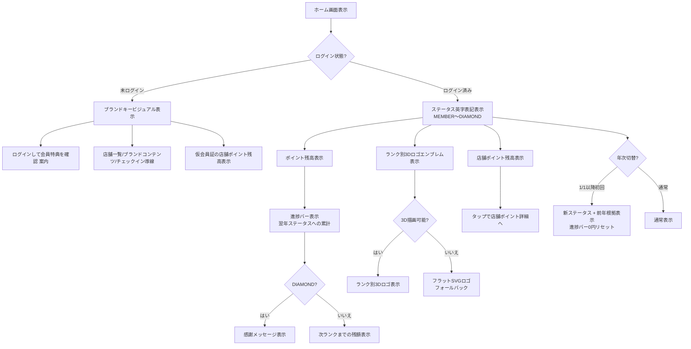

### S-3.1: ステータス・ポイント残高・特典を確認する

**ユーザーストーリー**
> 会員として、いまの自分のステータスとポイント残高、受けられる優待を確認したい。
> なぜなら、自分がどう遇されるのかを知り、BI-SUとの関係を実感したいから。

**できあがり条件**
- [ ] ホームに現在の公式ステータス（MEMBER / SILVER / GOLD / PLATINUM / DIAMOND）が英字表記で表示される
- [ ] 表示されるステータスは「前年1/1〜12/31の購入累計で確定した当年ステータス」である
- [ ] 現在の還元率（100円=Npt）が表示される
- [ ] ポイント残高が表示される
- [ ] ランク別の優待内容（バースデーギフト・シーズナルギフト・イベントご招待）が静的一覧で確認できる
- [ ] 画面に集計ルールの注記（「ステータスは前年1年間（1/1〜12/31）のご購入累計額で決まり、当年1年間適用されます」）が表示される

---

### S-3.2: 翌年ステータスへの進捗を確認する

**ユーザーストーリー**
> 会員として、今年いくら購入していて、次のランクまであといくらかを知りたい。
> なぜなら、翌年のステータスを意識した買い物の楽しみがほしいから。

**できあがり条件**
- [ ] 今年（1/1〜現在）の購入累計額が表示される
- [ ] 次のランク閾値（30万/50万/100万/200万円）までの残額と進捗バーが表示される
- [ ] 進捗は「翌年ステータスの見込み」であることが分かる表現になっている（現ステータスとの混同を防ぐ）
- [ ] 当年累計が現ステータスの閾値未満でも、マイナス等の不自然な表示にならない
- [ ] DIAMOND会員には進捗の代わりに最上位への感謝メッセージが表示される

---

### S-3.3: 年次のステータス切替わりを理解する

**ユーザーストーリー**
> 会員として、年が変わって自分のステータスがどうなったかを正しく知りたい。
> なぜなら、新しい1年の優待と目標を、誤解なく把握したいから。

**できあがり条件**
- [ ] 1/1以降にアプリを開くと、新しい当年ステータスと、その根拠（前年の購入累計）が確認できる
- [ ] 進捗バー・当年累計は0円から再スタートし、前年の数値と混在しない
- [ ] ステータスが下がった場合も、否定的な文言を使わず、現ステータス準拠の演出・表示で迎える
- [ ] 切替時期（1/1）と適用期間が画面の注記で確認できる

---

### S-3.4: 3Dロゴエンブレムがランクに応じて表示される

**ユーザーストーリー**
> 会員として、自分のランクを象徴する美しいロゴを見たい。
> なぜなら、BI-SUの世界観に包まれている実感が持てるから。

**できあがり条件**
- [ ] ホーム画面にBI-SUロゴの3D表現が表示される
- [ ] ランクによってロゴの色味が切り替わる（MEMBER=シャンパン / SILVER=シルバー / GOLD=ゴールド / PLATINUM=青系 / DIAMOND=深紅系）
- [ ] 3D描画が不可能な端末（GPU制限等）ではフラットなSVGロゴにフォールバックする
- [ ] ロゴの3D形状は公式ベクターデータを基にする（入手前は手作業トレース版で代替）

---

### S-3.5: 未ログイン時でもホーム画面でブランドの世界観に触れる

**ユーザーストーリー**
> 初めてアプリを開いた人として、ログインしていなくてもBI-SUの世界観を感じられるホーム画面を見たい。
> なぜなら、アプリをインストールしたことに価値を感じ、もっと知りたいと思えるから。

**できあがり条件**
- [ ] 未ログイン時のホーム画面にBI-SUブランドのキービジュアル（ボルネオ・アナツバメ等）が表示される
- [ ] ランク・ポイント・定期情報の代わりに「ログインして会員特典を確認」の案内が表示される
- [ ] 案内からログインフロー（S-1.2）にワンタップで遷移できる
- [ ] 店舗一覧・ブランドコンテンツ・チェックインへの導線がホーム画面から利用できる
- [ ] 未ログインでもホーム画面のデザイン品質（ブランドトンマナ・レイアウト）がログイン時と同等である

---

### S-3.6: 店舗ポイントの残高をホームで確認する

**ユーザーストーリー**
> 来店するたびにポイントを貯めている会員として、いま何ポイント持っているかをホーム画面ですぐ確認したい。
> なぜなら、次の買い物やクーポン交換の計画を立てたいから。

**できあがり条件**
- [ ] ホーム画面に店舗ポイントの残高が表示される
- [ ] ECポイント（楽楽連携）と店舗ポイントが別々に表示され、混同しない
- [ ] 未ログイン状態でも、仮会員証（S-4.5）で貯めた店舗ポイントの残高が表示される
- [ ] ポイント残高をタップすると店舗ポイント詳細（S-5.2）に遷移する

---

## EP-4: 会員証・店頭提示

バーコード表示を先行実装。未登録ユーザーには仮会員証を発行し、来店ポイントのみ反映。本登録後にランク等を反映。オフライン保証・輝度制御は継続。

**ストーリー数:** 6 ｜ **ステータス:** 一部待ち
**依存:** `OP-01 会員証仕様` `OP-27 店舗スキャナ環境`

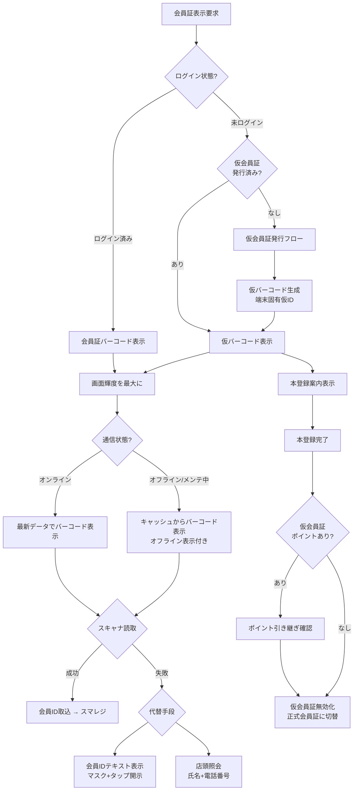

### S-4.1: レジでバーコードを提示して素早く会員証を見せる

**ユーザーストーリー**
> 会員として、レジで待たせずに会員証を提示したい。
> なぜなら、後ろのお客様を気にせず、スムーズに会計を済ませたいから。

**できあがり条件**
- [ ] ホームのファーストビューから1タップで会員証バーコードを表示できる
- [ ] アプリのコールドスタートから、スキップ操作1回を含めてバーコード表示まで3秒以内（自動計測: アイコンタップ起点〜バーコード描画完了）
- [ ] 起動演出中もスキップ・会員証ボタンが常時表示され、タップから0.3秒以内に反応する
- [ ] バーコード表示中は画面輝度が端末の最大値に引き上げられる
- [ ] バーコードには会員IDが含まれ、会員ランクは含まれない（ランクはスマレジ/EC側データを正とする）

---

### S-4.2: 電波なし・メンテ中でも会員証を使う

**ユーザーストーリー**
> 会員として、地下の店舗（GINZA SIX B1F等）で電波がなくても、システムメンテナンス中でも会員証を提示したい。
> なぜなら、レジの前で「表示できない」と慌てたくないから。

**できあがり条件**
- [ ] 機内モード・圏外の状態でも、バーコードが表示される（事前生成・キャッシュ）
- [ ] オフライン時に表示されるコードでも、店舗で会員特定が可能である
- [ ] サーバメンテナンス・API障害中も、会員証バーコードはキャッシュから表示できる
- [ ] オフライン・メンテ中はその旨が表示され、最新でない可能性のあるデータ（ポイント等）と区別できる

---

### S-4.3: （スタッフ）バーコードから会員ID取込

**ユーザーストーリー**
> 店舗スタッフとして、会員のバーコードをその場で読み取って会員IDをスマレジに取り込みたい。
> なぜなら、入力の手間とミスをなくし、接客に集中したいから。

**できあがり条件**
- [ ] アプリが表示するバーコードを、スマレジ（または接続スキャナ）で読み取ると会員IDが転記される
- [ ] バーコードのコード体系がスマレジの読取仕様と一致している
- [ ] 読み取り→会員特定までがレジ操作の流れの中で完結する（別端末・別アプリへの持ち替えがない）
- [ ] 購入データの履歴・累計への反映は S-8.2 で受け入れる（本ストーリーは読み取り・転記まで）

---

### S-4.4: バーコードが読めない時に代替手段で本人確認する

**ユーザーストーリー**
> 会員として、スマホの電池切れやアプリ不調のときでも会員として扱ってほしい。
> なぜなら、せっかく店舗まで来たのに優待を受けられないのは悲しいから。

**できあがり条件**
- [ ] バーコード画面から会員IDをテキストで確認できる（プライバシー配慮のためマスク表示+タップで開示）
- [ ] バーコードの生成に失敗した場合、自動で会員IDテキスト表示の代替に切り替わる
- [ ] スマホ自体を出せない場合の店頭照会手順（氏名+電話番号等）が店舗オペレーションとして定義されている

---

### S-4.5: 未登録でも仮会員証を取得し、店舗ポイントを貯める

**ユーザーストーリー**
> 初めて店舗を訪れた人として、会員登録なしでもすぐにポイントを貯め始めたい。
> なぜなら、レジで長い登録手続きをしたくないし、まずはお試しで使ってみたいから。

**できあがり条件**
- [ ] 未ログイン状態でアプリを起動し、「仮会員証を発行」から仮バーコードを取得できる
- [ ] 仮会員証には端末固有の仮IDが含まれ、店舗スキャナで読み取り可能である
- [ ] 仮会員証で来店ポイント・購入ポイント（店舗ポイント）を受け取れる
- [ ] 仮会員証であることが画面上で明示され、「本登録でさらに特典が広がる」案内が表示される
- [ ] 仮会員証はオフラインでも表示される（端末ローカルで生成・保持）

---

### S-4.6: 仮会員証で貯めたポイントを、本登録後のアカウントに引き継ぐ

**ユーザーストーリー**
> 仮会員証でポイントを貯めていた利用者として、正式に会員登録した後もポイントを失いたくない。
> なぜなら、お試し期間の来店実績を無駄にしたくないから。

**できあがり条件**
- [ ] ログイン（S-1.2）完了時に、端末に紐づく仮会員証のポイントが検出され、引き継ぎの確認が表示される
- [ ] 引き継ぎを承認すると、仮会員証の店舗ポイントが本アカウントに合算される
- [ ] 引き継ぎ完了後、仮会員証は無効化され、以後は正式な会員証（S-4.1）が表示される
- [ ] 引き継ぎの処理結果（成功/失敗/該当ポイントなし）が明確に表示される
- [ ] 同一端末で複数回の仮→本登録が行われた場合、二重引き継ぎが発生しない

---

## EP-5: 店舗ポイント

ECの「BASE」ポイントとは独立した店舗専用ポイント。ログインなしでも付与可能。ポイントの用途（クーポン交換等）は後続の企画で決定。

**ストーリー数:** 5 ｜ **ステータス:** 要決定
**依存:** `OP-28 店舗ポイント仕様` `OP-05 ポイント仕様`

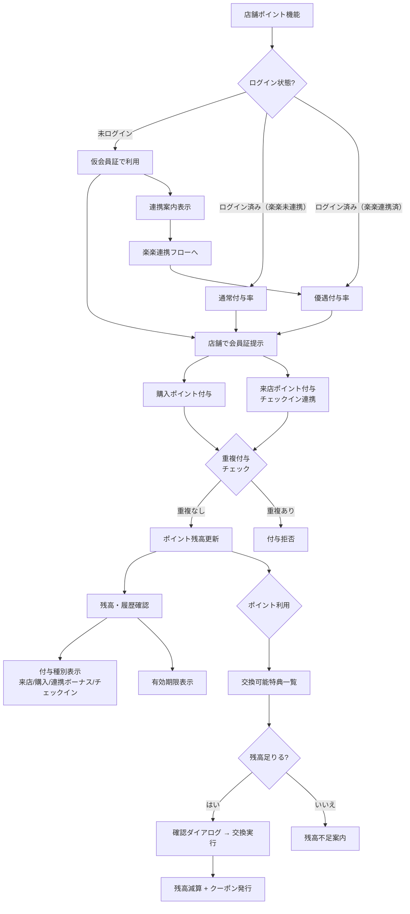

### S-5.1: 店舗で買い物や来店時にポイントを受け取る

**ユーザーストーリー**
> 店舗を訪れた利用者として、買い物や来店でポイントを受け取りたい。
> なぜなら、店舗に足を運ぶ楽しみが増え、次の来店の動機になるから。

**できあがり条件**
- [ ] 店頭で会員証（または仮会員証）のバーコードを提示すると、購入金額に応じたポイントが付与される
- [ ] チェックイン（EP-6）による来店ポイントも店舗ポイントとして付与される
- [ ] ポイント付与後、アプリの残高表示に反映されるまでの目安時間が定義されている
- [ ] 未ログイン（仮会員証）でもポイントが付与・蓄積される
- [ ] 同一来店での重複付与を防止する仕組みがある

---

### S-5.2: 貯まったポイントの残高と履歴を確認する

**ユーザーストーリー**
> ポイントを貯めている利用者として、いま何ポイント持っていて、いつどこで貯まったかを確認したい。
> なぜなら、ポイントの増減を把握し、利用計画を立てたいから。

**できあがり条件**
- [ ] 店舗ポイントの現在残高が表示される
- [ ] ポイント履歴（付与日時・付与元店舗・付与理由・増減ポイント数）が一覧で確認できる
- [ ] 履歴は新しい順に並び、20件ずつ追加読み込みできる
- [ ] ポイントに有効期限がある場合、期限が表示される
- [ ] 履歴が0件の場合、ポイントの貯め方を案内する空状態表示がある

---

### S-5.3: ポイントをクーポンや特典と交換する

**ユーザーストーリー**
> ポイントが貯まった会員として、ポイントを何かお得なものと交換したい。
> なぜなら、貯める目的があるとモチベーションが上がるから。

**できあがり条件**
- [ ] 交換可能な特典・クーポンの一覧が表示され、必要ポイント数が明示されている
- [ ] 残高が足りる特典を選択し、交換を実行できる（確認ダイアログを経る）
- [ ] 交換完了後、ポイント残高が即座に減算表示される
- [ ] 交換で取得したクーポンの利用方法・有効期限が表示される
- [ ] 特典ラインナップが未確定の場合、「準備中」の案内が表示される

---

### S-5.4: ポイントの付与理由と種別がわかる

**ユーザーストーリー**
> ポイントの内訳が気になる会員として、なぜポイントが増えたのかを確認したい。
> なぜなら、来店ボーナスなのか購入分なのか区別して、貯め方を工夫したいから。

**できあがり条件**
- [ ] ポイント履歴の各エントリに付与種別（来店ポイント / 購入ポイント / 連携ボーナス / チェックイン等）が表示される
- [ ] 種別ごとにアイコンまたはラベルで視覚的に区別できる
- [ ] 購入ポイントには対象の購入金額が併記される
- [ ] 連携ボーナス（楽楽連携時の優遇分）は通常付与と区別して表示される

---

### S-5.5: ログインで楽楽連携すると、ポイント付与率が優遇される

**ユーザーストーリー**
> 楽楽連携をまだしていない利用者として、連携するとどれくらいお得かを知りたい。
> なぜなら、メリットが具体的なら連携に踏み切れるから。

**できあがり条件**
- [ ] 未連携状態のポイント付与率と、楽楽連携後の優遇付与率が比較できる形で案内される
- [ ] 楽楽連携後、次回のポイント付与から優遇率が適用される
- [ ] 連携案内は店舗ポイント画面とホーム画面の両方に表示される
- [ ] 連携案内から楽楽連携フロー（S-1.2→S-1.3）にスムーズに遷移できる

---

## EP-6: チェックイン

レジ以外で来店を記録する機能。お客様が店内QRを読み取る方式も候補。導入判断は企画側で確定後。

**ストーリー数:** 3 ｜ **ステータス:** 要決定
**依存:** `OP-29 チェックイン仕様`

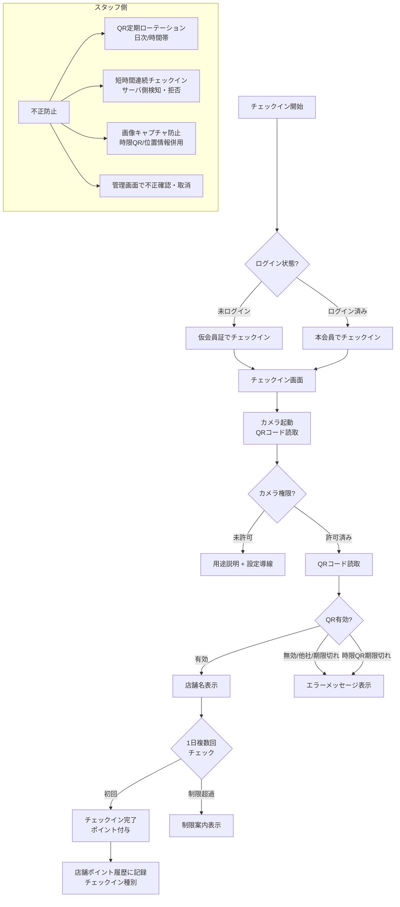

### S-6.1: 店舗に来店したことを記録し、ポイントを受け取る

**ユーザーストーリー**
> 店舗を訪れた利用者として、買い物をしなくても来店したことを記録してポイントを受け取りたい。
> なぜなら、「見に行くだけ」でもBI-SUとのつながりを感じ、次の来店が楽しみになるから。

**できあがり条件**
- [ ] 店舗に来店した際、アプリでチェックイン操作を行うと来店ポイントが付与される
- [ ] チェックイン成功時に、付与ポイント数と「チェックイン完了」の表示がある
- [ ] 同一店舗への1日複数回チェックインが制限される（制限ルールはOP-29で確定）
- [ ] チェックイン履歴が店舗ポイント履歴（S-5.2）に「チェックイン」種別で記録される
- [ ] 未ログイン（仮会員証）でもチェックインが可能である

---

### S-6.2: 店内のQRコードを読み取ってチェックインする

**ユーザーストーリー**
> 店舗を訪れた利用者として、店内に掲示されたQRコードをスマホで読み取ってチェックインしたい。
> なぜなら、操作が簡単で、自分のタイミングでできるから。

**できあがり条件**
- [ ] アプリ内の「チェックイン」画面からカメラを起動し、店舗設置のQRコードを読み取れる
- [ ] QRコードの読み取りに成功すると、店舗名が表示されチェックインが完了する
- [ ] カメラ権限が未許可の場合、用途説明と設定への導線が表示される
- [ ] 無効なQR（他社QR・期限切れ等）を読み取った場合、エラーメッセージが表示される
- [ ] 読み取りからチェックイン完了まで3秒以内で完了する

---

### S-6.3: （スタッフ）チェックインの不正利用を防止する

**ユーザーストーリー**
> 店舗スタッフとして、チェックイン機能が不正に利用されないようにしたい。
> なぜなら、ポイントの公正さを保ち、来店する会員が正しく優遇されるべきだから。

**できあがり条件**
- [ ] 店舗設置のQRコードは定期的にローテーション（日次/時間帯等）される仕組みがある
- [ ] 同一端末からの短時間連続チェックインがサーバ側で検知・拒否される
- [ ] QRコードの画像キャプチャによる店外からのチェックインを防止する仕組み（時限QR・位置情報併用等）が検討・定義されている
- [ ] 不正が疑われるチェックインを管理画面等で確認・取消できる運用フローがある

---

## EP-7: 定期情報

定期コースの閲覧専用ミラー。変更操作はECマイページへ橋渡し。ログイン必須機能。

**ストーリー数:** 5 ｜ **ステータス:** 一部待ち
**依存:** `OP-24 EC基盤API`

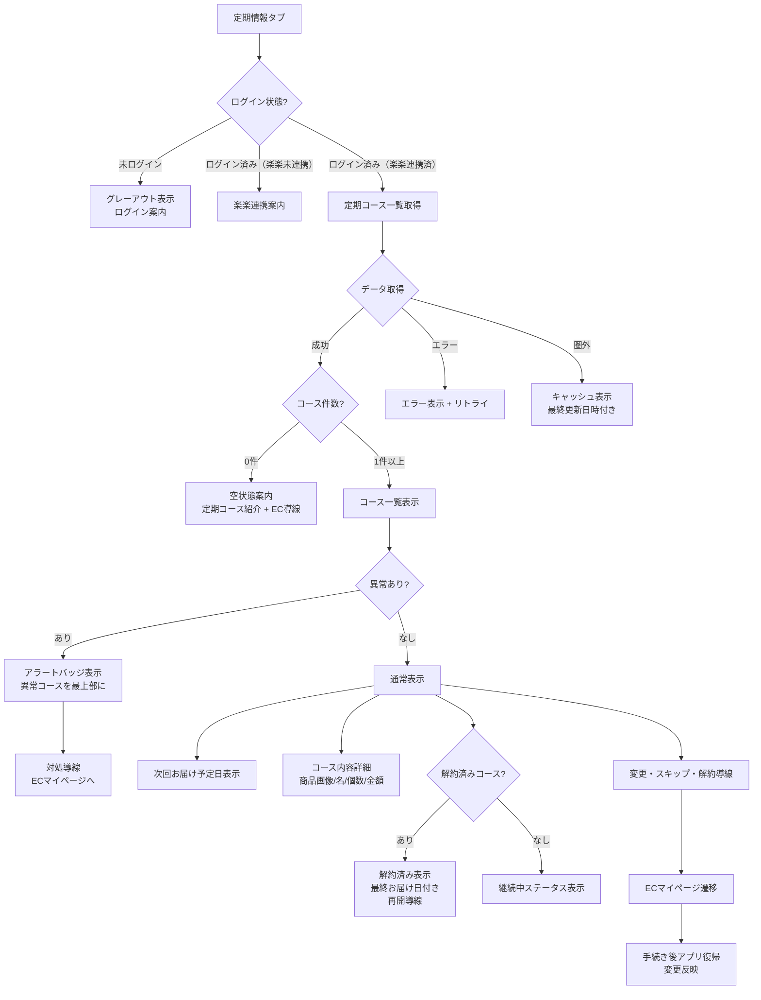

### S-7.1: 次回お届けを確認する

**ユーザーストーリー**
> 会員として、次の定期便がいつ届くかをすぐ確認したい。
> なぜなら、受け取りの予定を立て、飲み忘れなく続けたいから。

**できあがり条件**
- [ ] 利用中の各定期コースに、次回お届け予定日が表示される
- [ ] お届けサイクル（30日ごと等）が表示される
- [ ] 表示はECシステムの最新データと一致する

---

### S-7.2: 定期コースの内容を確認する

**ユーザーストーリー**
> 会員として、自分がどの定期コースを、いくらで、何個受け取っているか確認したい。
> なぜなら、家計の把握と、コース内容の思い違い防止のためだ。

**できあがり条件**
- [ ] 各コースに商品画像・商品名・個数・金額（税込）が表示される
- [ ] 複数の定期コースを契約している場合、すべて一覧で確認できる
- [ ] ステータス（継続中など）がひと目で分かる
- [ ] 定期コースが0件の場合、空状態の案内と定期コースの紹介（ECへの導線）が表示される

---

### S-7.3: 定期の変更手続きへ進む（ECマイページ誘導）

**ユーザーストーリー**
> 会員として、お届け日の変更やスキップをしたいとき、アプリから迷わず手続きに進みたい。
> なぜなら、電話をかけずに自分のタイミングで済ませたいから。

**できあがり条件**
- [ ] 各定期コースから「変更・スキップ・解約のお手続き」への導線があり、ECマイページの該当ページへ遷移できる
- [ ] 次回お届けの変更締切日（何日前まで変更可能か）が表示される
- [ ] 手続き後にアプリへ戻ると、変更が反映された表示になる

---

### S-7.4: 解約済みの定期を確認する

**ユーザーストーリー**
> 会員として、以前利用していた定期コースを確認したい。
> なぜなら、「また再開しようか」を考える材料にしたいから。

**できあがり条件**
- [ ] 解約済みコースが利用中と区別されて表示される（最終お届け日付き）
- [ ] 解約後12ヶ月以内のコースが表示される
- [ ] 解約済みコースから再開・再購入導線（ECへの遷移）がある

---

### S-7.5: 定期の異常（決済不備等）に気づく

**ユーザーストーリー**
> 会員として、定期便が止まりそうなとき（カード期限切れ等）に早く気づきたい。
> なぜなら、「届くはずのものが届かない」を避けたいから。

**できあがり条件**
- [ ] 決済エラーや一時停止などの異常状態が、通常の「継続中」と明確に区別して表示される
- [ ] 異常がある場合、ホームと定期情報タブにアラートバッジが表示され、該当コースが一覧の最上部に表示される
- [ ] 異常状態のコースには対処方法（ECマイページでのカード更新等）への導線が表示される
- [ ] 重要なお知らせ（決済不備等）はPUSH通知でも届く（S-10.2の「重要なお知らせ」カテゴリ=常時ON）

---

## EP-8: 購入履歴

ネット注文・店頭購入を横断した購入の記録。会員の「自分の買い物の控え」であり、CS問い合わせの自己解決装置。ログイン必須機能。

**ストーリー数:** 5 ｜ **ステータス:** 一部待ち
**依存:** `OP-15 履歴表示範囲` `OP-24 EC基盤API`

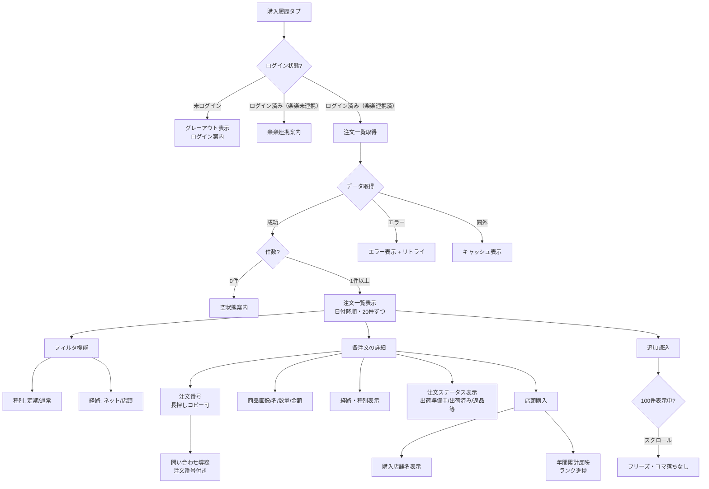

### S-8.1: 過去の注文を確認する

**ユーザーストーリー**
> 会員として、過去に何をいつ買ったか確認したい。
> なぜなら、「前に買ったのはどれだったか」を思い出して、次の買い物や問い合わせに使いたいから。

**できあがり条件**
- [ ] 注文一覧に、各注文の日付・注文番号・商品画像・商品名・数量・金額（税込）が表示される
- [ ] 表示日付の定義: ネット注文=出荷日、店頭購入=購入日。一覧はこの日付の降順で並ぶ
- [ ] 注文の種別（定期購入 / 通常購入）と経路（ネット注文 / 店頭購入）が表示される
- [ ] 1注文に複数商品が含まれる場合、全商品が確認できる
- [ ] 過去24ヶ月分を対象とし、20件ずつ追加読み込みできる
- [ ] 履歴が0件の場合、空状態の案内が表示される

---

### S-8.2: 店頭購入も履歴で確認する

**ユーザーストーリー**
> 会員として、店舗で買ったものもアプリの履歴で見たい。
> なぜなら、ネットと店舗を分けずに、BI-SUとの買い物をひとつの記録として持ちたいから。

**できあがり条件**
- [ ] 会員証を提示して店頭購入した注文が履歴に表示される
- [ ] 店頭購入には購入店舗名が表示される
- [ ] 店頭購入が年間購入累計（ステータス進捗）に反映される（包含が確定した場合）
- [ ] 店頭購入が履歴に反映されるまでの目安時間が定義され、ユーザーに分かる

---

### S-8.3: 目的の注文を素早く見つける

**ユーザーストーリー**
> 会員として、目当ての注文をすぐ見つけたい。
> なぜなら、履歴が増えても探すのに時間をかけたくないから。

**できあがり条件**
- [ ] 種別（定期/通常）・経路（ネット/店頭）で一覧を絞り込める
- [ ] 一覧はS-8.1の表示日付の降順で並び、スクロールで遡れる
- [ ] 100件読み込み済みの状態でも、スクロールにフリーズ・コマ落ちが発生しない
- [ ] 追加読み込み中は1秒以内にローディング表示が出る

---

### S-8.4: 問い合わせ時に注文番号を示す

**ユーザーストーリー**
> 会員として、問い合わせのときに注文番号をすぐ伝えたい。
> なぜなら、CSとのやりとりを早く正確に済ませたいから。

**できあがり条件**
- [ ] 各注文の注文番号が表示され、長押し等でコピーできる
- [ ] 注文の詳細表示から問い合わせ導線（S-10.4と同じ窓口）に進める
- [ ] アプリの表示とECの正式記録が食い違った場合の正本がECであることが利用案内に明記される

---

### S-8.5: 注文のいまの状態を知る

**ユーザーストーリー**
> 会員として、注文した商品がいまどういう状態か（出荷前・出荷済み・返品済み）を知りたい。
> なぜなら、「注文したのに履歴に出ない」「返したのに載っている」という不安を持ちたくないから。

**できあがり条件**
- [ ] 出荷前の注文が「出荷準備中」等のステータス付きで表示される。表示対象外とする場合は、その旨の案内文言が一覧にある
- [ ] 返品・キャンセルされた注文が、通常の注文と区別されて表示される
- [ ] 表示する注文ステータスの列挙が、ECシステムの実際のステータス値と一致している

---

## EP-9: 店舗一覧

会員を店舗へ案内し、迷わせず到着させる。店舗送客=アプリの主目的のひとつ。未ログインでも全機能利用可能。

**ストーリー数:** 5 ｜ **ステータス:** 一部待ち
**依存:** `OP-11 位置情報UX` `OP-20 地図方式`

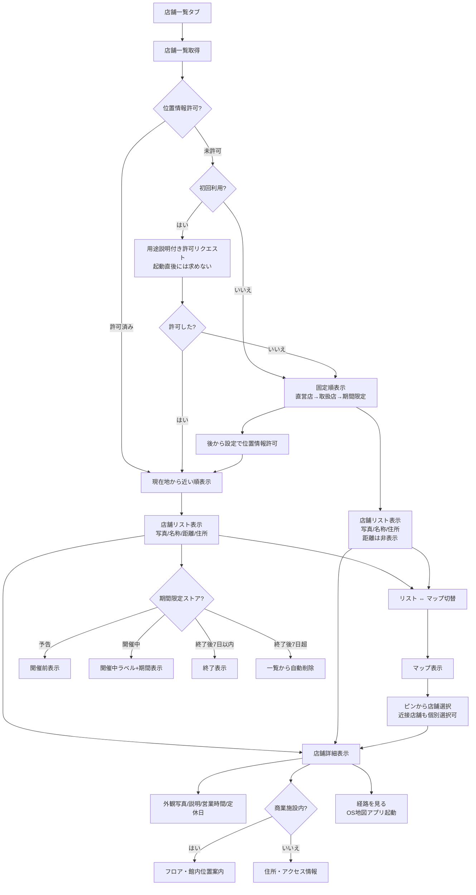

### S-9.1: 近くの店舗を探す

**ユーザーストーリー**
> 会員として、自分の近くにBI-SUの店舗があるか知りたい。
> なぜなら、実際に手に取り、相談しながら選びたいから。

**できあがり条件**
- [ ] 店舗がリスト表示され、各店舗に外観写真・店舗名・現在地からの距離・住所が表示される
- [ ] 位置情報許可時は現在地から近い順に並ぶ。未許可時は固定順（直営店→取扱店→期間限定）で表示される
- [ ] 距離は実際の現在地から計算される（位置情報許可時）
- [ ] 店舗区分（直営店 / 取扱店 / 期間限定）がひと目で区別できる
- [ ] 店舗データの追加・変更がアプリ更新なしで反映できる仕組みである

---

### S-9.2: 地図で店舗の位置をつかむ

**ユーザーストーリー**
> 会員として、店舗の位置関係を地図で見たい。
> なぜなら、旅行先や外出先で「行ける場所か」を直感的に判断したいから。

**できあがり条件**
- [ ] リスト⇔マップをワンタップで切り替えられる
- [ ] 地図上のピンから店舗を選び、詳細へ進める
- [ ] 複数店舗が近接するエリア（東京・京都）でも個別の店舗を選択できる

---

### S-9.3: 店舗の詳細を見て迷わず行く

**ユーザーストーリー**
> 会員として、行くと決めた店舗の場所・行き方・営業時間を知りたい。
> なぜなら、「着いたのに閉まっていた」「館内で見つからない」を避けたいから。

**できあがり条件**
- [ ] 店舗詳細に外観写真・説明文・営業時間・定休日・電話番号（公開店舗のみ）・住所・アクセスが表示される
- [ ] 商業施設内の店舗は、フロアと館内のおおよその位置が分かる案内（フロアマップ等）がある
- [ ] 「経路を見る」からOSの地図アプリが起動し、店舗への経路案内が始まる
- [ ] 営業時間・定休日は公式情報と一致している

---

### S-9.4: 期間限定ストアを知る

**ユーザーストーリー**
> 会員として、近くで開催されるポップアップストアを見逃したくない。
> なぜなら、期間限定の機会に実物を見たいから。

**できあがり条件**
- [ ] 期間限定店舗は「予告（開催前）」「開催中」「終了」の3状態で管理される
- [ ] 開催期間が明示され、開催中であることがひと目で分かる
- [ ] 終了後7日間は「終了しました」表示で一覧に残り、その後自動的に一覧から消える

---

### S-9.5: 位置情報を許可せずに店舗を探す

**ユーザーストーリー**
> 会員として、位置情報を渡さなくても店舗一覧は使いたい。
> なぜなら、プライバシーは自分でコントロールしたいから。

**できあがり条件**
- [ ] 位置情報の許可は店舗機能の初回利用時に、用途の説明付きで求められる（起動直後に求めない）
- [ ] 許可しない場合も店舗一覧・地図・詳細は利用できる（距離のみ非表示）
- [ ] 後から設定で許可した場合、距離表示が有効になる

---

## EP-10: 設定・サポート・多言語

ブランドコンテンツ・通知設定・プロフィール/支払い（EC誘導）・問い合わせ・規約。多言語対応（日本語/English）を追加。ブランド理念ページは未ログインでも閲覧可能。

**ストーリー数:** 7 ｜ **ステータス:** 一部待ち
**依存:** `OP-08 設定v1スコープ` `OP-09 通知要否` `OP-14 問い合わせ導線` `OP-30 多言語対応範囲`

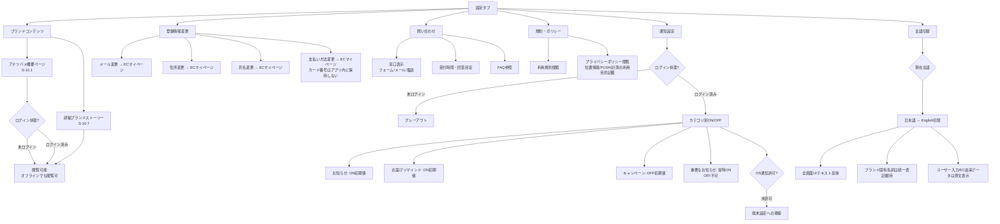

### S-10.1: アナツバメとブランドの物語を知る（未ログインでも可）

**ユーザーストーリー**
> 会員として、アナツバメとツバメの巣のことをもっと知りたい。
> なぜなら、自分が口にしているものの背景（ボルネオの洞窟・自然との共生）を理解して、安心と愛着を持ちたいから。

**できあがり条件**
- [ ] 「アナツバメについて」のコンテンツページがあり、アナツバメ・ボルネオの洞窟・巣の採取（ヒナが巣立った後の巣のみを採取するサステナビリティ）の物語が読める
- [ ] 起動演出と同一のキービジュアル・カラーパレットを使用し、ブランド責任者のレビュー承認を得ている
- [ ] 効能・効果を断定する表現を含まない（薬機法・景品表示法チェックを通過している）
- [ ] オフラインでも閲覧できる（アプリ内蔵コンテンツ）
- [ ] 未ログインでも閲覧可能である（認証状態に関わらずアクセスできる）

---

### S-10.2: PUSH通知の配信を設定する

**ユーザーストーリー**
> 会員として、受け取る通知を自分で選びたい。
> なぜなら、必要なお知らせは逃さず、不要な通知には煩わされたくないから。

**できあがり条件**
- [ ] 通知のカテゴリ別ON/OFF（お知らせ / お届け予定のリマインド / キャンペーン情報）が設定できる
- [ ] 「重要なお知らせ」（決済不備等・S-7.5連携）は常時ONで、OFFにできないことが明示される
- [ ] 初期値: お知らせ=ON / お届けリマインド=ON / キャンペーン=OFF
- [ ] OSの通知許可が未許可の場合、その旨と端末設定への導線が表示される
- [ ] OFFにしたカテゴリの通知は配信されない（配信基盤側と連動する）

---

### S-10.3: 登録情報・お支払い方法を変更する（ECマイページ誘導）

**ユーザーストーリー**
> 会員として、引っ越しやカード期限切れのときに登録情報を最新にしたい。
> なぜなら、定期便や大切な連絡を確実に受け取りたいから。

**できあがり条件**
- [ ] 設定から「メールアドレス変更」「住所変更」「氏名変更」「お支払い方法変更」それぞれの手続きに進める（ECマイページの該当ページへ遷移）
- [ ] メール変更完了後、アプリの表示メールアドレスが更新される
- [ ] 住所変更時、定期コースの次回お届けへの適用タイミングが案内される
- [ ] 氏名変更後、アプリのホーム・会員証・設定に表示される氏名が更新される
- [ ] アプリ内でカード番号を入力・保持・フル表示しない
- [ ] S-7.5（決済異常）の対処導線と同じ着地である

---

### S-10.4: 問い合わせる

**ユーザーストーリー**
> 会員として、困ったときにアプリから問い合わせたい。
> なぜなら、電話窓口を探し回らずに解決したいから。

**できあがり条件**
- [ ] 設定に「お問い合わせ」があり、窓口（フォーム/メール/電話等）に進める
- [ ] 受付時間・回答目安が表示される
- [ ] よくあるご質問（FAQ）が参照でき、自己解決を試せる

---

### S-10.5: 規約・プライバシーポリシーを確認する

**ユーザーストーリー**
> 会員として、利用規約とプライバシーポリシーをいつでも確認したい。
> なぜなら、自分の情報がどう扱われるかを知っておきたいから。

**できあがり条件**
- [ ] 設定から利用規約・プライバシーポリシーが閲覧できる
- [ ] プライバシーポリシーに位置情報・PUSH通知・利用状況計測の利用目的が記載されている
- [ ] 文書の改定時に最新版が表示される

---

### S-10.6: アプリの表示言語を日本語/Englishで切り替える

**ユーザーストーリー**
> 日本語以外を母語とする会員として、アプリの表示言語を英語に切り替えたい。
> なぜなら、自分が読みやすい言語で情報を確認し、安心して利用したいから。

**できあがり条件**
- [ ] 設定から表示言語を日本語/Englishで切り替えられる
- [ ] 言語切替後、全画面のUIテキスト（ボタン・ラベル・案内文）が選択言語で表示される
- [ ] 未ログインでも言語切替が可能である
- [ ] ブランド固有名詞（BI-SU / CLUB MEMBERS PROGRAM / ランク名等）は言語によらず統一表記を維持する
- [ ] 翻訳対象外のコンテンツ（ユーザー入力データ・EC由来のデータ）は原文のまま表示される

---

### S-10.7: BI-SUの理念・アナツバメの物語を深く知る（コンテンツページ）

**ユーザーストーリー**
> BI-SUに興味を持った人として、ブランドの理念やアナツバメの物語をもっと深く読みたい。
> なぜなら、BI-SUが大切にしていること（自然との共生・サステナビリティ）を理解し、共感したいから。

**できあがり条件**
- [ ] S-10.1の概要ページとは別に、より詳細なブランドストーリーページが用意されている
- [ ] ボルネオの自然・アナツバメの生態・巣の採取方法・サステナビリティへの取り組みが、写真とテキストで構成されている
- [ ] 効能・効果を断定する表現を含まない（薬機法・景品表示法チェックを通過している）
- [ ] 未ログインでも閲覧可能である
- [ ] オフラインでも閲覧できる（アプリ内蔵コンテンツ、または初回閲覧時にキャッシュ）
- [ ] ブランド責任者のレビュー承認を得ている

---

## EP-11: アプリ基盤・デザインシステム

Flutterプロジェクトの骨格・ナビゲーション・ブランドテーマ・共通コンポーネント。ハイブリッド方式に対応し、未ログイン/ログイン済みの画面状態パターンを基盤レベルで設計。全ユーザー体験Epicの土台。

**ストーリー数:** 5 ｜ **ステータス:** 即着手OK

```mermaid
flowchart TD
    A[EP-11: アプリ基盤] --> B[S-11.1<br/>Flutter初期化・CI/CD]
    A --> C[S-11.2<br/>タブナビ・画面遷移]
    A --> D[S-11.3<br/>ブランドテーマ]
    A --> E[S-11.4<br/>共通UIコンポーネント]
    A --> F[S-11.5<br/>状態管理パターン]

    B --> B1[Flutter最新安定版<br/>iOS/Androidビルド通過]
    B --> B2[ディレクトリ構成<br/>features/shared/core]
    B --> B3[状態管理: Riverpod<br/>ルーティング/DI方針]
    B --> B4[GitHub Actions CI/CD]
    B --> B5[ビルドフレーバー分離<br/>開発/ステージング/本番]

    C --> C1[フッター5タブ配置]
    C --> C2[スタック遷移<br/>一覧→詳細→戻る]
    C --> C3[モーダル共通パターン]
    C --> C4[画面遷移図ドキュメント]
    C --> C5[ディープリンク拡張ポイント]

    D --> D1[ThemeData定義<br/>アイボリー/シャンパンゴールド/5ランクカラー]
    D --> D2[明朝系フォント同梱<br/>Noto Serif JP等]
    D --> D3[ランク別テーマ切替]
    D --> D4[アイコンセット]
    D --> D5[ダークモードv1対象外<br/>ライトモード固定]

    E --> E1[Widgetbook/サンプル画面]
    E --> E2{コンポーネント一覧}
    E2 --> E3[ボタン: プライマリ/セカンダリ/テキスト]
    E2 --> E4[カード: 商品/注文/店舗]
    E2 --> E5[モーダルシート/アラートバッジ]
    E2 --> E6[進捗バー/ローディング]
    E2 --> E7[空状態/エラー+リトライ]

    F --> F1[3状態管理<br/>未ログイン/ログイン済み/楽楽連携済み]
    F --> F2[共通Mixin/Widget<br/>利用可能/グレーアウト/連携案内]
    F --> F3[認証変更のリアクティブ反映]
    F --> F4[機能アクセスマトリクスのテスト検証]
```

### S-11.1: Flutterプロジェクト初期化・CI/CD環境構築

**ユーザーストーリー**
> 開発者として、Flutter最新安定版でプロジェクトを初期化し、CI/CD環境を整えたい。
> なぜなら、iOS/Androidの両ターゲットで安定したビルド・テスト環境を最初から確保したいから。

**できあがり条件**
- [ ] Flutter最新安定版でプロジェクトが作成され、iOS / Android の両ターゲットでビルドが通る
- [ ] ディレクトリ構成（features / shared / core 等）が決定され、READMEに記載されている
- [ ] 状態管理ライブラリ（Riverpod等）・ルーティング・DI の方針が選定され、最小構成で動作する
- [ ] GitHub Actions（またはCI）でプッシュごとにビルド・lint・テストが自動実行される
- [ ] 開発用・ステージング・本番のビルドフレーバーが分離されている

---

### S-11.2: タブナビゲーション・画面遷移フレームワーク構築

**ユーザーストーリー**
> 開発者として、タブナビゲーションと画面遷移のフレームワークを先に固めたい。
> なぜなら、各機能画面を開発するときに遷移パターンで迷わず、統一された構造で実装を進めたいから。

**できあがり条件**
- [ ] フッターに5タブ（ホーム / 定期情報 / 購入履歴 / 店舗一覧 / 設定）が配置され、タップで切替できる
- [ ] 各タブ内のスタック遷移（一覧→詳細→戻る）が正しく動作する
- [ ] モーダル（バーコード表示・確認ダイアログ等）の表示・閉じるパターンが共通化されている
- [ ] 画面遷移図（全タブ+モーダル+詳細画面のつながり）がドキュメントとして確定している
- [ ] ディープリンク対応の拡張ポイントが設計されている（v1では実装不要だが、構造として塞がない）

---

### S-11.3: ブランドテーマ定義（カラー・タイポグラフィ・アイコン）

**ユーザーストーリー**
> 開発者として、BI-SUブランドのカラー・タイポグラフィ・アイコンをThemeDataとして一元管理したい。
> なぜなら、全画面で統一されたブランド体験を保ち、ランク別テーマ切替も効率的に行いたいから。

**できあがり条件**
- [ ] BI-SUブランドカラー（アイボリー・シャンパンゴールド・5ランクカラー）がThemeDataとして定義され、全画面で一元参照される
- [ ] 明朝系フォント（Noto Serif JP等）がアプリに同梱され、見出し・本文・キャプションのTextStyleが定義されている
- [ ] ランク別テーマ切替（背景色・アクセント色・テキスト色）がランク値の変更だけで全画面に波及する
- [ ] アイコンセット（タブアイコン・設定メニューアイコン等）が定義されている
- [ ] ダークモードは v1 スコープ外と明記し、ライトモード固定とする

---

### S-11.4: 共通UIコンポーネント整備

**ユーザーストーリー**
> 開発者として、再利用可能な共通UIコンポーネントを先に整備したい。
> なぜなら、各画面で個別にUIを作り込むと見た目の不統一と手戻りが発生するから。

**できあがり条件**
- [ ] 以下の共通コンポーネントが作成され、Widgetbookまたはサンプル画面で一覧確認できる: ブランドボタン（プライマリ/セカンダリ/テキスト）、カード（商品カード/注文カード/店舗カード）、モーダルシート、アラートバッジ、進捗バー、ローディングインジケータ、空状態表示、エラー表示+リトライ
- [ ] 各コンポーネントが共通DoDのアクセシビリティ要件（文字サイズ200%・コントラスト）を満たしている
- [ ] コンポーネントの命名・ファイル配置ルールがREADMEに記載されている

---

### S-11.5: 未ログイン/ログイン済みの画面状態管理パターン設計

**ユーザーストーリー**
> 開発者として、未ログイン/ログイン済み/楽楽連携済みの3状態を基盤レベルで管理したい。
> なぜなら、各画面が個別に認証状態を判定するのではなく、一貫したパターンで状態に応じた表示切替を行いたいから。

**できあがり条件**
- [ ] 認証状態（未ログイン / ログイン済み（楽楽未連携） / ログイン済み（楽楽連携済み））を管理するグローバルな状態管理が実装されている
- [ ] 各画面が認証状態に応じて「利用可能 / グレーアウト+ログイン案内 / 楽楽連携案内」を統一パターンで表示できるMixin/Widgetが提供されている
- [ ] 認証状態の変更（ログイン/ログアウト/連携完了）が全画面にリアクティブに反映される
- [ ] 未ログイン→ログインの遷移時に、表示中の画面が再読み込みなしで状態更新される
- [ ] ログイン状態別の機能アクセスマトリクス（エピック・ストーリーマップ v2.0記載）が実装と一致していることをテストで検証できる

---

## EP-12: データ層・API連携

データモデル・API契約・モックサーバ・オフラインキャッシュ。楽楽API連携を新たに追加。本番API待ちだがモックで先行可能。

**ストーリー数:** 6 ｜ **ステータス:** 一部待ち
**依存:** `OP-24 EC基盤API` `OP-26 楽楽API仕様`

```mermaid
flowchart TD
    A[EP-12: データ層] --> B[S-12.1<br/>データモデル定義]
    A --> C[S-12.2<br/>API契約+モックサーバ]
    A --> D[S-12.3<br/>オフラインキャッシュ]
    A --> E[S-12.4<br/>画面状態パターン]
    A --> F[S-12.5<br/>楽楽API連携基盤]
    A --> G[S-12.6<br/>店舗ポイントAPI]

    B --> B1[Dart class定義<br/>会員/定期/注文/店舗/ポイント]
    B --> B2[JSON変換実装<br/>fromJson/toJson]
    B --> B3[ステータスenum<br/>定期/注文/店舗]
    B --> B4[金額: 税込int円単位<br/>日付: ISO 8601]
    B --> B5[1注文=複数商品<br/>親子構造]

    C --> C1[OpenAPI仕様定義<br/>全エンドポイント]
    C --> C2[モックサーバ構築]
    C --> C3[全ランク・全ステータスの<br/>サンプルデータ]
    C --> C4[モック→本番切替<br/>ビルドフレーバーのみ]

    D --> D1[ローカルキャッシュ<br/>会員/バーコード/定期/店舗]
    D --> D2[最終更新日時表示]
    D --> D3[オンライン復帰時<br/>バックグラウンド再取得]
    D --> D4[セキュアストレージ保存<br/>Keychain/EncryptedSP]
    D --> D5[ログアウト/退会時<br/>キャッシュ完全消去]

    E --> E1{画面状態4パターン}
    E1 --> E2[空: 案内文+EC導線]
    E1 --> E3[読込中: ブランドローディング]
    E1 --> E4[エラー: 説明+リトライ]
    E1 --> E5[圏外: オフライン表示+キャッシュ]
    E --> E6[共通Widgetとして提供]

    F --> F1[楽楽APIクライアント<br/>認証/リクエスト/エラー共通化]
    F --> F2[メール照合API]
    F --> F3[カスタマークリエイトAPI]
    F --> F4[レスポンス→データモデル変換]
    F --> F5[障害時フォールバック]
    F --> F6[モックモード対応]

    G --> G1[OpenAPI仕様定義<br/>付与/照会/利用/引継ぎ]
    G --> G2[仮会員→本会員<br/>ポイント引継ぎAPI]
    G --> G3[重複防止<br/>べき等性設計]
    G --> G4[モックデータ<br/>来店/購入/チェックイン/連携ボーナス]
```

### S-12.1: データモデル定義（会員・定期・注文・店舗・ポイント）

**ユーザーストーリー**
> 開発者として、全機能で共通利用するデータモデルを先に定義したい。
> なぜなら、各機能で異なるデータ構造を作ると後で統合に苦しむから。

**できあがり条件**
- [ ] 以下のデータモデルがDart classとして定義され、JSON変換（fromJson/toJson）が実装されている: 会員（ID・氏名・メール・電話・ランク・ポイント残高）、定期コース（商品・金額・サイクル・次回届け日・ステータス）、注文（注文番号・日付・経路・種別・ステータス・商品リスト・金額）、店舗（名称・区分・住所・座標・営業時間・画像）、ポイント（残高・有効期限・履歴）、店舗ポイント（残高・付与種別・履歴・仮会員証紐付け）
- [ ] ステータスのenum（定期: 継続中/一時停止/決済エラー/解約済み、注文: 出荷準備中/出荷済み/配達完了/返品/キャンセル、店舗: 常設/予告/開催中/終了）が網羅的に列挙されている
- [ ] 金額は税込int（円単位）、日付はISO 8601で統一されている
- [ ] 1注文=複数商品の親子構造になっている（1注文1商品ではない）

---

### S-12.2: API契約定義 + モックサーバ構築

**ユーザーストーリー**
> 開発者として、API契約を先に定義しモックサーバを構築したい。
> なぜなら、本番API待ちでもUI開発を並行して進めたいから。

**できあがり条件**
- [ ] 全エンドポイント（認証・会員情報取得・定期一覧・注文一覧・店舗一覧・ポイント残高・店舗ポイント・楽楽連携）のリクエスト/レスポンスがOpenAPI形式（またはMarkdown仕様書）で定義されている
- [ ] モックサーバ（またはアプリ内モックリポジトリ）が起動し、全画面がモックデータで動作する
- [ ] モックデータに全ランク（MEMBER〜DIAMOND）・全定期ステータス・全注文ステータスのサンプルが含まれている
- [ ] 本番API接続時にモック→本番の切替がビルドフレーバーまたは設定値の変更のみで行える

---

### S-12.3: オフラインキャッシュ・データ同期

**ユーザーストーリー**
> 開発者として、オフラインキャッシュとデータ同期の戦略を基盤として構築したい。
> なぜなら、圏外でも会員証やホーム画面が使える体験をアプリ全体で一貫して提供したいから。

**できあがり条件**
- [ ] 会員情報・バーコード・定期情報・店舗データがローカルにキャッシュされ、圏外でも直近の取得データが表示される
- [ ] キャッシュデータの表示時に「最終更新: ○月○日 ○時」が確認でき、最新でない可能性が分かる
- [ ] オンライン復帰時にバックグラウンドでデータが再取得され、画面に反映される
- [ ] 認証トークン・個人情報のキャッシュはセキュアストレージ（iOS Keychain / Android EncryptedSharedPreferences）に保存される
- [ ] ログアウト/退会時にキャッシュが完全消去される（S-1.7 / S-1.8のDoD連携）

---

### S-12.4: 画面状態パターン共通実装（空/読込中/エラー/圏外）

**ユーザーストーリー**
> 開発者として、画面の4状態（空/読込中/エラー/圏外）を共通Widgetとして実装したい。
> なぜなら、各画面で個別に状態表示を実装すると見た目と挙動がばらつくから。

**できあがり条件**
- [ ] 全データ取得画面で以下4状態の表示が統一パターンで実装されている: (1) 空（データ0件）: 用途に応じた案内文+ECへの導線、(2) 読込中: ブランドに合ったローディング表示、(3) エラー: 原因の説明+リトライボタン、(4) 圏外: オフライン表示+キャッシュ利用の旨
- [ ] バーコード（S-4.2）とホーム（S-3.1）は圏外でもキャッシュから表示され、「表示できない」状態にならない
- [ ] エラーからのリトライが1タップで行え、成功すれば正常画面に自動遷移する
- [ ] 状態パターンは共通Widgetとして提供され、各画面が個別実装しない

---

### S-12.5: 楽楽API連携基盤（メール照合・顧客作成・データ引き継ぎ）

**ユーザーストーリー**
> 開発者として、楽楽APIとの連携を共通基盤として実装したい。
> なぜなら、認証・会員情報・購入データの取得を各画面で個別に実装するのではなく、統一されたインターフェースで扱いたいから。

**できあがり条件**
- [ ] 楽楽APIとの通信を行うクライアントモジュールが実装され、認証・リクエスト・エラーハンドリングが共通化されている
- [ ] メール照合API（入力メールアドレスで楽楽顧客を検索）が実装されている
- [ ] カスタマークリエイトAPI（新規顧客作成）が実装されている（API可否確認後）
- [ ] 楽楽APIのレスポンスをアプリ内データモデル（S-12.1）に変換するマッパーが実装されている
- [ ] 楽楽API障害時のフォールバック（キャッシュ表示・リトライ・EC誘導）が定義されている
- [ ] モックモードで楽楽API連携の全フローが動作確認できる

---

### S-12.6: 店舗ポイントデータ管理（付与/照会/利用のAPI設計）

**ユーザーストーリー**
> 開発者として、店舗ポイントの付与・照会・利用を一貫したAPIで管理したい。
> なぜなら、仮会員証・本会員証・チェックインなど複数の経路からのポイント操作を安全に処理したいから。

**できあがり条件**
- [ ] 店舗ポイントのAPI契約（付与・残高照会・履歴取得・利用・引き継ぎ）がOpenAPI形式で定義されている
- [ ] 仮会員証ID→本会員IDのポイント引き継ぎAPIが定義されている
- [ ] ポイント付与の重複防止（べき等性）が設計に含まれている
- [ ] 店舗ポイントのモックデータ（付与パターン: 来店/購入/チェックイン/連携ボーナス）が用意されている
- [ ] オフライン時のポイント操作（照会はキャッシュ、付与は店舗側で処理）の挙動が定義されている

---

## EP-13: 横断品質・計測

アクセシビリティ・KPI計測・セキュリティ基盤・パフォーマンス。方針を早期に決め、各機能Epicと並行で作り込む。

**ストーリー数:** 4 ｜ **ステータス:** 即着手OK
**依存:** `OP-13 KPI設計`

```mermaid
flowchart TD
    A[EP-13: 横断品質] --> B[S-13.1<br/>アクセシビリティ]
    A --> C[S-13.2<br/>KPI計測]
    A --> D[S-13.3<br/>セキュリティ基盤]
    A --> E[S-13.4<br/>パフォーマンス]

    B --> B1[文字サイズ200%<br/>テキスト欠け・重なりなし]
    B --> B2[写真背景テキスト<br/>WCAG AA 4.5:1以上]
    B --> B3[reduced-motion対応<br/>静止画短縮・即時切替]
    B --> B4[タップ領域44pt以上]
    B --> B5[VoiceOver/TalkBack<br/>主要フロー操作可]

    C --> C1[計測イベント定義<br/>起動/ログイン/バーコード/タブ/EC遷移等]
    C --> C2[Firebase Analytics等<br/>SDK組込]
    C --> C3[計測ブロック時<br/>アプリ動作影響なし]
    C --> C4[プライバシーポリシー<br/>計測目的記載]

    D --> D1[セキュアストレージ<br/>Keychain/EncryptedSP]
    D --> D2[全API通信HTTPS<br/>証明書ピンニング検討]
    D --> D3[スクリーンショット制御<br/>方針決定]
    D --> D4[ログアウト/退会時<br/>全認証情報消去]
    D --> D5[デバッグログ<br/>個人情報出力なし]

    E --> E1[コールドスタート→ホーム<br/>3秒以内]
    E --> E2[サムネイル使用<br/>一覧初期表示1秒以内]
    E --> E3[演出動画<br/>1ランク4MB以内]
    E --> E4[100件スクロール<br/>60fps]
    E --> E5[アプリ本体サイズ<br/>50MB以内]
```

### S-13.1: アクセシビリティ（文字サイズ・コントラスト・reduced-motion）

**ユーザーストーリー**
> 視力に不安がある会員として、文字を大きくしても快適にアプリを使いたい。
> なぜなら、小さな文字が読めないためにBI-SUの情報にアクセスできないのは避けたいから。

**できあがり条件**
- [ ] OSの文字サイズ設定を200%にした状態で、全画面のテキストが欠けず・重ならず読める
- [ ] 写真背景上のテキストはWCAG AA基準（コントラスト比4.5:1以上）を満たす（オーバーレイ等で確保）
- [ ] OSの「視差効果を減らす」/「アニメーションを削除」設定時、起動演出が静止画に短縮され、画面遷移アニメーションが即時切替になる
- [ ] 全タップ可能要素のタップ領域が44pt以上ある
- [ ] スクリーンリーダー（VoiceOver / TalkBack）で主要フロー（ログイン→バーコード表示→タブ切替）が操作できる

---

### S-13.2: KPI計測イベント設計・SDK実装

**ユーザーストーリー**
> プロダクトマネージャーとして、アプリの利用状況を定量的に把握したい。
> なぜなら、会員がどの機能をどう使っているかを知り、改善の優先順位を判断したいから。

**できあがり条件**
- [ ] 計測イベント一覧が定義されている。最低限: アプリ起動 / ログイン完了 / バーコード表示 / 各タブ閲覧 / ECマイページ遷移 / 店舗詳細閲覧 / 経路案内起動 / チェックイン完了 / 店舗ポイント利用
- [ ] アナリティクスSDK（Firebase Analytics等）が組み込まれ、上記イベントが送信されている
- [ ] イベント送信がユーザーの通知設定やOS制限でブロックされた場合もアプリ動作に影響しない
- [ ] プライバシーポリシー（S-10.5）に計測の利用目的が記載されている

---

### S-13.3: セキュリティ基盤（データ暗号化・認証トークン管理）

**ユーザーストーリー**
> セキュリティを重視する会員として、自分の個人情報が安全に管理されていると確信したい。
> なぜなら、会員ID・メールアドレス・購入情報が漏洩するリスクは絶対に避けたいから。

**できあがり条件**
- [ ] 認証トークンはセキュアストレージ（iOS Keychain / Android EncryptedSharedPreferences）に保存され、平文でファイルやログに残らない
- [ ] API通信は全てHTTPSで行い、証明書ピンニングの採否が検討・記録されている
- [ ] バーコード表示画面でのスクリーンショット/画面キャプチャの制御方針が決定されている（会員IDの漏洩リスク vs ユーザビリティのバランス）
- [ ] ログアウト・退会時にセキュアストレージ含む全認証情報が消去される
- [ ] デバッグビルドのログに個人情報（氏名・メール・電話番号・会員ID）が出力されない

---

### S-13.4: パフォーマンス基準（起動3秒・画像最適化）

**ユーザーストーリー**
> 忙しい会員として、アプリの動作が軽快であってほしい。
> なぜなら、レジの前で待たされたり、画面がもたつくとストレスを感じるから。

**できあがり条件**
- [ ] コールドスタートからホーム表示まで3秒以内（中位端末: iPhone 12 / Pixel 6相当で計測）
- [ ] 商品画像・店舗画像はリサイズ済みサムネイルを使用し、一覧画面の初期表示が1秒以内
- [ ] 起動演出の動画ファイルサイズは1ランクあたり4MB以内（5ランクで合計20MB以内）
- [ ] 購入履歴100件読み込み状態でのスクロールが60fps（S-8.3のDoD連携）
- [ ] アプリ本体サイズ（動画除く）が50MB以内

---

## EP-14: リリース準備

開発終盤の仕上げ。試作要素の除去・素材権利確認・ストア申請・OS互換テスト。

**ストーリー数:** 4 ｜ **ステータス:** 後半
**依存:** `OP-16 素材権利` `OP-22 対応OS` `OP-25 配信計画`

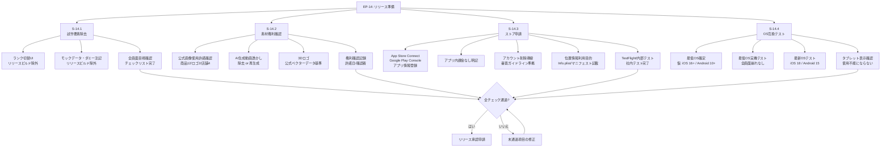

### S-14.1: 試作専用要素の除去（ランク切替UI等）

**ユーザーストーリー**
> リリース担当者として、開発用の試作要素がリリースビルドに残らないようにしたい。
> なぜなら、会員にデバッグ用UIやダミーデータが見えると信頼を損なうから。

**できあがり条件**
- [ ] 開発・デバッグ用のランク切替UIがリリースビルドに含まれない
- [ ] モックデータ・ダミー注記（「これはサンプルです」等）がリリースビルドに残っていない
- [ ] 全画面を目視確認し、開発用要素のチェックリストが完了している

---

### S-14.2: 素材権利確認・AI透かし除去

**ユーザーストーリー**
> リリース担当者として、使用素材の権利を確認し、AI生成コンテンツの透かしを処理したい。
> なぜなら、権利問題でリリース後に素材差し替えが発生するリスクを避けたいから。

**できあがり条件**
- [ ] 使用している公式画像（商品12点・ロゴ2点・店舗外観4点）の使用許諾が確認されている
- [ ] AI生成動画の右下透かしが除去されている、または透かしなしで再生成されている
- [ ] 3Dロゴが公式ベクターデータから作成されている（または暫定版であることが関係者に合意されている）
- [ ] 権利確認の記録（許諾日・確認者）がドキュメントに残されている

---

### S-14.3: ストア申請・配信準備（iOS App Store / Google Play）

**ユーザーストーリー**
> リリース担当者として、ストア申請に必要な情報を整え、配信準備を完了したい。
> なぜなら、審査リジェクトによるスケジュール遅延を避けたいから。

**できあがり条件**
- [ ] App Store Connect / Google Play Console にアプリ情報（名称・説明文・スクリーンショット・プライバシーURL）が登録されている
- [ ] アプリ内課金がないことが申請情報に明記されている
- [ ] アカウント削除導線（S-1.8）がApp Store審査ガイドライン準拠であること
- [ ] 位置情報の利用目的がInfo.plist（iOS）/マニフェスト（Android）に正しく記載されている
- [ ] TestFlight / 内部テストトラックで社内テストが完了している

---

### S-14.4: 対応OS最低バージョン確定・互換性テスト

**ユーザーストーリー**
> リリース担当者として、対応OSの最低バージョンを確定し互換性を検証したい。
> なぜなら、会員の端末で動作しないアプリをリリースするわけにはいかないから。

**できあがり条件**
- [ ] 対応OSの最低バージョンが確定している（仮案: iOS 16+ / Android 10+）
- [ ] 最低バージョンの実機（またはシミュレータ）で全画面が崩れず動作する
- [ ] 最新OS（iOS 18 / Android 15相当）でも正常動作する
- [ ] タブレット（iPad / Android タブレット）での表示が著しく崩れない（最適化は不要だが、使用不能にならない）

---

*出典：エピック・ストーリーマップ v2.0 / 受け入れ条件一覧 v2.0 / 要件定義書 v1.3 / 仕様書 v1.3 / 6/18 要件会議議事録*
*練習プロジェクト・社内検討用*
