# BI-SU 画面遷移図

| 項目 | 内容 |
|---|---|
| 文書バージョン | **v1.0** |
| 作成日 | 2026-06-19 |
| 参照文書 | 要件定義書 v2.1 / 仕様書 v2.1 / 画面一覧・遷移図 2026-06-18 / エピック・ストーリーマップ v2.0 |

---

## 1. 全体遷移図

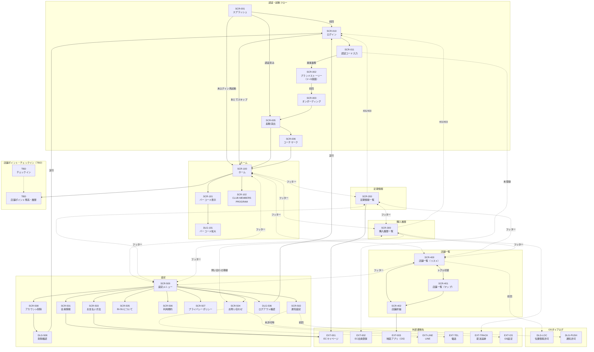

## 2. 遷移パターン別フロー

### 2.1 起動フロー

ユーザーの状態に応じた3パターンの起動フロー。

#### パターンA: 初回起動（未認証）

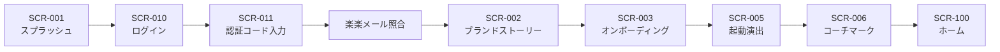

#### パターンB: 通常起動（認証済み・2回目以降）

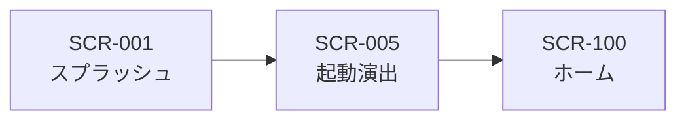

#### パターンC: 未ログイン起動（ハイブリッド方式）

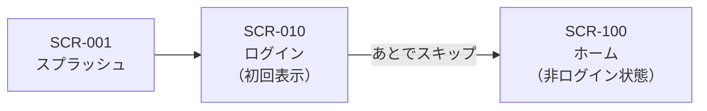

> **ハイブリッド方式（v2.1）**: 未ログインでもホーム・店舗一覧・ブランドコンテンツ・仮会員証・店舗ポイント・チェックインが利用可能。定期情報・購入履歴はグレーアウト表示でログイン案内を表示。

### 2.2 認証フロー

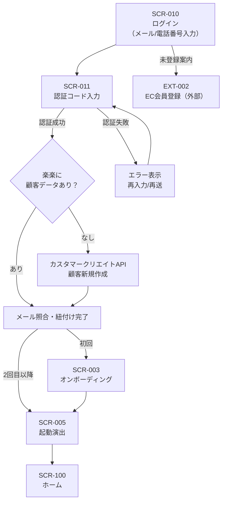

### 2.3 タブ間遷移（フッターナビゲーション）

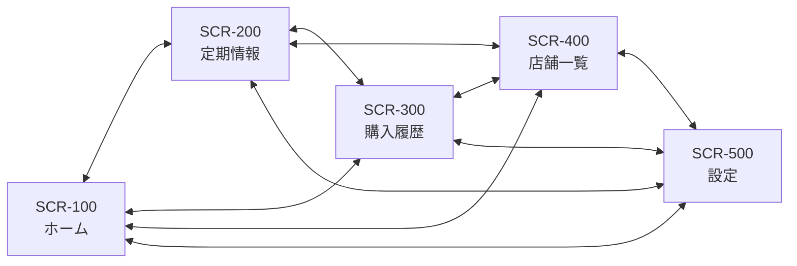

> フッター5タブにより任意のタブ間を直接移動可能。タブバーはホーム表示時のみダークガラス（backdrop-blur）、他画面はアイボリー。

### 2.4 ホーム起点の遷移

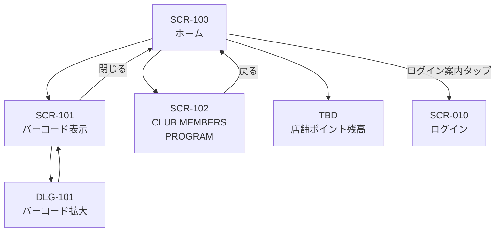

> バーコード表示はモーダル形式。オフラインでもキャッシュから表示可能。輝度自動最大化。仮会員証の場合も同一フローでバーコードを表示。

### 2.5 定期情報フロー

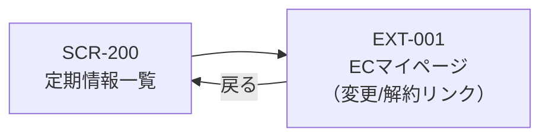

> 閲覧専用。変更・スキップ・解約はECマイページへ誘導。変更締切日を表示。

### 2.6 購入履歴フロー

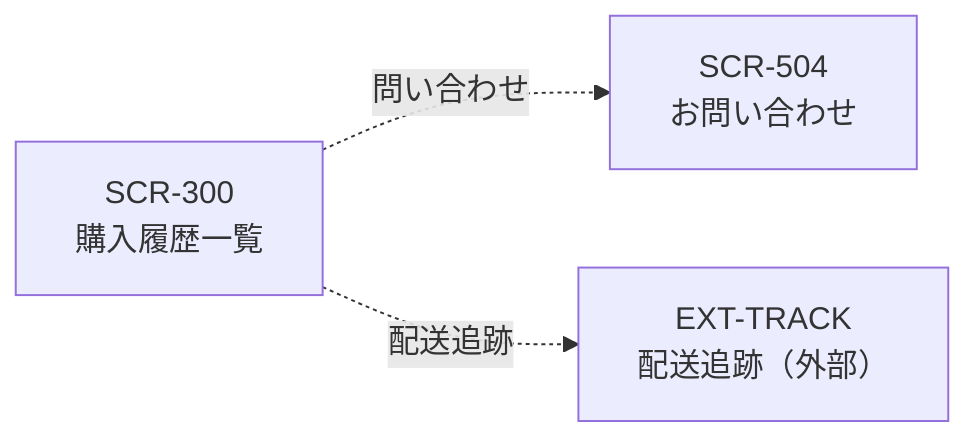

> 購入履歴一覧から問い合わせ・配送追跡への導線あり。詳細はインライン表示。

### 2.7 店舗一覧探索フロー

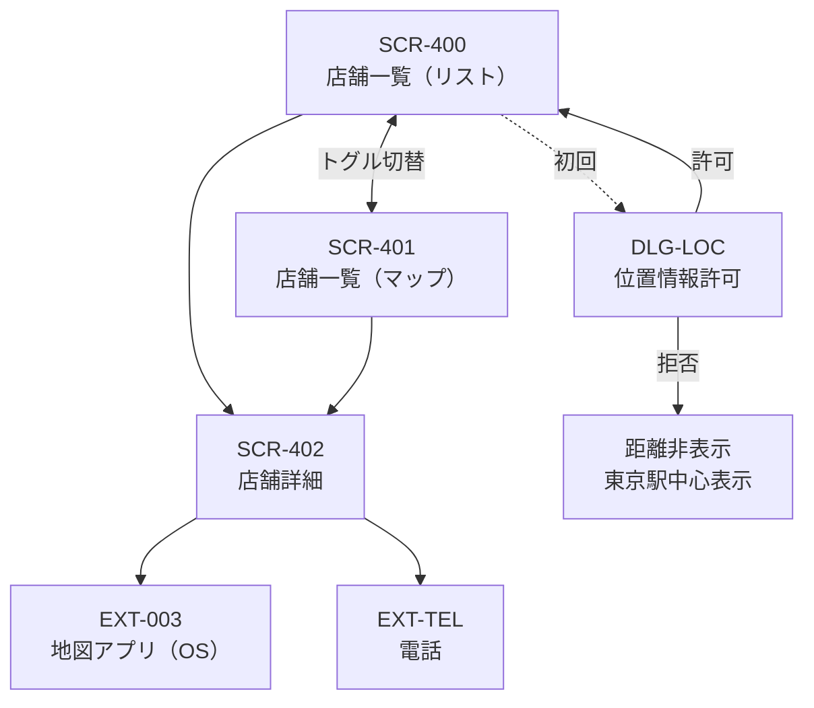

> リストとマップはトグル切替。位置情報拒否時は距離非表示、東京駅中心のデフォルト地図表示。未ログインでも全機能利用可能。

### 2.8 設定フロー

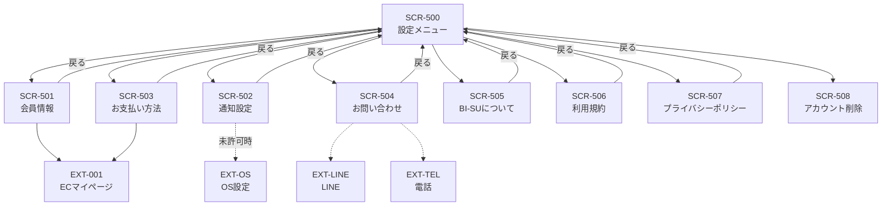

> 未ログインでも利用可能: BI-SUについて・利用規約・プライバシーポリシー・お問い合わせ・多言語切替。ログイン必須: 会員情報・通知設定・お支払い方法。

### 2.9 外部遷移フロー

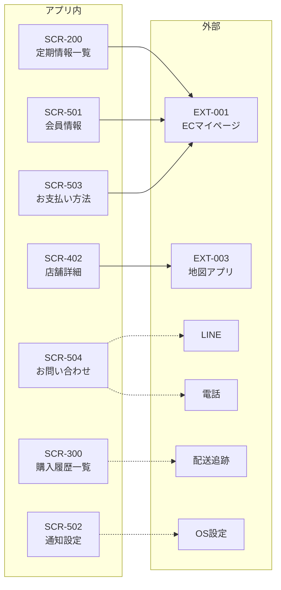

### 2.10 ログアウトフロー

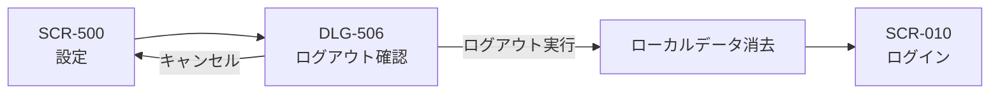

> ログアウト実行時は端末のローカルキャッシュを完全消去し、ログイン画面へ遷移。

### 2.11 アカウント削除フロー

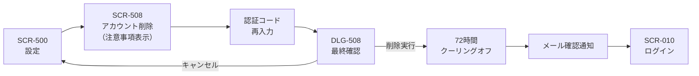

> 多段階確認: 注意事項表示 -> 認証コード再認証 -> 最終確認ダイアログ -> 72時間クーリングオフ -> メール通知 -> 完了。App Store審査要件。

### 2.12 セッション期限切れ・エラーハンドリングフロー

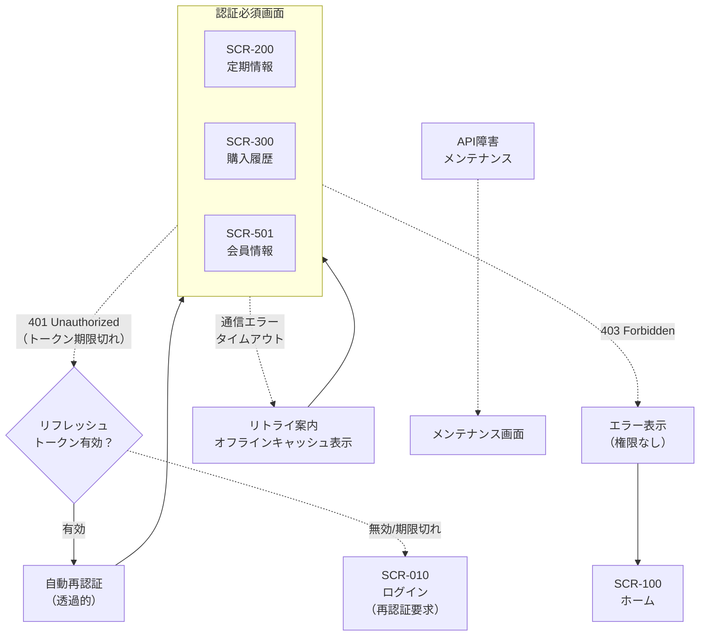

### 2.13 ゲスト→認証済みフロー（ハイブリッド方式）

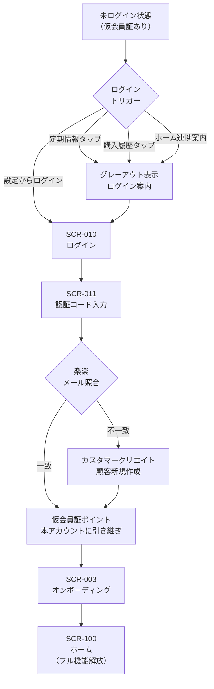

> ハイブリッド方式の核心フロー。未ログインで貯めた店舗ポイント（仮会員証）を、ログイン時に本アカウントへ引き継ぎ。定期情報・購入履歴・ランク制度が解放される。

### 2.14 店舗ポイント・チェックインフロー（v2.1新設・TBD）

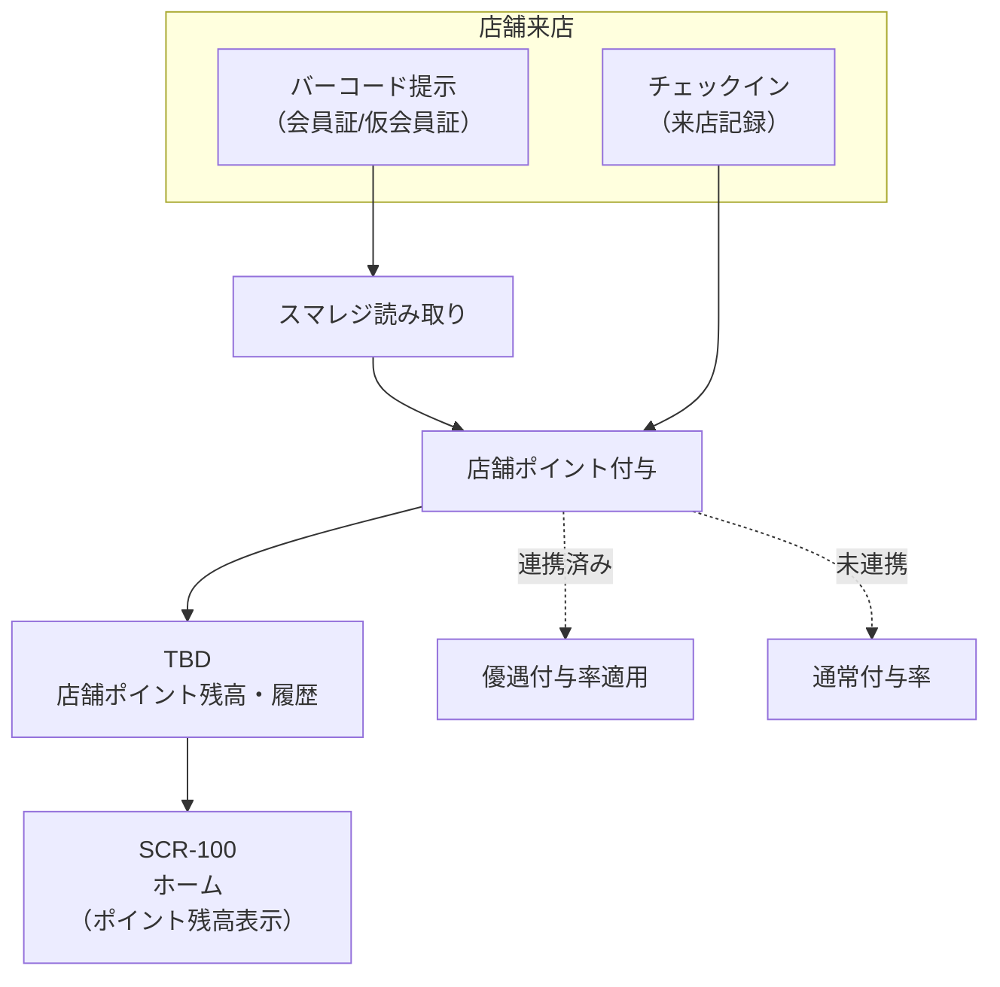

> 店舗ポイントはBI-SUポイント（楽楽EC連動）とは独立した制度。ログインなしでも仮会員証で付与可能。楽楽連携済みの場合はポイント付与率を優遇。画面ID・詳細仕様はTBD（OP-28, OP-29）。

---

## 3. 画面遷移テーブル

### 3.1 認証・起動フロー

| # | 遷移元 | 遷移先 | トリガー | ユーザーストーリー | 遷移種別 |
|---|---|---|---|---|---|
| 1 | SCR-001 スプラッシュ | SCR-010 ログイン | 初回起動 | 初めてアプリを開いた | 自動 |
| 2 | SCR-001 スプラッシュ | SCR-005 起動演出 | 認証済み再起動 | アプリを再び開いた | 自動 |
| 3 | SCR-001 スプラッシュ | SCR-100 ホーム | 未ログイン再起動 | 未ログインのまま再起動 | 自動 |
| 4 | SCR-010 ログイン | SCR-011 認証コード入力 | 送信ボタン | メール/電話番号を入力した | タップ |
| 5 | SCR-010 ログイン | SCR-100 ホーム | 「あとで」スキップ | ログインせずに使いたい | タップ |
| 6 | SCR-011 認証コード入力 | SCR-002 ブランドストーリー | 認証成功+楽楽連携（初回） | 認証コードを正しく入力した | 自動 |
| 7 | SCR-002 ブランドストーリー | SCR-003 オンボーディング | 完了/スキップ | ブランド紹介を見終わった | タップ |
| 8 | SCR-011 認証コード入力 | SCR-005 起動演出 | 認証成功（2回目以降） | 再ログインした | 自動 |
| 9 | SCR-011 認証コード入力 | EXT-002 EC会員登録 | 未登録案内 | EC未登録だった | タップ |
| 10 | SCR-003 オンボーディング | SCR-005 起動演出 | 完了 | オンボーディングを終えた | タップ |
| 11 | SCR-005 起動演出 | SCR-006 コーチマーク | 演出終了（初回ログイン後） | 初めてログインした | 自動 |
| 12 | SCR-005 起動演出 | SCR-100 ホーム | 演出終了/スキップ | 演出を見た/スキップした | 自動/タップ |
| 13 | SCR-006 コーチマーク | SCR-100 ホーム | 閉じる | 使い方を確認した | タップ |

### 3.2 タブ間遷移（フッターナビゲーション）

| # | 遷移元 | 遷移先 | トリガー | ユーザーストーリー | 遷移種別 |
|---|---|---|---|---|---|
| 14 | SCR-100 ホーム | SCR-200 定期情報 | フッタータブ | 定期情報を見たい | タップ |
| 15 | SCR-100 ホーム | SCR-300 購入履歴 | フッタータブ | 購入履歴を見たい | タップ |
| 16 | SCR-100 ホーム | SCR-400 店舗一覧 | フッタータブ | 店舗を探したい | タップ |
| 17 | SCR-100 ホーム | SCR-500 設定 | フッタータブ | 設定を開きたい | タップ |
| 18 | SCR-200 定期情報 | SCR-100 ホーム | フッタータブ | ホームに戻りたい | タップ |
| 19 | SCR-200 定期情報 | SCR-300 購入履歴 | フッタータブ | 購入履歴を見たい | タップ |
| 20 | SCR-200 定期情報 | SCR-400 店舗一覧 | フッタータブ | 店舗を探したい | タップ |
| 21 | SCR-200 定期情報 | SCR-500 設定 | フッタータブ | 設定を開きたい | タップ |
| 22 | SCR-300 購入履歴 | SCR-100 ホーム | フッタータブ | ホームに戻りたい | タップ |
| 23 | SCR-300 購入履歴 | SCR-200 定期情報 | フッタータブ | 定期情報を見たい | タップ |
| 24 | SCR-300 購入履歴 | SCR-400 店舗一覧 | フッタータブ | 店舗を探したい | タップ |
| 25 | SCR-300 購入履歴 | SCR-500 設定 | フッタータブ | 設定を開きたい | タップ |
| 26 | SCR-400 店舗一覧 | SCR-100 ホーム | フッタータブ | ホームに戻りたい | タップ |
| 27 | SCR-400 店舗一覧 | SCR-200 定期情報 | フッタータブ | 定期情報を見たい | タップ |
| 28 | SCR-400 店舗一覧 | SCR-300 購入履歴 | フッタータブ | 購入履歴を見たい | タップ |
| 29 | SCR-400 店舗一覧 | SCR-500 設定 | フッタータブ | 設定を開きたい | タップ |
| 30 | SCR-500 設定 | SCR-100 ホーム | フッタータブ | ホームに戻りたい | タップ |
| 31 | SCR-500 設定 | SCR-200 定期情報 | フッタータブ | 定期情報を見たい | タップ |
| 32 | SCR-500 設定 | SCR-300 購入履歴 | フッタータブ | 購入履歴を見たい | タップ |
| 33 | SCR-500 設定 | SCR-400 店舗一覧 | フッタータブ | 店舗を探したい | タップ |

### 3.3 ホーム起点遷移

| # | 遷移元 | 遷移先 | トリガー | ユーザーストーリー | 遷移種別 |
|---|---|---|---|---|---|
| 34 | SCR-100 ホーム | SCR-101 バーコード表示 | 左上バーコードボタン | 会員証を提示したい | タップ |
| 35 | SCR-101 バーコード表示 | DLG-101 バーコード拡大 | バーコードタップ | 読み取りやすくしたい | タップ |
| 36 | DLG-101 バーコード拡大 | SCR-101 バーコード表示 | 閉じる | 拡大表示を閉じたい | タップ |
| 37 | SCR-101 バーコード表示 | SCR-100 ホーム | 閉じる/戻る | バーコード表示を終えた | タップ |
| 38 | SCR-100 ホーム | SCR-102 CLUB MEMBERS PROGRAM | 特典エリアタップ | ランク特典を確認したい | タップ |
| 39 | SCR-102 CLUB MEMBERS PROGRAM | SCR-100 ホーム | 戻る | 確認を終えた | タップ |
| 40 | SCR-100 ホーム | SCR-010 ログイン | ログイン案内カードタップ | ログインして機能を解放したい | タップ |
| 41 | SCR-100 ホーム | TBD 店舗ポイント残高 | ポイント残高タップ | 店舗ポイント詳細を見たい | タップ |

### 3.4 定期情報遷移

| # | 遷移元 | 遷移先 | トリガー | ユーザーストーリー | 遷移種別 |
|---|---|---|---|---|---|
| 42 | SCR-200 定期情報一覧 | EXT-001 ECマイページ | 変更/解約リンク | コースを変更/解約したい | タップ |
| 43 | EXT-001 ECマイページ | SCR-200 定期情報一覧 | ブラウザ→アプリ復帰 | ECで変更後アプリに戻った | 自動（データ再取得） |

### 3.5 購入履歴遷移

| # | 遷移元 | 遷移先 | トリガー | ユーザーストーリー | 遷移種別 |
|---|---|---|---|---|---|
| 44 | SCR-300 購入履歴一覧 | SCR-504 お問い合わせ | 問い合わせボタン | この注文について問い合わせたい | タップ（クロスタブ） |
| 45 | SCR-300 購入履歴一覧 | EXT-TRACK 配送追跡 | 追跡ボタン | 配送状況を確認したい | タップ（外部） |

### 3.6 店舗一覧遷移

| # | 遷移元 | 遷移先 | トリガー | ユーザーストーリー | 遷移種別 |
|---|---|---|---|---|---|
| 46 | SCR-400 店舗一覧（リスト） | SCR-401 店舗一覧（マップ） | マップ切替ボタン | 地図で店舗を探したい | タップ（トグル） |
| 47 | SCR-401 店舗一覧（マップ） | SCR-400 店舗一覧（リスト） | リスト切替ボタン | リストで店舗を見たい | タップ（トグル） |
| 48 | SCR-400 店舗一覧（リスト） | SCR-402 店舗詳細 | 店舗カード選択 | この店舗の詳細を見たい | タップ |
| 49 | SCR-401 店舗一覧（マップ） | SCR-402 店舗詳細 | ピン→店舗選択 | マップ上の店舗を見たい | タップ |
| 50 | SCR-402 店舗詳細 | EXT-003 地図アプリ | 「経路を見る」 | 店舗までの道順を知りたい | タップ（外部） |
| 51 | SCR-402 店舗詳細 | EXT-TEL 電話 | 電話番号タップ | 店舗に電話したい | タップ（外部） |
| 52 | SCR-402 店舗詳細 | SCR-400/401 | 戻る | 店舗一覧に戻りたい | タップ |
| 53 | SCR-400 店舗一覧 | DLG-LOC 位置情報許可 | 初回アクセス | 近くの店舗を距離順で見たい | 自動（OSダイアログ） |

### 3.7 設定遷移

| # | 遷移元 | 遷移先 | トリガー | ユーザーストーリー | 遷移種別 |
|---|---|---|---|---|---|
| 54 | SCR-500 設定 | SCR-501 会員情報 | メニュー選択 | 登録情報を確認したい | タップ |
| 55 | SCR-500 設定 | SCR-502 通知設定 | メニュー選択 | 通知を設定したい | タップ |
| 56 | SCR-500 設定 | SCR-503 お支払い方法 | メニュー選択 | 支払い方法を確認したい | タップ |
| 57 | SCR-500 設定 | SCR-504 お問い合わせ | メニュー選択 | 問い合わせたい | タップ |
| 58 | SCR-500 設定 | SCR-505 BI-SUについて | メニュー選択 | ブランドストーリーを読みたい（初回紹介（SCR-002）と同じ内容） | タップ |
| 59 | SCR-500 設定 | SCR-506 利用規約 | メニュー選択 | 利用規約を確認したい | タップ |
| 60 | SCR-500 設定 | SCR-507 プライバシーポリシー | メニュー選択 | PPを確認したい | タップ |
| 61 | SCR-501 会員情報 | EXT-001 ECマイページ | 変更ボタン | 登録情報を変更したい | タップ（外部） |
| 62 | SCR-503 お支払い方法 | EXT-001 ECマイページ | 変更ボタン | 支払い方法を変更したい | タップ（外部） |
| 63 | SCR-502 通知設定 | DLG-PUSH 通知許可 | 通知ONトグル（初回） | 通知を受け取りたい | 自動（OSダイアログ） |
| 64 | SCR-502 通知設定 | EXT-OS OS設定 | 未許可時の設定導線 | 端末設定で通知を許可したい | タップ（外部） |
| 65 | SCR-504 お問い合わせ | EXT-LINE LINE | LINE相談ボタン | LINEで問い合わせたい | タップ（外部） |
| 66 | SCR-504 お問い合わせ | EXT-TEL 電話 | 電話番号タップ | 電話で問い合わせたい | タップ（外部） |
| 67 | SCR-5xx サブ画面 | SCR-500 設定 | 戻る | 設定メニューに戻りたい | タップ |

### 3.8 ログアウト・退会遷移

| # | 遷移元 | 遷移先 | トリガー | ユーザーストーリー | 遷移種別 |
|---|---|---|---|---|---|
| 68 | SCR-500 設定 | DLG-506 ログアウト確認 | ログアウトボタン | ログアウトしたい | タップ |
| 69 | DLG-506 ログアウト確認 | SCR-010 ログイン | 「ログアウト」実行 | 本当にログアウトする | タップ |
| 70 | DLG-506 ログアウト確認 | SCR-500 設定 | キャンセル | やめた | タップ |
| 71 | SCR-500 設定 | SCR-508 アカウント削除 | 最下部テキストリンク | アカウントを削除したい | タップ |
| 72 | SCR-508 アカウント削除 | DLG-508 削除確認 | 確認→認証コード再入力 | 本当に削除する | タップ |
| 73 | DLG-508 削除確認 | SCR-010 ログイン | 「削除」実行 | アカウントを削除した | タップ |
| 74 | DLG-508 削除確認 | SCR-500 設定 | キャンセル | やめた | タップ |

### 3.9 セッション期限切れ・エラー遷移

| # | 遷移元 | 遷移先 | トリガー | ユーザーストーリー | 遷移種別 |
|---|---|---|---|---|---|
| 75 | 認証必須画面（全般） | 自動再認証（透過的） | 401（リフレッシュトークン有効） | セッションが切れたが自動復帰した | 自動 |
| 76 | 認証必須画面（全般） | SCR-010 ログイン | 401（リフレッシュトークン無効） | セッションが完全に切れた | 自動（エラー） |
| 77 | 認証必須画面（全般） | SCR-100 ホーム | 403（権限なし） | 権限がない画面にアクセスした | 自動（エラー） |
| 78 | 任意の画面 | リトライ案内/キャッシュ表示 | 通信エラー/タイムアウト | ネットワークに繋がらない | 自動（フォールバック） |
| 79 | 任意の画面 | メンテナンス画面 | API障害/メンテナンス | サーバーがメンテナンス中 | 自動（フォールバック） |

### 3.10 ゲスト→認証フロー（ハイブリッド方式）

| # | 遷移元 | 遷移先 | トリガー | ユーザーストーリー | 遷移種別 |
|---|---|---|---|---|---|
| 80 | SCR-200 定期情報（グレーアウト） | SCR-010 ログイン | ログイン案内タップ | 定期情報を見るためにログインしたい | タップ |
| 81 | SCR-300 購入履歴（グレーアウト） | SCR-010 ログイン | ログイン案内タップ | 購入履歴を見るためにログインしたい | タップ |
| 82 | SCR-100 ホーム（非ログイン） | SCR-010 ログイン | 連携案内カードタップ | 会員特典を確認するためにログインしたい | タップ |
| 83 | SCR-010 ログイン | SCR-011 認証コード | 認証情報入力 | ログインしたい | タップ |
| 84 | 認証完了 | ポイント引き継ぎ処理 | 楽楽連携成功 | 仮会員証のポイントを引き継ぎたい | 自動 |
| 85 | ポイント引き継ぎ完了 | SCR-100 ホーム（フル機能） | 処理完了 | 全機能が使えるようになった | 自動 |

---

## 4. 画面ID一覧（参照）

| 画面ID | 画面名 | 種別 | 認証要否 |
|---|---|---|---|
| SCR-001 | スプラッシュ | システム | 不要 |
| SCR-002 | ブランドストーリー（1〜3画面） | フルスクリーン | 認証後（初回のみ） |
| SCR-003 | オンボーディング | フルスクリーン | 認証後 |
| SCR-005 | 起動演出 | フルスクリーン | 不要（ランク演出は認証後） |
| SCR-006 | コーチマーク | オーバーレイ | 認証後 |
| SCR-010 | ログイン | フルスクリーン | 不要 |
| SCR-011 | 認証コード入力 | フルスクリーン | 不要 |
| SCR-100 | ホーム | タブ | 不要（フル表示は認証後） |
| SCR-101 | バーコード表示 | モーダル | 不要（仮会員証対応） |
| SCR-102 | CLUB MEMBERS PROGRAM | サブ画面 | 認証後 |
| SCR-200 | 定期情報一覧 | タブ | 必須 |
| SCR-300 | 購入履歴一覧 | タブ | 必須 |
| SCR-400 | 店舗一覧（リスト） | タブ | 不要 |
| SCR-401 | 店舗一覧（マップ） | サブ画面 | 不要 |
| SCR-402 | 店舗詳細 | サブ画面 | 不要 |
| SCR-500 | 設定メニュー | タブ | 不要 |
| SCR-501 | 会員情報 | サブ画面 | 必須 |
| SCR-502 | 通知設定 | サブ画面 | 必須 |
| SCR-503 | お支払い方法 | サブ画面 | 必須 |
| SCR-504 | お問い合わせ | サブ画面 | 不要 |
| SCR-505 | BI-SUについて | サブ画面 | 不要 |
| SCR-506 | 利用規約 | サブ画面 | 不要 |
| SCR-507 | プライバシーポリシー | サブ画面 | 不要 |
| SCR-508 | アカウント削除 | サブ画面 | 必須 |
| DLG-101 | バーコード拡大 | ダイアログ | 不要 |
| DLG-506 | ログアウト確認 | ダイアログ | 必須 |
| DLG-508 | 削除確認 | ダイアログ | 必須 |
| DLG-LOC | 位置情報許可 | OSダイアログ | 不要 |
| DLG-PUSH | 通知許可 | OSダイアログ | 必須 |
| EXT-001 | ECマイページ | 外部 | 必須 |
| EXT-002 | EC会員登録 | 外部 | 不要 |
| EXT-003 | Google Maps | 外部 | 不要 |
| TBD | 店舗ポイント残高・履歴 | TBD | 不要 |
| TBD | チェックイン | TBD | 不要 |
| TBD | 仮会員証 | TBD | 不要 |
| SCR-509 | 言語設定（日/EN） | サブ画面 | 不要 |

---

## 5. 遷移ルール・注記

### 5.1 ハイブリッド方式の表示制御

| 機能 | 未ログイン | ログイン済み |
|---|---|---|
| ホーム（ブランドビジュアル） | MEMBER演出 | ランク別表示 |
| バーコード表示 | 仮会員証 | 本会員証 |
| 店舗ポイント | 通常付与率 | 優遇付与率 |
| チェックイン | 利用可能 | 利用可能 |
| 店舗一覧 | 全機能利用可能 | 全機能利用可能 |
| BI-SUについて | 閲覧可能 | 閲覧可能 |
| 定期情報 | グレーアウト（ログイン案内） | 全機能 |
| 購入履歴 | グレーアウト（ログイン案内） | 全機能 |
| ランク・進捗バー | 非表示 | 表示 |
| 通知設定 | 非表示 | 表示 |
| 会員情報 | 非表示 | 表示 |

### 5.2 遷移線の凡例

| 線種 | 意味 |
|---|---|
| 実線（-->） | 通常遷移 |
| 双方向実線（<-->） | 相互遷移（タブ切替・トグル等） |
| 点線（-.->） | 条件付き遷移（エラー・フォールバック・外部・クロスタブ） |
| 赤点線 | 戻りフロー（ログアウト・退会→ログイン画面） |

### 5.3 画面ID命名規則

- **SCR-0xx**: 認証・起動フロー（タブ到達前）
- **SCR-x00**: メインタブのルート画面（百の位=タブ番号）
- **SCR-x01〜**: サブ画面
- **DLG-xxx**: ダイアログ/モーダル
- **EXT-xxx**: 外部遷移先
- **TBD**: v2.1新設で画面ID未確定

### 5.4 クロスタブ遷移

通常はサブ画面→親タブへの「戻る」遷移だが、以下はタブをまたぐ例外的な遷移:

- SCR-300（購入履歴一覧）→ SCR-504（お問い合わせ）: 購入履歴タブから設定タブのサブ画面へ直接遷移

### 5.5 外部遷移時の復帰

- ECマイページ（EXT-001）からアプリに戻った際は、遷移元画面でデータ再取得を行う
- 地図アプリ（EXT-003）はOS標準のアプリ切替で復帰
- LINE/電話はOS標準の動作に従う
