# BI-SU シーケンス図

| 項目 | 内容 |
|---|---|
| 文書バージョン | **v1.0** |
| 作成日 | 2026-06-19 |
| 対応要件定義書 | 要件定義書_BI-SU会員アプリ v2.1（2026-06-18） |
| 対応仕様書 | 仕様書_BI-SU会員アプリ v2.4（2026-06-24） |

---

## S1: 起動・認証フロー

ハイブリッド方式（v2.1）により、未ログインでも基本機能が利用可能。ログイン+楽楽EC連携は任意。

### S1-1: 初回起動（未ログイン・ゲストモード）

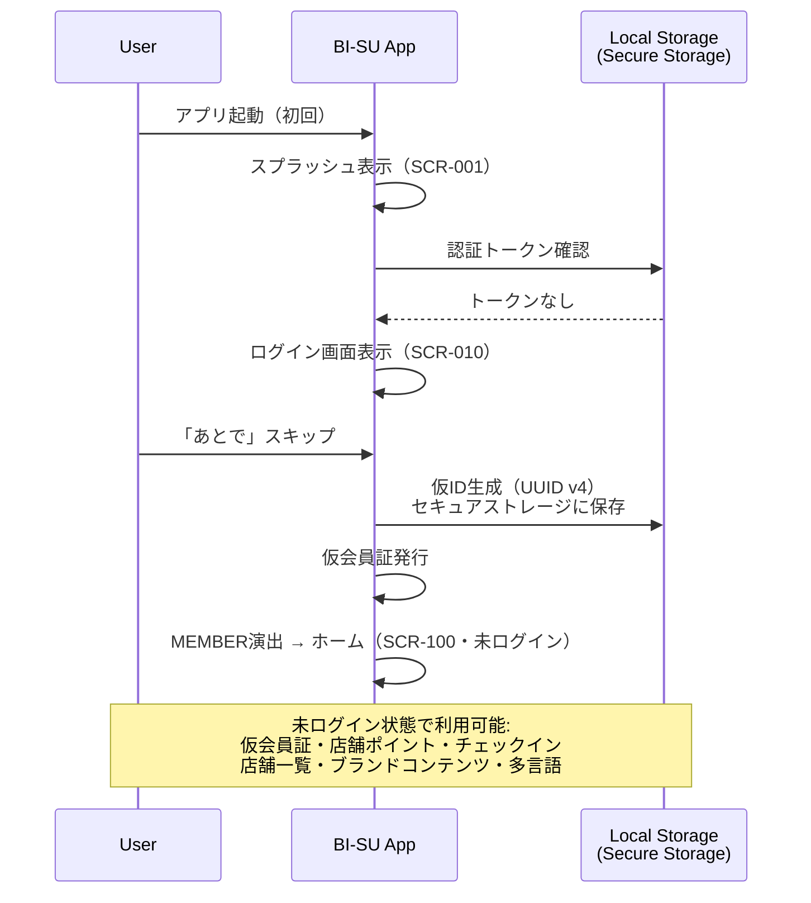
```mermaid
sequenceDiagram
    participant U as User
    participant App as BI-SU App
    participant LS as Local Storage<br/>(Secure Storage)

    U->>App: アプリ起動（初回）
    App->>App: スプラッシュ表示（SCR-001）
    App->>LS: 認証トークン確認
    LS-->>App: トークンなし
    App->>App: ログイン画面表示（SCR-010）
    U->>App: 「あとで」スキップ
    App->>LS: 仮ID生成（UUID v4）<br/>セキュアストレージに保存
    App->>App: 仮会員証発行
    App->>App: MEMBER演出 → ホーム（SCR-100・未ログイン）

    Note over U,LS: 未ログイン状態で利用可能:<br/>仮会員証・店舗ポイント・チェックイン<br/>店舗一覧・ブランドコンテンツ・多言語
```

### S1-2: ログイン + 楽楽EC連携（初回認証）

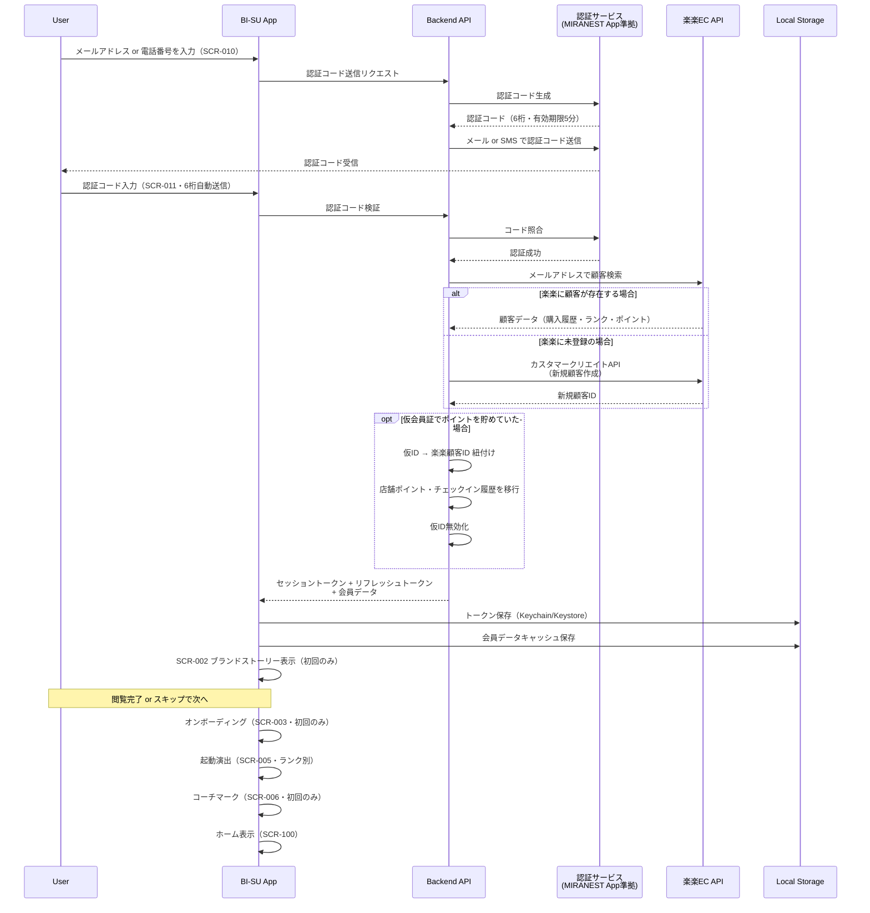
```mermaid
sequenceDiagram
    participant U as User
    participant App as BI-SU App
    participant API as Backend API
    participant Auth as 認証サービス<br/>(MIRANEST App準拠)
    participant REC as 楽楽EC API
    participant LS as Local Storage

    U->>App: メールアドレス or 電話番号を入力（SCR-010）
    App->>API: 認証コード送信リクエスト
    API->>Auth: 認証コード生成
    Auth-->>API: 認証コード（6桁・有効期限5分）
    API->>Auth: メール or SMS で認証コード送信
    Auth-->>U: 認証コード受信

    U->>App: 認証コード入力（SCR-011・6桁自動送信）
    App->>API: 認証コード検証
    API->>Auth: コード照合
    Auth-->>API: 認証成功

    API->>REC: メールアドレスで顧客検索
    alt 楽楽に顧客が存在する場合
        REC-->>API: 顧客データ（購入履歴・ランク・ポイント）
    else 楽楽に未登録の場合
        API->>REC: カスタマークリエイトAPI<br/>（新規顧客作成）
        REC-->>API: 新規顧客ID
    end

    opt 仮会員証でポイントを貯めていた場合
        API->>API: 仮ID → 楽楽顧客ID 紐付け
        API->>API: 店舗ポイント・チェックイン履歴を移行
        API->>API: 仮ID無効化
    end

    API-->>App: セッショントークン + リフレッシュトークン<br/>+ 会員データ
    App->>LS: トークン保存（Keychain/Keystore）
    App->>LS: 会員データキャッシュ保存

    App->>App: SCR-002 ブランドストーリー表示（初回のみ）
    Note over U,App: 閲覧完了 or スキップで次へ
    App->>App: オンボーディング（SCR-003・初回のみ）
    App->>App: 起動演出（SCR-005・ランク別）
    App->>App: コーチマーク（SCR-006・初回のみ）
    App->>App: ホーム表示（SCR-100）
```

### S1-3: 再起動（ログイン済み・2回目以降）

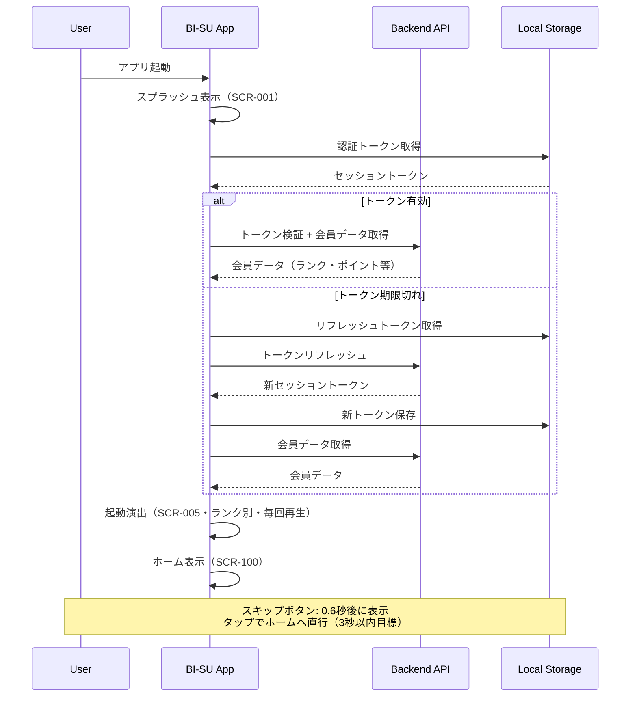
```mermaid
sequenceDiagram
    participant U as User
    participant App as BI-SU App
    participant API as Backend API
    participant LS as Local Storage

    U->>App: アプリ起動
    App->>App: スプラッシュ表示（SCR-001）
    App->>LS: 認証トークン取得
    LS-->>App: セッショントークン

    alt トークン有効
        App->>API: トークン検証 + 会員データ取得
        API-->>App: 会員データ（ランク・ポイント等）
    else トークン期限切れ
        App->>LS: リフレッシュトークン取得
        App->>API: トークンリフレッシュ
        API-->>App: 新セッショントークン
        App->>LS: 新トークン保存
        App->>API: 会員データ取得
        API-->>App: 会員データ
    end

    App->>App: 起動演出（SCR-005・ランク別・毎回再生）
    App->>App: ホーム表示（SCR-100）

    Note over U,LS: スキップボタン: 0.6秒後に表示<br/>タップでホームへ直行（3秒以内目標）
```

### S1-4: ログアウト

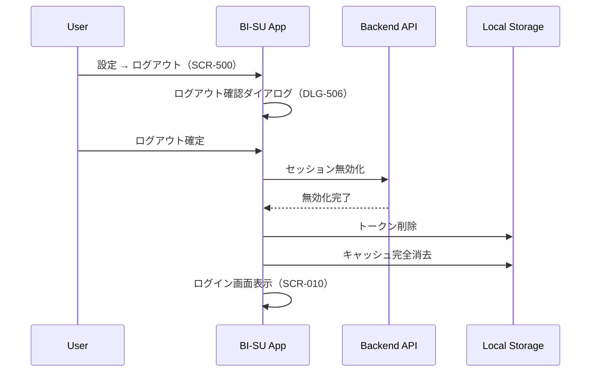
```mermaid
sequenceDiagram
    participant U as User
    participant App as BI-SU App
    participant API as Backend API
    participant LS as Local Storage

    U->>App: 設定 → ログアウト（SCR-500）
    App->>App: ログアウト確認ダイアログ（DLG-506）
    U->>App: ログアウト確定
    App->>API: セッション無効化
    API-->>App: 無効化完了
    App->>LS: トークン削除
    App->>LS: キャッシュ完全消去
    App->>App: ログイン画面表示（SCR-010）
```

---

## S2: 会員証バーコード表示

バーコード先行方式（v2.1）。スマレジで読み取り、会員IDを転記する運用。

### S2-1: 正会員バーコード表示

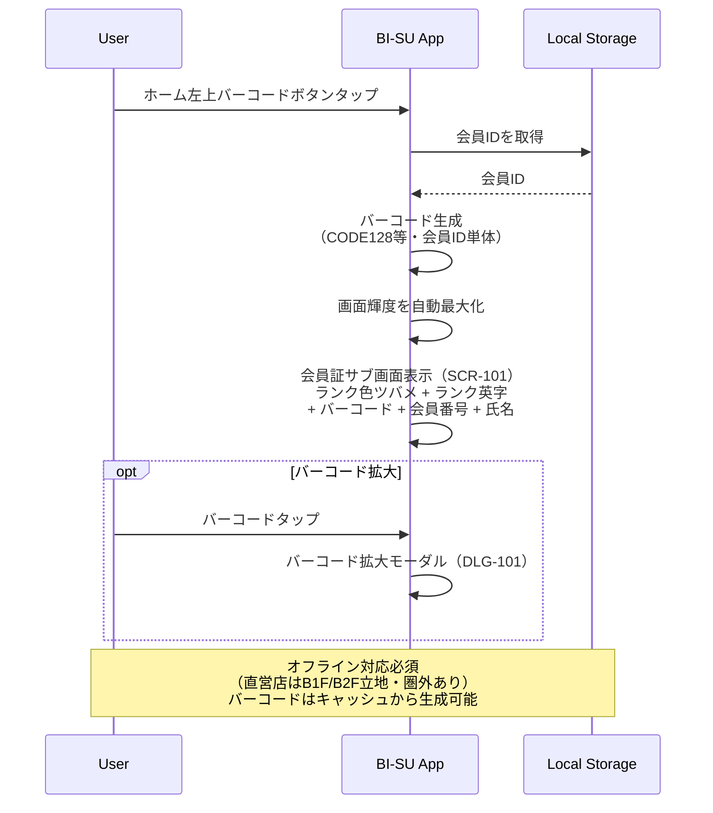
```mermaid
sequenceDiagram
    participant U as User
    participant App as BI-SU App
    participant LS as Local Storage

    U->>App: ホーム左上バーコードボタンタップ
    App->>LS: 会員IDを取得
    LS-->>App: 会員ID
    App->>App: バーコード生成<br/>（CODE128等・会員ID単体）
    App->>App: 画面輝度を自動最大化
    App->>App: 会員証サブ画面表示（SCR-101）<br/>ランク色ツバメ + ランク英字<br/>+ バーコード + 会員番号 + 氏名

    opt バーコード拡大
        U->>App: バーコードタップ
        App->>App: バーコード拡大モーダル（DLG-101）
    end

    Note over U,LS: オフライン対応必須<br/>（直営店はB1F/B2F立地・圏外あり）<br/>バーコードはキャッシュから生成可能
```

### S2-2: 仮会員証バーコード表示（未ログイン）

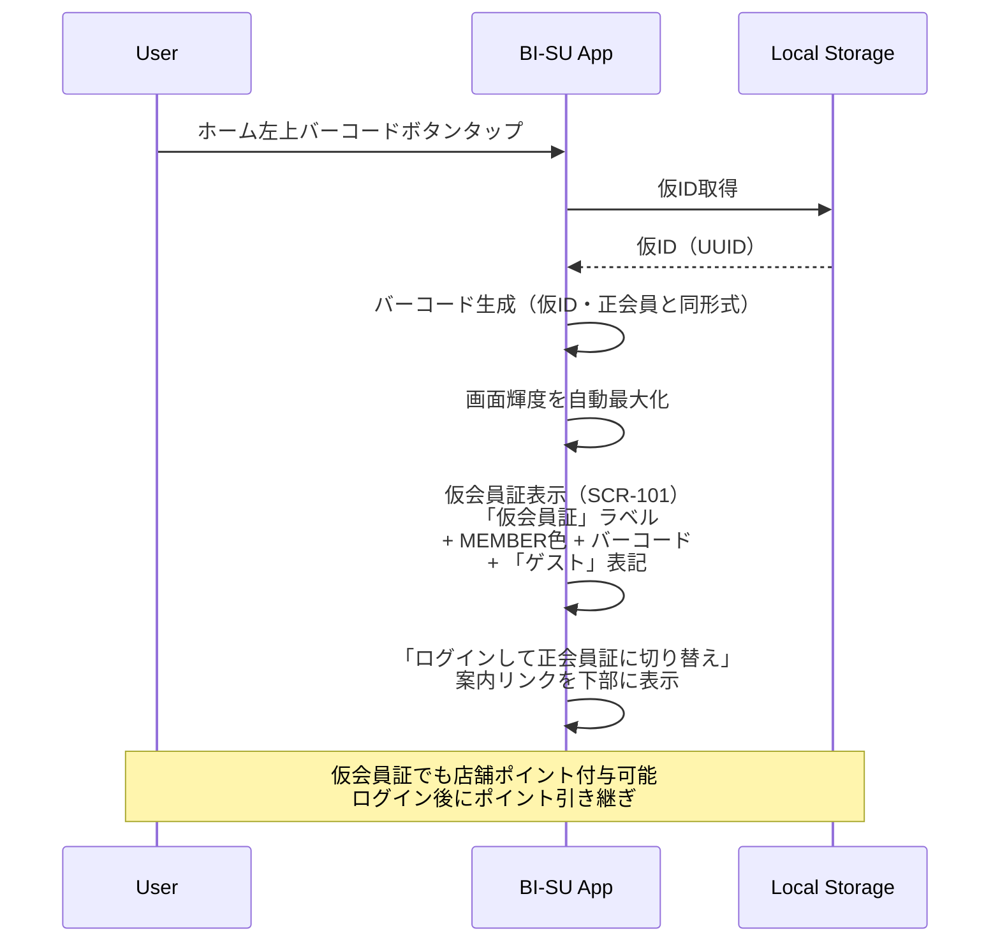
```mermaid
sequenceDiagram
    participant U as User
    participant App as BI-SU App
    participant LS as Local Storage

    U->>App: ホーム左上バーコードボタンタップ
    App->>LS: 仮ID取得
    LS-->>App: 仮ID（UUID）
    App->>App: バーコード生成（仮ID・正会員と同形式）
    App->>App: 画面輝度を自動最大化
    App->>App: 仮会員証表示（SCR-101）<br/>「仮会員証」ラベル<br/>+ MEMBER色 + バーコード<br/>+ 「ゲスト」表記
    App->>App: 「ログインして正会員証に切り替え」<br/>案内リンクを下部に表示

    Note over U,LS: 仮会員証でも店舗ポイント付与可能<br/>ログイン後にポイント引き継ぎ
```

### S2-3: 店頭での読み取りフロー

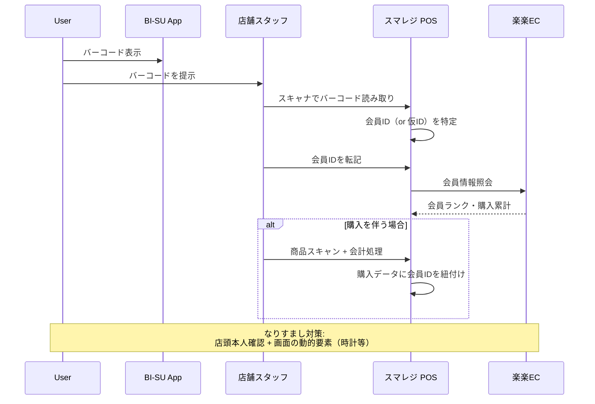
```mermaid
sequenceDiagram
    participant U as User
    participant App as BI-SU App
    participant Staff as 店舗スタッフ
    participant Sma as スマレジ POS
    participant REC as 楽楽EC

    U->>App: バーコード表示
    U->>Staff: バーコードを提示
    Staff->>Sma: スキャナでバーコード読み取り
    Sma->>Sma: 会員ID（or 仮ID）を特定
    Staff->>Sma: 会員IDを転記
    Sma->>REC: 会員情報照会
    REC-->>Sma: 会員ランク・購入累計

    alt 購入を伴う場合
        Staff->>Sma: 商品スキャン + 会計処理
        Sma->>Sma: 購入データに会員IDを紐付け
    end

    Note over U,REC: なりすまし対策:<br/>店頭本人確認 + 画面の動的要素（時計等）
```

---

## S3: 店舗一覧（店舗一覧・マップ）

店舗情報はWordPress API（公式サイト）から取得。未ログインでも全機能利用可能。

### S3-1: 店舗一覧・マップ表示

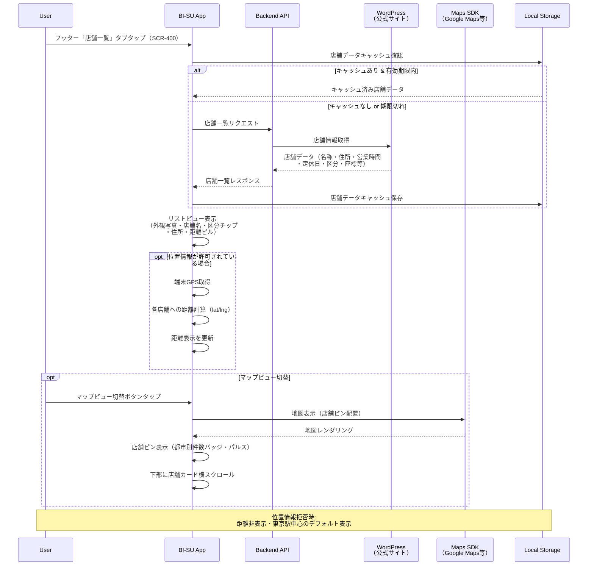
```mermaid
sequenceDiagram
    participant U as User
    participant App as BI-SU App
    participant API as Backend API
    participant WP as WordPress<br/>（公式サイト）
    participant Maps as Maps SDK<br/>（Google Maps等）
    participant LS as Local Storage

    U->>App: フッター「店舗一覧」タブタップ（SCR-400）

    App->>LS: 店舗データキャッシュ確認
    alt キャッシュあり & 有効期限内
        LS-->>App: キャッシュ済み店舗データ
    else キャッシュなし or 期限切れ
        App->>API: 店舗一覧リクエスト
        API->>WP: 店舗情報取得
        WP-->>API: 店舗データ（名称・住所・営業時間<br/>・定休日・区分・座標等）
        API-->>App: 店舗一覧レスポンス
        App->>LS: 店舗データキャッシュ保存
    end

    App->>App: リストビュー表示<br/>（外観写真・店舗名・区分チップ<br/>・住所・距離ピル）

    opt 位置情報が許可されている場合
        App->>App: 端末GPS取得
        App->>App: 各店舗への距離計算（lat/lng）
        App->>App: 距離表示を更新
    end

    opt マップビュー切替
        U->>App: マップビュー切替ボタンタップ
        App->>Maps: 地図表示（店舗ピン配置）
        Maps-->>App: 地図レンダリング
        App->>App: 店舗ピン表示（都市別件数バッジ・パルス）
        App->>App: 下部に店舗カード横スクロール
    end

    Note over U,LS: 位置情報拒否時:<br/>距離非表示・東京駅中心のデフォルト表示
```

### S3-2: 店舗詳細 + 地図アプリ連携

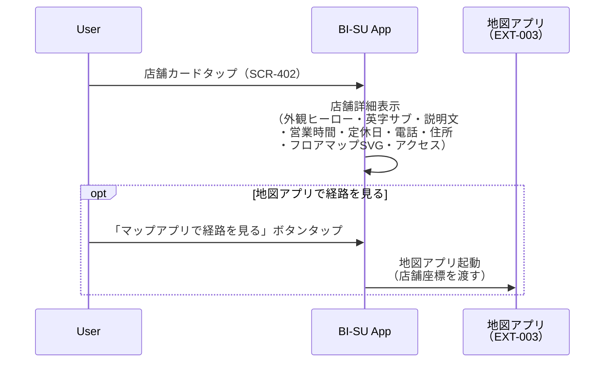
```mermaid
sequenceDiagram
    participant U as User
    participant App as BI-SU App
    participant ExtMap as 地図アプリ<br/>（EXT-003）

    U->>App: 店舗カードタップ（SCR-402）
    App->>App: 店舗詳細表示<br/>（外観ヒーロー・英字サブ・説明文<br/>・営業時間・定休日・電話・住所<br/>・フロアマップSVG・アクセス）

    opt 地図アプリで経路を見る
        U->>App: 「マップアプリで経路を見る」ボタンタップ
        App->>ExtMap: 地図アプリ起動<br/>（店舗座標を渡す）
    end
```

---

## S4: 定期情報

楽楽EC APIから定期購入データを取得。ログイン + 楽楽連携が必須。

### S4-1: 定期情報一覧・詳細

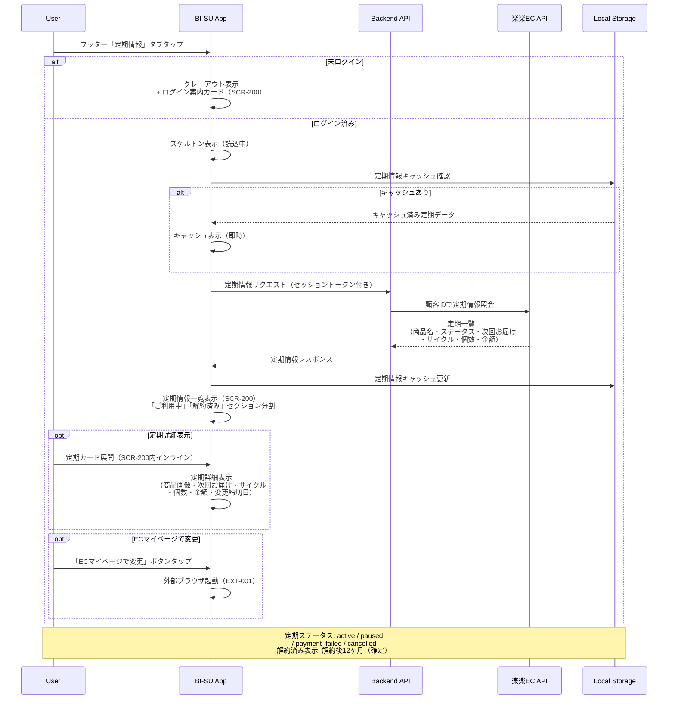
```mermaid
sequenceDiagram
    participant U as User
    participant App as BI-SU App
    participant API as Backend API
    participant REC as 楽楽EC API
    participant LS as Local Storage

    U->>App: フッター「定期情報」タブタップ

    alt 未ログイン
        App->>App: グレーアウト表示<br/>+ ログイン案内カード（SCR-200）
    else ログイン済み
        App->>App: スケルトン表示（読込中）
        App->>LS: 定期情報キャッシュ確認
        alt キャッシュあり
            LS-->>App: キャッシュ済み定期データ
            App->>App: キャッシュ表示（即時）
        end

        App->>API: 定期情報リクエスト（セッショントークン付き）
        API->>REC: 顧客IDで定期情報照会
        REC-->>API: 定期一覧<br/>（商品名・ステータス・次回お届け<br/>・サイクル・個数・金額）
        API-->>App: 定期情報レスポンス
        App->>LS: 定期情報キャッシュ更新
        App->>App: 定期情報一覧表示（SCR-200）<br/>「ご利用中」「解約済み」セクション分割

        opt 定期詳細表示
            U->>App: 定期カード展開（SCR-200内インライン）
            App->>App: 定期詳細表示<br/>（商品画像・次回お届け・サイクル<br/>・個数・金額・変更締切日）
        end

        opt ECマイページで変更
            U->>App: 「ECマイページで変更」ボタンタップ
            App->>App: 外部ブラウザ起動（EXT-001）
        end
    end

    Note over U,LS: 定期ステータス: active / paused<br/>/ payment_failed / cancelled<br/>解約済み表示: 解約後12ヶ月（確定）
```

---

## S5: 購入履歴

楽楽EC APIから注文データを取得。ログイン + 楽楽連携が必須。

### S5-1: 購入履歴一覧・詳細

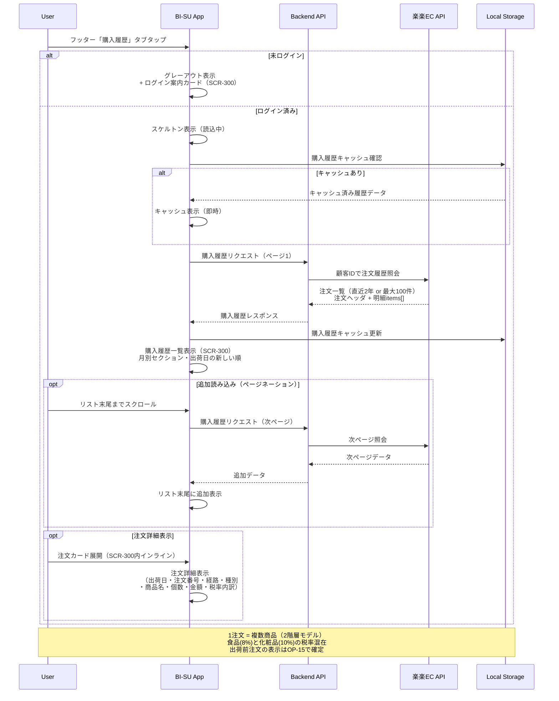
```mermaid
sequenceDiagram
    participant U as User
    participant App as BI-SU App
    participant API as Backend API
    participant REC as 楽楽EC API
    participant LS as Local Storage

    U->>App: フッター「購入履歴」タブタップ

    alt 未ログイン
        App->>App: グレーアウト表示<br/>+ ログイン案内カード（SCR-300）
    else ログイン済み
        App->>App: スケルトン表示（読込中）
        App->>LS: 購入履歴キャッシュ確認
        alt キャッシュあり
            LS-->>App: キャッシュ済み履歴データ
            App->>App: キャッシュ表示（即時）
        end

        App->>API: 購入履歴リクエスト（ページ1）
        API->>REC: 顧客IDで注文履歴照会
        REC-->>API: 注文一覧（直近2年 or 最大100件）<br/>注文ヘッダ + 明細items[]
        API-->>App: 購入履歴レスポンス
        App->>LS: 購入履歴キャッシュ更新
        App->>App: 購入履歴一覧表示（SCR-300）<br/>月別セクション・出荷日の新しい順

        opt 追加読み込み（ページネーション）
            U->>App: リスト末尾までスクロール
            App->>API: 購入履歴リクエスト（次ページ）
            API->>REC: 次ページ照会
            REC-->>API: 次ページデータ
            API-->>App: 追加データ
            App->>App: リスト末尾に追加表示
        end

        opt 注文詳細表示
            U->>App: 注文カード展開（SCR-300内インライン）
            App->>App: 注文詳細表示<br/>（出荷日・注文番号・経路・種別<br/>・商品名・個数・金額・税率内訳）
        end
    end

    Note over U,LS: 1注文 = 複数商品（2階層モデル）<br/>食品(8%)と化粧品(10%)の税率混在<br/>出荷前注文の表示はOP-15で確定
```

---

## S6: 設定変更

設定画面の各項目は閲覧専用（変更はECマイページ誘導）。

### S6-1: 会員情報表示・ECマイページ誘導

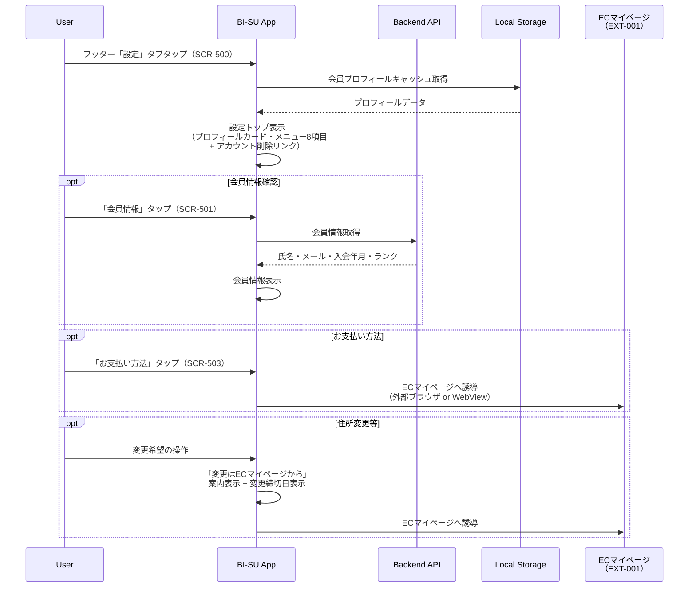
```mermaid
sequenceDiagram
    participant U as User
    participant App as BI-SU App
    participant API as Backend API
    participant LS as Local Storage
    participant Ext as ECマイページ<br/>（EXT-001）

    U->>App: フッター「設定」タブタップ（SCR-500）
    App->>LS: 会員プロフィールキャッシュ取得
    LS-->>App: プロフィールデータ
    App->>App: 設定トップ表示<br/>（プロフィールカード・メニュー8項目<br/>+ アカウント削除リンク）

    opt 会員情報確認
        U->>App: 「会員情報」タップ（SCR-501）
        App->>API: 会員情報取得
        API-->>App: 氏名・メール・入会年月・ランク
        App->>App: 会員情報表示
    end

    opt お支払い方法
        U->>App: 「お支払い方法」タップ（SCR-503）
        App->>Ext: ECマイページへ誘導<br/>（外部ブラウザ or WebView）
    end

    opt 住所変更等
        U->>App: 変更希望の操作
        App->>App: 「変更はECマイページから」<br/>案内表示 + 変更締切日表示
        App->>Ext: ECマイページへ誘導
    end
```

### S6-2: 通知設定

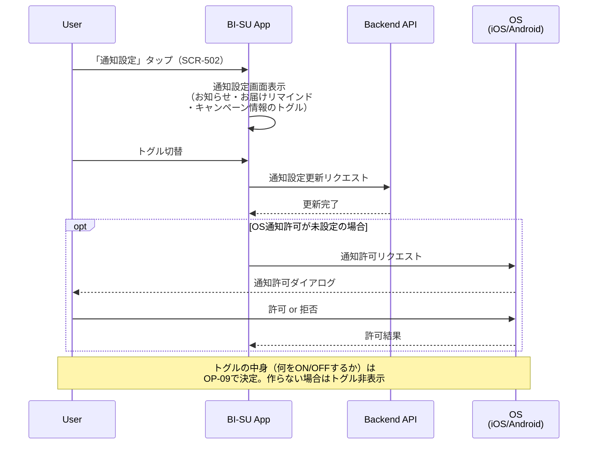
```mermaid
sequenceDiagram
    participant U as User
    participant App as BI-SU App
    participant API as Backend API
    participant OS as OS<br/>(iOS/Android)

    U->>App: 「通知設定」タップ（SCR-502）
    App->>App: 通知設定画面表示<br/>（お知らせ・お届けリマインド<br/>・キャンペーン情報のトグル）

    U->>App: トグル切替
    App->>API: 通知設定更新リクエスト
    API-->>App: 更新完了

    opt OS通知許可が未設定の場合
        App->>OS: 通知許可リクエスト
        OS-->>U: 通知許可ダイアログ
        U->>OS: 許可 or 拒否
        OS-->>App: 許可結果
    end

    Note over U,OS: トグルの中身（何をON/OFFするか）は<br/>OP-09で決定。作らない場合はトグル非表示
```

### S6-3: 多言語切替

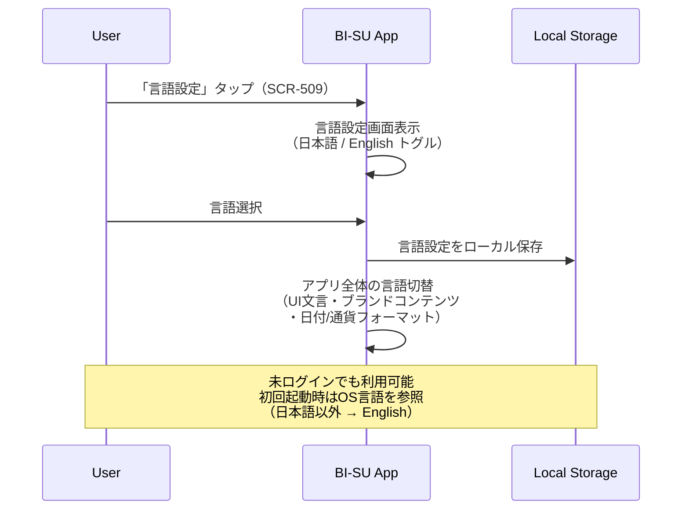
```mermaid
sequenceDiagram
    participant U as User
    participant App as BI-SU App
    participant LS as Local Storage

    U->>App: 「言語設定」タップ（SCR-509）
    App->>App: 言語設定画面表示<br/>（日本語 / English トグル）
    U->>App: 言語選択
    App->>LS: 言語設定をローカル保存
    App->>App: アプリ全体の言語切替<br/>（UI文言・ブランドコンテンツ<br/>・日付/通貨フォーマット）

    Note over U,LS: 未ログインでも利用可能<br/>初回起動時はOS言語を参照<br/>（日本語以外 → English）
```

### S6-4: アカウント削除

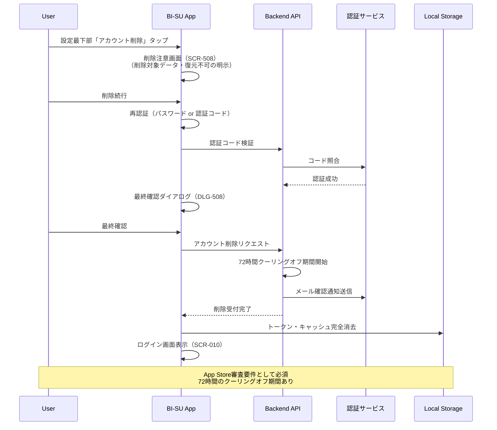
```mermaid
sequenceDiagram
    participant U as User
    participant App as BI-SU App
    participant API as Backend API
    participant Auth as 認証サービス
    participant LS as Local Storage

    U->>App: 設定最下部「アカウント削除」タップ
    App->>App: 削除注意画面（SCR-508）<br/>（削除対象データ・復元不可の明示）
    U->>App: 削除続行
    App->>App: 再認証（パスワード or 認証コード）
    App->>API: 認証コード検証
    API->>Auth: コード照合
    Auth-->>API: 認証成功
    App->>App: 最終確認ダイアログ（DLG-508）
    U->>App: 最終確認
    App->>API: アカウント削除リクエスト
    API->>API: 72時間クーリングオフ期間開始
    API->>Auth: メール確認通知送信
    API-->>App: 削除受付完了
    App->>LS: トークン・キャッシュ完全消去
    App->>App: ログイン画面表示（SCR-010）

    Note over U,LS: App Store審査要件として必須<br/>72時間のクーリングオフ期間あり
```

---

## S7: PUSH通知

APNs/FCM によるプッシュ通知の登録・受信フロー。

### S7-1: デバイストークン登録

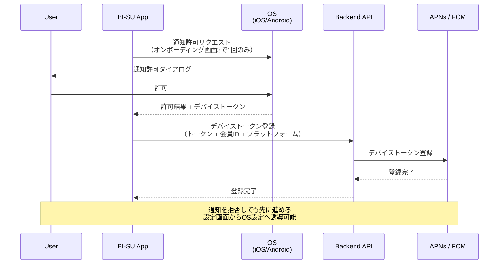
```mermaid
sequenceDiagram
    participant U as User
    participant App as BI-SU App
    participant OS as OS<br/>(iOS/Android)
    participant API as Backend API
    participant Push as APNs / FCM

    App->>OS: 通知許可リクエスト<br/>（オンボーディング画面3で1回のみ）
    OS-->>U: 通知許可ダイアログ
    U->>OS: 許可
    OS-->>App: 許可結果 + デバイストークン

    App->>API: デバイストークン登録<br/>（トークン + 会員ID + プラットフォーム）
    API->>Push: デバイストークン登録
    Push-->>API: 登録完了
    API-->>App: 登録完了

    Note over U,Push: 通知を拒否しても先に進める<br/>設定画面からOS設定へ誘導可能
```

### S7-2: PUSH通知配信・受信

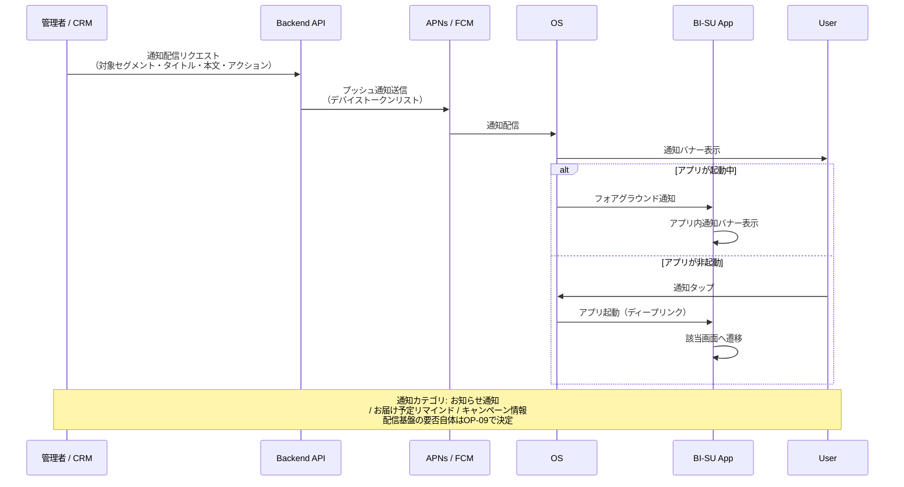
```mermaid
sequenceDiagram
    participant Admin as 管理者 / CRM
    participant API as Backend API
    participant Push as APNs / FCM
    participant OS as OS
    participant App as BI-SU App
    participant U as User

    Admin->>API: 通知配信リクエスト<br/>（対象セグメント・タイトル・本文・アクション）
    API->>Push: プッシュ通知送信<br/>（デバイストークンリスト）
    Push->>OS: 通知配信
    OS->>U: 通知バナー表示

    alt アプリが起動中
        OS->>App: フォアグラウンド通知
        App->>App: アプリ内通知バナー表示
    else アプリが非起動
        U->>OS: 通知タップ
        OS->>App: アプリ起動（ディープリンク）
        App->>App: 該当画面へ遷移
    end

    Note over Admin,U: 通知カテゴリ: お知らせ通知<br/>/ お届け予定リマインド / キャンペーン情報<br/>配信基盤の要否自体はOP-09で決定
```

---

## S8: 店舗ポイント・チェックイン

BI-SUポイント（楽楽EC連動）とは独立した店舗専用ポイント制度。ログインなしでも利用可能。

### S8-1: 店舗ポイント付与（購入時）

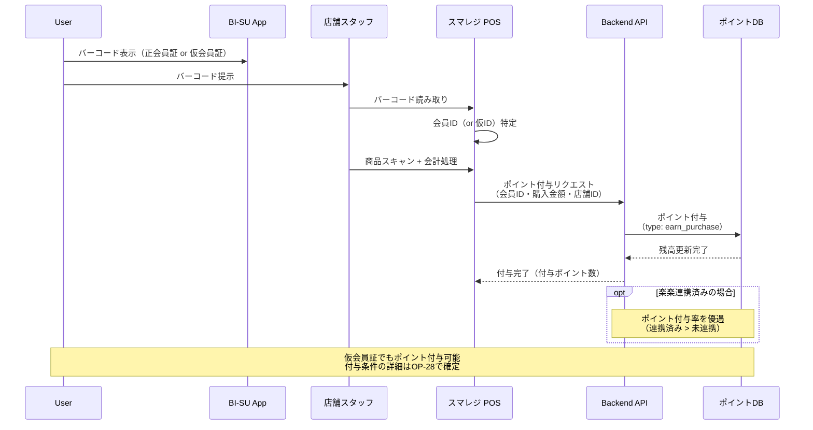
```mermaid
sequenceDiagram
    participant U as User
    participant App as BI-SU App
    participant Staff as 店舗スタッフ
    participant Sma as スマレジ POS
    participant API as Backend API
    participant DB as ポイントDB

    U->>App: バーコード表示（正会員証 or 仮会員証）
    U->>Staff: バーコード提示
    Staff->>Sma: バーコード読み取り
    Sma->>Sma: 会員ID（or 仮ID）特定
    Staff->>Sma: 商品スキャン + 会計処理
    Sma->>API: ポイント付与リクエスト<br/>（会員ID・購入金額・店舗ID）
    API->>DB: ポイント付与<br/>（type: earn_purchase）
    DB-->>API: 残高更新完了
    API-->>Sma: 付与完了（付与ポイント数）

    opt 楽楽連携済みの場合
        Note over API,DB: ポイント付与率を優遇<br/>（連携済み > 未連携）
    end

    Note over U,DB: 仮会員証でもポイント付与可能<br/>付与条件の詳細はOP-28で確定
```

### S8-2: チェックイン（来店記録）

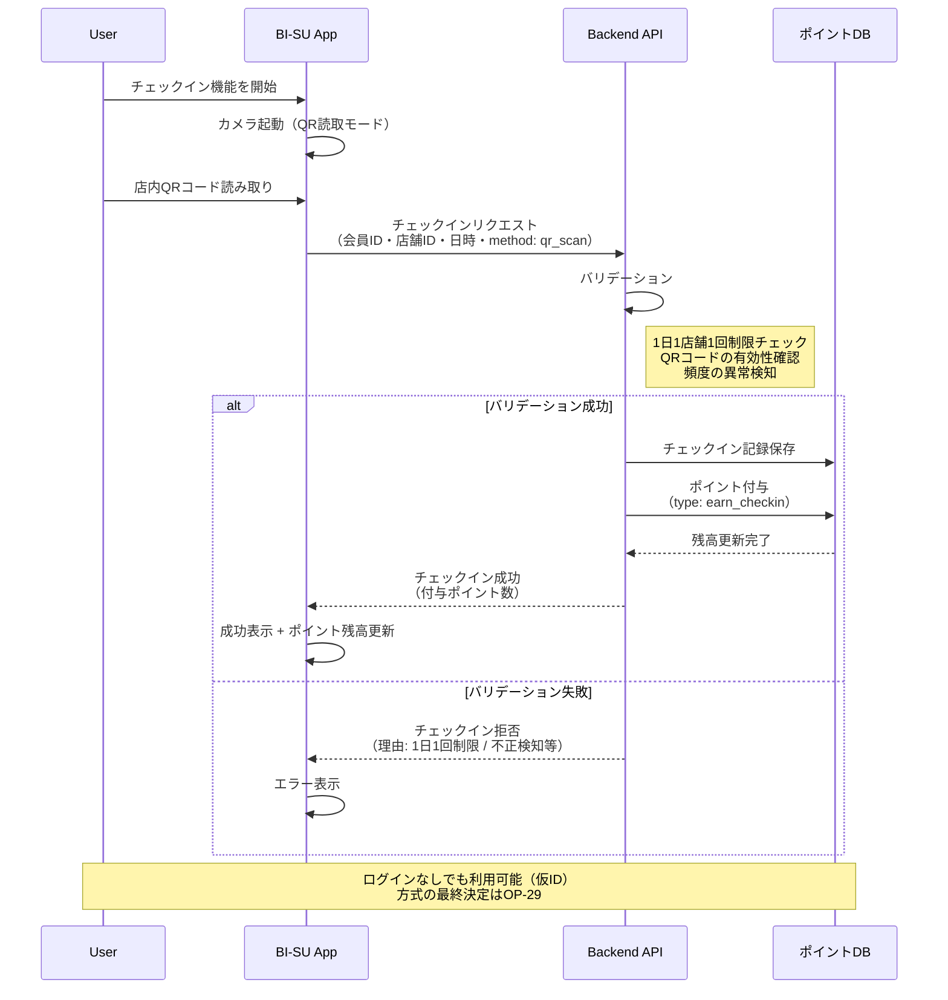
```mermaid
sequenceDiagram
    participant U as User
    participant App as BI-SU App
    participant API as Backend API
    participant DB as ポイントDB

    U->>App: チェックイン機能を開始
    App->>App: カメラ起動（QR読取モード）
    U->>App: 店内QRコード読み取り

    App->>API: チェックインリクエスト<br/>（会員ID・店舗ID・日時・method: qr_scan）

    API->>API: バリデーション
    Note right of API: 1日1店舗1回制限チェック<br/>QRコードの有効性確認<br/>頻度の異常検知

    alt バリデーション成功
        API->>DB: チェックイン記録保存
        API->>DB: ポイント付与<br/>（type: earn_checkin）
        DB-->>API: 残高更新完了
        API-->>App: チェックイン成功<br/>（付与ポイント数）
        App->>App: 成功表示 + ポイント残高更新
    else バリデーション失敗
        API-->>App: チェックイン拒否<br/>（理由: 1日1回制限 / 不正検知等）
        App->>App: エラー表示
    end

    Note over U,DB: ログインなしでも利用可能（仮ID）<br/>方式の最終決定はOP-29
```

### S8-3: 店舗ポイント照会

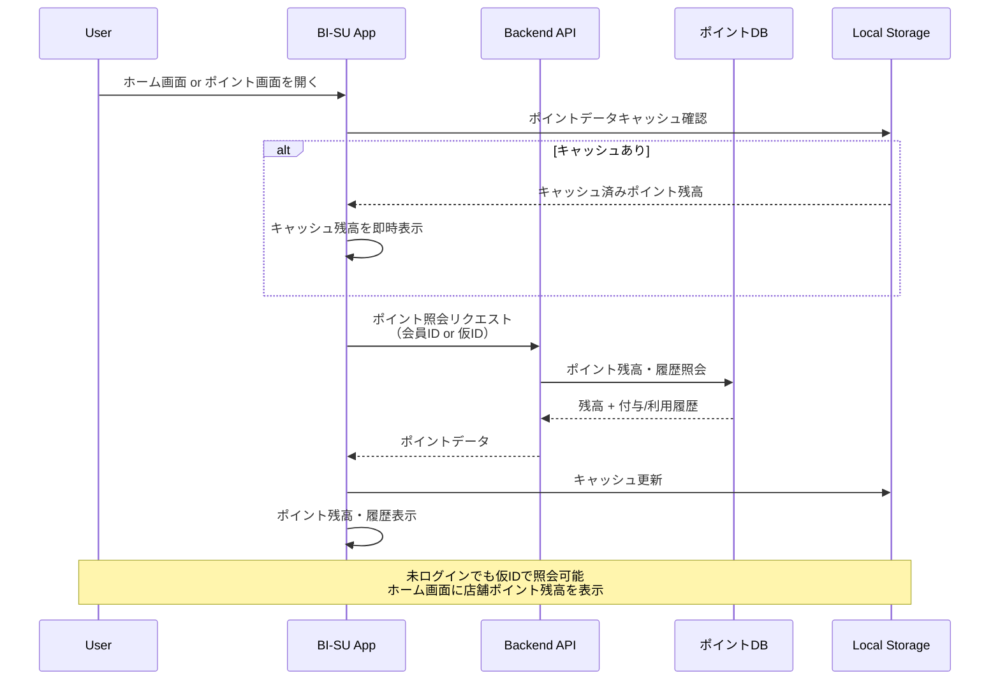
```mermaid
sequenceDiagram
    participant U as User
    participant App as BI-SU App
    participant API as Backend API
    participant DB as ポイントDB
    participant LS as Local Storage

    U->>App: ホーム画面 or ポイント画面を開く

    App->>LS: ポイントデータキャッシュ確認
    alt キャッシュあり
        LS-->>App: キャッシュ済みポイント残高
        App->>App: キャッシュ残高を即時表示
    end

    App->>API: ポイント照会リクエスト<br/>（会員ID or 仮ID）
    API->>DB: ポイント残高・履歴照会
    DB-->>API: 残高 + 付与/利用履歴
    API-->>App: ポイントデータ
    App->>LS: キャッシュ更新
    App->>App: ポイント残高・履歴表示

    Note over U,LS: 未ログインでも仮IDで照会可能<br/>ホーム画面に店舗ポイント残高を表示
```

---

## S9: エラー・オフラインハンドリング

通信不可・API障害・メンテナンス時の共通的な挙動。

### S9-1: 認証エラー（401 / 403）

```mermaid
sequenceDiagram
    participant U as User
    participant App as BI-SU App
    participant API as Backend API
    participant LS as Local Storage

    App->>API: APIリクエスト（セッショントークン付き）
    API-->>App: 401 Unauthorized

    App->>LS: リフレッシュトークン取得
    App->>API: トークンリフレッシュ
    alt リフレッシュ成功
        API-->>App: 新セッショントークン
        App->>LS: 新トークン保存
        App->>API: 元のAPIリクエストを再試行
        API-->>App: 正常レスポンス
    else リフレッシュ失敗（403 / トークン無効）
        API-->>App: 403 Forbidden
        App->>LS: トークン・キャッシュ消去
        App->>App: ログイン画面表示（SCR-010）<br/>+ 「再ログインしてください」メッセージ
    end
```

### S9-2: オフライン・通信エラー時のキャッシュフォールバック

```mermaid
sequenceDiagram
    participant U as User
    participant App as BI-SU App
    participant API as Backend API
    participant LS as Local Storage

    App->>API: APIリクエスト
    API-->>App: タイムアウト or ネットワークエラー

    App->>LS: キャッシュデータ取得
    alt キャッシュあり
        LS-->>App: キャッシュ済みデータ
        App->>App: キャッシュデータ表示<br/>+ 「最終更新 ○時○分」バナー<br/>+ 再試行ボタン
    else キャッシュなし
        App->>App: エラー画面表示<br/>+ 再試行ボタン
    end

    Note over U,LS: 画面別のオフライン挙動:<br/>会員証バーコード → キャッシュで表示継続（必須）<br/>店舗一覧 → 静的データで表示継続<br/>定期情報/購入履歴 → キャッシュ表示+バナー<br/>チェックイン → チェックイン不可バナー
```

### S9-3: メンテナンスモード

```mermaid
sequenceDiagram
    participant U as User
    participant App as BI-SU App
    participant API as Backend API

    App->>API: APIリクエスト
    API-->>App: 503 Service Unavailable<br/>+ メンテナンス情報（期間・メッセージ）

    App->>App: メンテナンス告知画面表示<br/>（メンテナンス期間・復旧見込み）
    App->>App: 利用可能機能のみ開放:<br/>バーコード表示（キャッシュ）<br/>店舗一覧（静的データ）<br/>店舗ポイント照会（キャッシュ）
```

### S9-4: 強制アップデート

```mermaid
sequenceDiagram
    participant U as User
    participant App as BI-SU App
    participant API as Backend API
    participant Store as App Store<br/>/ Google Play

    App->>API: バージョンチェックAPI
    API-->>App: 最新バージョン情報<br/>（最低バージョン・推奨バージョン）

    alt アプリバージョン < 最低バージョン
        App->>App: 強制アップデート画面<br/>（操作不可・ストアへ誘導のみ）
        U->>App: 「アップデート」ボタンタップ
        App->>Store: ストアページを開く
    else アプリバージョン < 推奨バージョン
        App->>App: アップデート推奨バナー表示<br/>（「あとで」で閉じ可能）
    else 最新
        App->>App: 通常起動
    end
```

---

## S10: AIコンシェルジュ（将来対応）

> AIコンシェルジュはBI-SUアプリのスコープではなく、MIRANEST Appの機能として開発が進行中。BI-SU会員アプリのv1スコープには含まれない。
>
> 将来的にBI-SU会員アプリにも類似のAI機能を統合する可能性があるが、現時点では未定義。

---

## 依存コンポーネント一覧

| コンポーネント | 役割 | 備考 |
|---|---|---|
| **BI-SU App（Flutter）** | クライアントアプリ。全画面・演出・キャッシュ・オフライン処理 | iOS 16+ / Android 10+ |
| **Backend API（AWS）** | 認証・データ中継・ポイント管理・チェックイン処理。楽楽EC APIへのプロキシ | APIキー/シークレットはサーバーサイドで管理 |
| **認証サービス** | MIRANEST App準拠の認証基盤。メール/SMS認証コード送信 | 共用 or 同等設計で新設 |
| **楽楽EC API** | 顧客検索（メール照合）・カスタマークリエイト・購入履歴・定期情報・ランク・ポイント | OP-26で仕様確定（山本担当） |
| **スマレジ POS** | 店舗のバーコード読み取り・会員ID転記・購入データ連携 | OP-01, OP-27 |
| **WordPress（公式サイト）** | 店舗情報の提供（名称・住所・営業時間・座標等） | OP-21で更新運用を確定 |
| **APNs / FCM** | プッシュ通知の配信基盤 | OP-09で要否を決定 |
| **Google Maps SDK** | マップビューの地図表示・店舗ピン配置 | Google Maps SDK で確定（OP-20クローズ） |
| **Local Storage** | セキュアストレージ（Keychain/Keystore）でトークン保存。一般キャッシュでデータ保存 | ログアウト時に完全消去 |

---

## キャッシュ TTL サマリ

| データ種別 | キャッシュ方式 | TTL（仮置き） | オフライン時 | 備考 |
|---|---|---|---|---|
| 認証トークン | セキュアストレージ | セッション有効期間（OP-06で確定） | 保持（オフライン表示に使用） | リフレッシュトークンで自動更新 |
| 会員証バーコード | セキュアストレージ（会員ID） | 永続（ID変更時のみ更新） | **表示継続必須** | 地下店舗対応（B1F/B2F） |
| 仮会員証ID | セキュアストレージ | 永続（アプリ再インストールで再発行） | 表示継続 | UUID v4 |
| 会員プロフィール | ローカルキャッシュ | 30分（仮置き） | キャッシュ表示 + 「最終更新」バナー | ランク・ポイント残高含む |
| 定期情報 | ローカルキャッシュ | 15分（仮置き） | キャッシュ表示 + バナー | ステータス変更の即時性を考慮 |
| 購入履歴 | ローカルキャッシュ | 30分（仮置き） | キャッシュ表示 + バナー | ページネーション分も含む |
| 店舗一覧 | ローカルキャッシュ / アプリ同梱 | 24時間（仮置き） | 静的データで表示継続 | POP UPの期間に注意 |
| 店舗ポイント残高 | ローカルキャッシュ | 10分（仮置き） | キャッシュ表示 + バナー | 仮IDでも保持 |
| チェックイン履歴 | ローカルキャッシュ | 30分（仮置き） | キャッシュ表示 | — |
| 言語設定 | ローカルストレージ | 永続 | 保持 | ログアウトでもリセットしない |
| 起動演出動画 | アプリ同梱 or CDN + ローカルキャッシュ | 永続（バージョン更新で差替え） | 同梱版で再生 | OP-07で配布方式決定 |

---

## 未決定事項サマリ（シーケンスに影響するもの）

| OP-ID | 論点 | シーケンスへの影響 | 重要度 |
|---|---|---|---|
| OP-05 | ポイント制度のシステム仕様 | S8のポイント付与ロジック・S2のホーム表示内容 | ★★★ |
| OP-24 | EC基盤API仕様 | S4/S5のデータ取得フロー全体 | ★★★ |
| OP-26 | 楽楽API仕様（顧客作成/メール照合） | S1-2の認証+楽楽連携フロー | ★★★ |
| OP-28 | 店舗ポイント仕様 | S8-1/S8-3のポイント付与・照会フロー | ★★★ |
| OP-01 | バーコード読取オペ・POS連携 | S2-3の店頭読み取りフロー | ★★ |
| OP-06 | 会員ライフサイクル詳細 | S1の認証フロー全般（トークン有効期間等） | ★★ |
| OP-09 | PUSH通知の要否 | S7のフロー全体（作らない場合は不要） | ★★ |
| OP-27 | スキャナ環境棚卸し | S2のバーコード形式（CODE128等） | ★★ |
| OP-29 | チェックイン方式 | S8-2のチェックインフロー（QR/位置情報/Beacon等） | ★★ |
| OP-11 | 位置情報の許諾UX | S3-1の距離表示フロー | ★★ |
| OP-12 | データ鮮度・正本宣言 | 全キャッシュTTLの確定値 | ★★ |
| ~~OP-20~~ | ~~地図方式~~ | Google Maps SDK で確定（2026-06-24クローズ） | - |
| OP-30 | 多言語対応範囲 | S6-3の切替対象範囲 | ★ |
| OP-31 | Amazon Pay認証 | S1-2に認証手段を追加する可能性 | ★ |
